# HomeFM — A Foundation Model for Smart-Home Understanding

**Design document** · v0.1 · 2026-09-22 · Status: Draft for review

---

## Table of contents

1. [Overview](#1-overview)
   - [1.1 Key terms in plain words](#11-key-terms-in-plain-words)
2. [Goals and non-goals](#2-goals-and-non-goals)
3. [Requirements](#3-requirements)
4. [Prior work: DomusFM and its gaps](#4-prior-work-domusfm-and-its-gaps)
   - [4.1 Limitations of DomusFM against our requirements, with scenarios](#41-limitations-of-domusfm-against-our-requirements-with-scenarios)
   - [4.2 DomusFM vs HomeFM, step by step](#42-domusfm-vs-homefm-step-by-step)
5. [System architecture](#5-system-architecture)
   - [5.2 Two pipelines: training and live](#52-two-pipelines-training-and-live)
6. [Data model](#6-data-model)
   - [6.4 From raw data to Home Tokens](#64-from-raw-data-to-home-tokens)
   - [6.5 Device registry (the device table)](#65-device-registry-the-device-table)
   - [6.6 Home onboarding: building the device registry](#66-home-onboarding-building-the-device-registry)
7. [HomeFM model architecture](#7-homefm-model-architecture)
   - [7.0 In plain words](#70-in-plain-words)
   - [7.4 Inside one minute: from Home Tokens to the transformer](#74-inside-one-minute-from-home-tokens-to-the-transformer)
   - [7.5 Making minute vectors comparable with sentences](#75-making-minute-vectors-comparable-with-sentences)
8. [Pretraining design](#8-pretraining-design)
   - [8.0 In plain words](#80-in-plain-words)
   - [8.4 Proposed refinements (variant G)](#84-proposed-refinements-variant-g)
   - [8.5 Setup and training, step by step](#85-setup-and-training-step-by-step)
   - [8.6 DomusFM masking vs HomeFM games, on one window](#86-domusfm-masking-vs-homefm-games-on-one-window)
   - [8.7 Why games 1 and 2 (the rationale for variant E)](#87-why-games-1-and-2-the-rationale-for-variant-e)
9. [Downstream heads and analytics engines](#9-downstream-heads-and-analytics-engines)
10. [Query agent](#10-query-agent)
   - [10.1 How the agent reads HomeFM outputs](#101-how-the-agent-reads-homefm-outputs)
   - [10.2 End-to-end example: counting cooking](#102-end-to-end-example-counting-cooking)
11. [Data strategy](#11-data-strategy)
12. [Evaluation plan](#12-evaluation-plan)
13. [Deployment, privacy and edge](#13-deployment-privacy-and-edge)
14. [Roadmap](#14-roadmap)
15. [Risks and open questions](#15-risks-and-open-questions)
16. [Repository layout](#16-repository-layout)

---

## 1. Overview

Users should be able to ask a smart home **any question in natural language** and get a correct, evidence-backed answer:

- *"How much energy was consumed in the last hour?"*
- *"How many times did my kid cry today?"*
- *"How many times did cooking happen in the last 4 hours?"*
- *"How many parcels did we receive yesterday?"*
- *"How many people are in the living room?"*
- *"Is anything wrong with the fridge?"* · *"Did grandma eat lunch?"* · *"Anything unusual last night?"* · *"Did the dog bark while we were out?"*

Questions span activity recognition, security events, pets, childcare, elderly care, device defects, energy and anomaly detection. The domain list is open-ended, so the system is designed around a **small set of question types** and an **open-vocabulary foundation model**, not around per-question detectors.

**Core principle:** the foundation model and perception experts *understand* the home and turn raw signals into structured, searchable facts (events, episodes, states, scores). A database *counts*. An LLM agent *plans* which tools to call. Numbers in answers always come from tools, never from the LLM.

### 1.1 Key terms in plain words

Every term below uses the same example: one evening in one kitchen. The terms are listed in the order data flows through the system.

**The data**

| Term | Plain meaning | Kitchen example |
|---|---|---|
| **Event** | One thing a sensor reported, at one moment. The smallest piece of information. | "18:31:02, stove plug, 1,850 W" or "18:29, fridge door, opened" |
| **Home Token** | The same event rewritten in one standard format, so events from any brand or type of sensor look alike (§6.1). | `time=18:31:02, device="stove in kitchen", value=1850 W` |
| **Event store** | A plain database table of every event: the house's raw logbook (§6.3). | 10,000 rows for today, one per sensor report |

**What the model does**

| Term | Plain meaning | Kitchen example |
|---|---|---|
| **Vector** (embedding) | A list of a few hundred numbers that describes something. Things with similar meaning get similar lists. It is how a computer holds "meaning". | Two cooking minutes get similar lists. A cooking minute and a sleeping minute get very different ones. |
| **Moment** (minute summary) | All events in one minute squeezed into one vector. The model thinks in minutes, not single events (§7). | 18:31: stove on, 2 motions, fridge opened, all turned into one vector |
| **Context** | The model reads each minute together with the minutes before it, like reading a sentence instead of a single word. | "18:31, stove on" plus "someone came in at 18:28, it's dinnertime" means probably cooking |
| **HomeFM** (the foundation model) | The part that turns events into minute vectors that carry context. It understands the house's activity but does not give answers itself. | |
| **Pretraining** | Teaching HomeFM, before it ever sees your home, by letting it study many other homes' data without anyone labelling anything (§8). | It learns "stove, kitchen motion and evening usually go together" |
| **Head** | A small add-on that reads a minute vector and gives one specific answer. There is one head per job (§9). | Cooking head: "0.93 chance this minute is cooking". Occupancy head: "1 person in the kitchen" |

**From minutes to things you can count**

| Term | Plain meaning | Kitchen example |
|---|---|---|
| **Episode** | One occurrence of an activity, with a start and an end, built by joining consecutive minutes that the head marked as that activity. This is what "how many times" counts (§9.1). | Minutes 18:30 → 19:22 marked "cooking" make **1 episode** of cooking |
| **Episode rules** | Simple per-activity rules for joining or dropping minutes. | "A break shorter than 10 min is still the same cooking." "Under 3 min is not cooking", so a 1-minute microwave use is not counted. |
| **Episode store** | A database table of episodes: the house's diary of activities, in plain text. | `cooking, 18:30–19:22, kitchen, confidence 0.94` |
| **Concept** | An activity or thing the system can talk about, written as a word plus a short sentence. | `cooking`, described as "someone is cooking food in the kitchen" |
| **Ontology** | The house's dictionary: which rooms, devices, people and concepts exist, and what nicknames mean (§6.2). | "kid" → Aarav, and the stove is in the kitchen |

**"A sentence instead of learned weights"**

In DomusFM, each activity the model knows is a row of numbers learned from labelled examples. The only way to add a new activity is to collect examples and retrain. In HomeFM, each activity is **a sentence**. The sentence is turned into a vector, and each minute vector is compared with it. The closer they are, the more likely that minute is that activity.

- **DomusFM** is like a checklist with fixed boxes. A new box needs retraining.
- **HomeFM** is like describing what you are looking for in words. Something new is just a new description.

For example, "someone is vacuuming" gives a new activity immediately, without collecting labelled examples first (§4.1 L1).

**Answering a question**

| Term | Plain meaning | Example |
|---|---|---|
| **Vector store** (e.g. Qdrant) | A database that saves the minute vectors and can quickly find "the minutes most similar to X". It searches by meaning rather than by exact words. | Find the minutes most like "someone is vacuuming" |
| **Agent** (LLM) | The chat part that reads the question, calls tools and writes the reply. It never calculates anything itself (§10). | |
| **Tool** | A function the agent calls to fetch facts. | `query_episodes(cooking, 16:00–20:00)` → 2 episodes |
| **Bridge 1** (stored facts) | For known activities: the answer is already sitting in the episode store. It is fast and reliable (§10.1). | "Cooking today?" is a table lookup |
| **Bridge 2** (search by meaning) | For activities nobody stored: search the vector store with a sentence. It is slower and less certain (§10.1). | "Frying today?" searches for minutes like "frying food in a pan" |
| **Label** | A human saying "this stretch was cooking". Optional in HomeFM: it improves accuracy but is not needed for an activity to exist. | The user replies "that was just tea" |
| **Confidence** | How sure the system is, shown with every answer. | "2 times (high confidence)" |

**The whole flow in one line:** sensors report **events** → the model reads them **minute by minute, in context** → **heads** say what each minute looks like → minutes are joined into **episodes** and written into the **diary** → a user asks a question → the **agent** looks it up in the diary, or **searches by meaning** if it is not there → it answers with **times and confidence**. §10.2 walks through this flow in full for one question.

**Technical keywords, in plain words**

These terms appear in the technical sections (§4.2, §7–§9). Each has a one-line plain meaning.

*Building blocks*

| Keyword | Plain meaning |
|---|---|
| **Transformer** | The standard neural-network design behind modern AI models. It reads a sequence and lets every item look at the other items to understand it in context. |
| **Attention / self-attention** | The mechanism inside a transformer: for each item, decide how much to "look at" each other item. |
| **Layer / head** | A transformer is a stack of layers. Each layer has several heads that look for different kinds of relationships at the same time. |
| **d (hidden size)** | How many numbers are in each vector inside the model (384 for DomusFM, 256 for HomeFM's corpus configuration). |
| **Parameters** | The numbers the model learns during training. More parameters means a bigger model (DomusFM 28.6M in our reimplementation, HomeFM 8.0M). |
| **MLP / linear layer** | The simplest learned building blocks: they turn one vector into another. |
| **Text encoder (MiniLM)** | An existing, small language model (`all-MiniLM-L6-v2`) that turns any sentence into 384 numbers. Both models use it **frozen**: it is never retrained. |
| **Frozen** | A part of the model whose numbers are not changed during training. |
| **Projection head** | A small learned layer that moves vectors into a shared space, so two different kinds of vector can be compared. |

*Describing events and time*

| Keyword | Plain meaning |
|---|---|
| **Attribute** | One piece of an event: which device, which room, the value, the time, the source. |
| **Attribute fusion** | Combining an event's attributes into one vector, letting them inform each other first. |
| **Cyclic encoding** | Writing time of day and day of week as positions on circles, so 23:59 and 00:01 come out close together. |
| **Δt (delta-t)** | "Time since": for example, seconds since the previous event, or until the next one. |
| **Window** | The slice of history the model reads at once. DomusFM uses 30 events, and HomeFM uses a span of minutes. |
| **Stride** | How far the window moves each step. DomusFM's stride of 1 means one new window for every new event. |
| **Positional encoding** | Information that tells the model the order of items in a sequence. |
| **Latent** | A learned internal vector that is not directly an input or an output. |
| **Perceiver** | A design in which a few learned "question" vectors (latents) read a variable number of inputs and summarise them into a fixed size. HomeFM uses it to turn "any number of events in a minute" into one vector. |
| **Segment softmax** | A trick for computing attention separately inside each minute, for all minutes at once. It is fast and uses little memory. |
| **Stream transformer** | HomeFM's main transformer, which reads the sequence of minute vectors. |
| **Event read-out** | A small transformer that goes back from minutes to single events, when event-level detail is needed. |
| **Day token** | One vector that summarises a whole day, so the model can compare weeks. |

*Reading modes and speed*

| Keyword | Plain meaning |
|---|---|
| **Causal** | Reads only the past, never the future. This is required for live use and for forecasting. |
| **Bidirectional** | Reads past and future together. This is better for looking back and correcting. |
| **KV cache** | Keeps the results already computed for earlier minutes, so a new minute costs one step instead of re-reading everything. |
| **Inference** | Running the trained model on new data, as opposed to training it. |
| **Edge / hub** | The small computer inside the home where the model runs, so data stays at home. |

*Training*

| Keyword | Plain meaning |
|---|---|
| **Self-supervised** | Training without human labels: the data itself provides the answers, for example by hiding part of it and guessing it. |
| **Masking** | Hiding part of the input so the model has to guess it. |
| **Loss** | A score of how wrong the model is. Training pushes it down. A loss near zero straight away means the game is too easy. |
| **Contrastive learning** | Training by comparison: pull two views of the same thing together, and push different things apart. |
| **InfoNCE** | DomusFM's contrastive loss: "among everything in this batch, pick out my own masked copy". |
| **Positive / negative** | In contrastive learning, a positive is a pair that should match, and a negative is a pair that should not. A **false negative** is a pair pushed apart even though it is really the same behaviour (two ordinary nights of sleep). |
| **Temporal point process (TPP)** | A model of *when* events happen, not only which. "Marked" means it also predicts what the event is. |
| **Log-normal mixture** | A flexible way to predict a waiting time: a blend of several bell curves on a log scale, so "in 10 seconds" and "in 3 hours" can both be likely. |
| **NLL (negative log-likelihood)** | How surprised the model is by what actually happened. Low means expected, high means unusual. HomeFM uses it as the **surprise score** for anomalies. |
| **JEPA** | "Predict the hidden part's meaning, not its raw details." The model fills in hidden minutes' vectors instead of exact events. |
| **EMA target** | A slowly updated copy of the model (an exponential moving average of its weights) that produces the answers JEPA is trained to predict. It keeps training stable. |
| **Collapse** | A failure where the model outputs the same vector for everything, which makes some losses trivially low. |
| **SigLIP** | A way to match minutes with sentences that scores each pair separately as match or no-match, so one minute can match several sentences. |
| **Alignment** | Training minute vectors and sentence vectors to live in the same space, so they can be compared. |
| **CLIP** | The well-known image–text model that introduced this kind of alignment. HomeFM applies the same idea to sensor minutes. |
| **Gradient reversal / home-adversarial** | A training trick that stops the model from learning *which home* the data came from, so it learns behaviour rather than one home's quirks. |
| **Pretraining / fine-tuning** | Pretraining learns general skills from lots of data without labels. Fine-tuning then adjusts the model for one task with a few labels. |
| **Ablation / variant (A–G)** | Running the same setup with one part changed, to measure what that part contributes. |

*Outputs and evaluation*

| Keyword | Plain meaning |
|---|---|
| **Classifier / class** | A head that picks one item from a fixed list. Each item is a class. |
| **Tagger** | HomeFM's activity head: it scores every concept sentence for every minute, and several can be "on" at once. |
| **Multi-label** | More than one label can be true at the same moment (cooking *and* baby crying). |
| **Cosine similarity** | A score from −1 to 1 of how closely two vectors point the same way. It is how "close in meaning" is measured. |
| **Hysteresis** | Using a higher threshold to switch on than to switch off, so a flickering score does not create many tiny episodes. |
| **Calibration** | Adjusting scores so that "0.9" really means about 90 % likely. |
| **Occupant slot (person card)** | A learned vector for each resident or pet that events are assigned to, so the model can tell people apart. |
| **Zero-shot** | Recognising something with no labelled examples of it. |
| **Weighted F1** | The accuracy score for activity labels, which balances precision and recall and weights each activity by how often it occurs. |
| **Multiset F1** | The accuracy score for next-k prediction: how well the predicted bag of events matches the true bag, ignoring order. |
| **Leave-one-dataset-out** | Testing on a home the model never saw during pretraining, one home at a time. |
| **Fold / cross-validation** | Splitting the test home's data into parts and testing on each part in turn. The "±" in results is the spread across folds. |

## 2. Goals and non-goals

**Goals**

- G1. One pretrained model (**HomeFM**) that transfers to unseen homes with arbitrary device sets.
- G2. Open-vocabulary: recognise and search for concepts that were never labelled ("vacuuming", "guest arrived").
- G3. Handles binary events, continuous telemetry, and audio/vision detector outputs in one representation.
- G4. Reasons over seconds → hours → weeks (cries, cooking, routines, device degradation).
- G5. Produces exact counts/durations via episode segmentation, calibrated anomaly and device-health scores, and forecasts.
- G6. Runs streaming on an edge hub; raw audio/video never leaves the home.

**Non-goals (v1)**

- Processing raw video or raw audio inside HomeFM (handled by edge perception experts, see §5).
- Home automation control / actuation.
- Medical diagnosis. Elderly-care outputs are *behavioural signals*, not clinical judgements.

## 3. Requirements

### 3.1 Question taxonomy

Domains are open-ended; question **types** are a small, closed set. Every type maps to a tool path.

| Type | Example | Answered by |
|---|---|---|
| Count / aggregate | "How many times did the dog bark today?" | Event / episode store (SQL) |
| Current state | "How many people are in the living room?" | State table |
| When / last time | "When did grandma last take her medicine?" | Episodes |
| Duration | "How long did the kids watch TV?" | Episodes |
| Comparison / trend | "Am I cooking less than last month?" | Aggregates + baselines |
| Anomaly | "Anything unusual last night?" | Anomaly engine |
| Diagnosis | "Is my fridge OK?" · "Why is the bill high?" | Device-health engine + energy breakdown |
| Well-being / routine | "Did Dad eat lunch?" · "Is Mum sleeping well?" | Routine model + episodes |
| Summary | "What happened while I was away?" | Semantic retrieval + LLM summary |
| Prediction | "Will the guest room be warm by 6?" | Forecast head |
| Unanswerable | "Were the plants watered?" (no sensor) | Capability registry → honest refusal |

### 3.2 Model requirements

| ID | Requirement |
|---|---|
| R1 | Open vocabulary (text-aligned embeddings, zero-shot concepts) |
| R2 | Multi-modal: binary, continuous, audio/vision detector embeddings, device telemetry |
| R3 | Multi-scale time: seconds, hours, days/weeks |
| R4 | Multiple occupants, identities, pets |
| R5 | Episode boundaries (start/end) for counting and duration |
| R6 | Anomaly and device-health scores |
| R7 | Real-time forecasting of what happens next and when |
| R8 | Transfer across homes, devices, naming conventions |
| R9 | Streaming inference on edge hardware |
| R10 | Embeddings searchable by the query agent |

### 3.3 Non-functional requirements

- Answer latency < 2 s for store-backed questions.
- Edge student model < 500 MB RAM, < 20 ms per moment update on a hub-class CPU.
- Raw media processed on-device; only events and embeddings stored.
- Every answer carries evidence (timestamps, episodes) and a confidence level.

## 4. Prior work: DomusFM and its gaps

**DomusFM** (Fiori et al., arXiv 2602.01910, 2026) is a 36M-parameter foundation model for smart-home binary event streams:

- Each event `(timestamp, sensor, ON/OFF)` is described by textual attributes (house item, room, sensor type) embedded with Sentence-BERT (MiniLM), plus a status embedding and cyclic time encoding, fused by attribute self-attention.
- A 12-layer transformer contextualises events over a sliding window of 30 events.
- Pretraining: two-stage contrastive (InfoNCE) — attribute masking, then whole-event masking with the event encoder frozen. **Pretraining uses no labels.**
- Downstream tasks: a small head is fine-tuned on 5–30 % of the target dataset's activity labels. The authors do not annotate any data; the labels are the human-made activity logs that ship with the public datasets (CASAS, UCI, …).
- Leave-one-dataset-out on 7 public datasets: beats DeepCASAS, Chronos and a GPT-2 baseline on ADL recognition, next-k event prediction and clustering with 5–30 % labels; runs at ~10 ms per window on a Celeron mini-PC.

| Requirement | DomusFM | Gap |
|---|---|---|
| R1 Open vocabulary | Can only name activities that already have labelled examples (5–30 % of the target dataset's labels used for fine-tuning) | ❌ |
| R2 Multi-modal | Binary events only; continuous data must be binarised | ❌ |
| R3 Multi-scale time | Fixed 30-event window | ❌ |
| R4 Multi-occupant | Single resident assumed | ❌ |
| R5 Episodes | One label per window | ⚠️ |
| R6 Anomaly / device health | Not addressed | ❌ |
| R7 Forecasting | Bag of next-k events, no timing | ⚠️ |
| R8 Transfer | Semantic sensor attributes | ✅ keep |
| R9 Edge | Small, but recomputes full windows | ⚠️ |
| R10 Searchable embeddings | Not text-aligned | ❌ |

**Kept from DomusFM:** semantic sensor attributes, cyclic time encoding, attribute-level fusion, self-supervised pretraining, edge-sized student. **DomusFM is our baseline** (§12).

### 4.1 Limitations of DomusFM against our requirements, with scenarios

**In one picture:** DomusFM is like a guard who watches only on/off lights, remembers the last 30 blinks, assumes one person lives in the house, and can only name activities it was shown examples of. HomeFM aims to be a guard who also reads meters, hears and sees (through on-device detectors), remembers weeks, knows who is who, and understands plain words.

A plain-language walkthrough of every limitation (why DomusFM made each choice, a side-by-side example, and what is built) is in [LIMITATIONS_AND_REMEDIES.md](LIMITATIONS_AND_REMEDIES.md).

For each limitation below:

- **In simple words:** the problem without jargon.
- **In the paper:** where the paper states it, or where it follows from the design.
- **Example:** a real user question that breaks.
- **What goes wrong:** the concrete failure.
- **How HomeFM fixes it:** the design response, with a pointer to the section.

**Summary**

| # | DomusFM limitation | In one line | HomeFM fix |
|---|---|---|---|
| L1 | Closed label set | Can only name activities that already have labelled examples | Link sensor patterns to words, so any concept can be asked about |
| L2 | Binary events only | Sees "fridge ON", not "fridge draws 180 W" | Keep real numbers as input |
| L3 | Fixed 30-event window | Its memory is sometimes 2 minutes, sometimes 6 hours, never weeks | Fixed 1-minute steps, hours of context, daily summaries for weeks |
| L4 | Single occupant | Cannot tell people apart, count them, or tell a person from a pet | Person cards per resident and pet, per-room people count |
| L5 | One label per window | Cannot count "cooked 3 times" or see two things at once | Start/end detection, several tags at once, counting rules per activity |
| L6 | No anomaly or device health | Cannot say "this is unusual" or "this sensor is broken" | Surprise score, anomaly engine, device-health engine |
| L7 | Forecast without timing | Knows what comes next, not when | Also predicts how long until the next event |
| L8 | Not searchable by text | Its knowledge cannot be searched with words | Minute summaries stored in the same space as text |
| L9 | No audio or vision | Cannot hear a baby cry or see a parcel | On-device sound and camera detectors feed in events |
| L10 | Small, old training data | Never saw smart locks, cameras or robot vacuums | Many more homes, simulated homes, pilot homes |
| L11 | Weak training game | Learns sensor quirks instead of behaviour | New four-stage pretraining recipe (§8) |

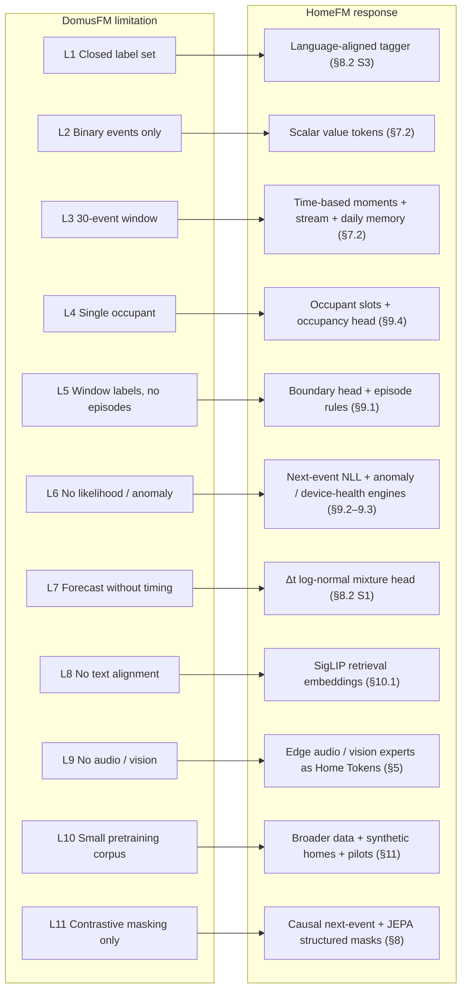

#### L1 · Closed label set, no zero-shot (R1)

- **In simple words:** DomusFM learns patterns on its own, but it can only put a *name* on an activity if it has been shown labelled examples of that activity. A new idea like "vacuuming" has no name in the model until someone provides examples.
- **In the paper:** §7.4.3 states DomusFM "does not yet operate in a zero-shot fashion" (zero-shot means recognising something with no labelled examples). Every activity-recognition result fine-tunes a linear head on 5–30 % of the target dataset's labels (§6.1.3, §6.4.3).
- **Where the labels come from:** the paper does no labelling of its own, and pretraining is label-free. The labels used for fine-tuning are the human-made activity annotations that ship with the public datasets (CASAS, UCI, …). So DomusFM *learns* without labels, but it can only *name* an activity that already has labelled examples.
- **Example:** *"How many times did someone vacuum today?"* None of the public datasets has a "vacuuming" annotation, and this home has never labelled it.
- **What goes wrong:** there is no output for "vacuuming". Pretraining may group vacuuming-like moments together (the paper's clustering task needs no labels), but the group has no name and cannot be found by the word "vacuuming". To add it as a class, someone must first provide labelled examples. 5 % of a CASAS dataset is still days of annotated activity, which a household will not provide for every new question.
- **Same failure:** "guest visit", "kids doing homework", "Dad took medicine", any concept the user invents.
- **How HomeFM fixes it:** each minute's summary is trained to sit close to text that describes it (SigLIP alignment, §8.2 Stage 3). A cooking minute lands near the words "someone is cooking". A new concept is then found by comparing minutes with its text, with no labels. Labels are still useful, but to improve accuracy, not to make a concept exist.

#### L2 · Binary events only; continuous data must be binarised (R2, R6)

- **In simple words:** DomusFM only understands on and off. Meters that report amounts (power, temperature, humidity) have to be squashed into on/off first, and the amount is thrown away.
- **In the paper:** §3.1 and §7.4.2 require continuous streams to be discretised into ON/OFF "virtual events" by pre-processing, and acknowledge possible information loss.
- **Example A:** *"How much energy did we use in the last hour?"* ON/OFF events for the kettle, oven and heater carry no kWh, so the answer cannot come from the model's input.
- **Example B:** *"Is my fridge OK?"* A failing compressor runs 25 min per cycle instead of 12 and draws 20 % more power. After binarisation both look like `fridge ON … fridge OFF`. Only the gap between events changes slightly, and the power level is gone.
- **Example C:** bathroom humidity turned into `shower ON/OFF` needs a threshold tuned per bathroom and season. A wrong threshold silently creates or deletes showers.
- **What goes wrong:** energy questions cannot be answered, slow device faults are invisible, and hand-tuned thresholds add hidden errors.
- **How HomeFM fixes it:** numbers enter the model as numbers (value tokens, sent when the value changes), so 1,800 W stays 1,800 W. Level, on/off rhythm and trend are all kept, and energy and device-health reasoning read the real signal (§7.0 step 1, §7.2).

#### L3 · Fixed 30-event window (R3)

- **In simple words:** DomusFM always looks at exactly the last 30 events. How much time that covers depends on how busy the home is: minutes when busy, hours when quiet, and never days or weeks.
- **In the paper:** §6.2 uses event-based windows of 30 events. §7.2 notes that the time covered by a fixed number of events varies widely across datasets, and performance drops in a 5-minute time-based variant.
- **Example A:** *"How many times did cooking happen in the last 4 hours?"* In a busy kitchen 30 events can be about 2 minutes, so a 40-minute cooking session spans many windows and no single window sees its start and end.
- **Example B:** at night, 30 events can cover 6 hours, so one window mixes sleeping, a bathroom trip and an early breakfast.
- **Example C:** *"Is Mum sleeping worse than last month?"* or *"Is the fridge degrading?"* need days to weeks of context. A 30-event window cannot see a trend.
- **What goes wrong:** long activities are cut into pieces, quiet periods are blurred together, and slow changes are invisible.
- **How HomeFM fixes it:** time is cut into fixed 1-minute slots, so "the last 4 hours" always means 240 steps whether the home is busy or quiet. A stream model reads hours of minutes in order, and daily summaries cover weeks (§7.0 steps 3–5).

#### L4 · Single occupant / perfect data association (R4)

- **In simple words:** DomusFM assumes one person lives in the home, or that someone has already told it who caused each event. A motion sensor fires the same way for grandma, her grandson or the dog.
- **In the paper:** §7.4.1 assumes single occupancy or that each event is already attributed to a person, and calls multi-occupant association an open challenge.
- **Example A:** *"How many people are in the living room?"* A PIR sensor fires the same way for one or four people. DomusFM has no occupancy output and no notion of "who".
- **Example B:** *"Did grandma eat lunch?"* while her grandson cooks at noon. Kitchen events are attributed to "the resident", so grandma's missed meal is hidden.
- **Example C:** the dog walks through the hallway at 2 am. Without a pet/person distinction this looks like an elderly person wandering at night: either a false alarm, or real wandering is learned as normal.
- **Example D:** *"Did we have guests?"* Guests mostly show up as more people than residents, which a single-occupant model cannot represent.
- **What goes wrong:** counts of people, per-person care questions and guest detection are impossible, and pets cause false alarms.
- **How HomeFM fixes it:** a "person card" (occupant slot) per resident and pet that events are assigned to, a per-room people count, and signals that carry identity (camera person counts, phone presence, radar) where the household allows them. With motion sensors only, it gives a calibrated range instead of a falsely confident number (§7.0, §9.4).

#### L5 · One label per window, no episode boundaries (R5)

- **In simple words:** DomusFM puts one activity label on each moment, but never says where an activity *starts* and *ends*. Counting "how many times" needs those start and end points, and a single label cannot show two things happening at once.
- **In the paper:** §6.4.1 classifies the activity at the last event of each window, with a stride of one event. The output is a per-event label sequence, not a list of occurrences.
- **Example:** *"How many times did cooking happen today?"* The model emits thousands of per-event labels, which have to be turned into episodes with no learned boundaries. A two-minute gap while stirring splits one cooking session into three. Brief "Other" labels in between (§6.1.1) fragment episodes further.
- **Example (overlapping):** cooking while the baby cries. A single-label window must pick one, so one of the two counts is wrong.
- **What goes wrong:** counts and durations are unreliable, and overlapping activities are lost.
- **How HomeFM fixes it:** several tags per minute (activities can overlap), a head that marks starts and ends, and per-activity rules in the ontology, for example "cries less than 60 s apart count as one" and "drop anything shorter than the minimum duration". Counts are computed from these episodes, not from windows (§9.1).

#### L6 · No likelihood, anomaly or device-health output (R6)

- **In simple words:** DomusFM can describe what is happening, but it cannot say *how unusual* it is for this home, and it has no idea when a sensor or appliance is broken.
- **In the paper:** §7.4.4 lists anomaly detection, behaviour-change detection and occupancy prediction as future work. The contrastive objective yields embeddings, not probabilities.
- **Example A:** *"Anything unusual last night?"* The front door opened at 03:12. DomusFM can embed that window but cannot say how improbable it is *for this home*.
- **Example B:** a PIR sensor stuck ON after a battery fault produces a regular stream of events. The model has no notion that the sensor is broken and may treat it as someone present.
- **Example C:** *"Is Dad's routine changing?"* Three night bathroom trips instead of one, week after week, is an early health signal that needs a per-person baseline and a drift score.
- **What goes wrong:** no security alerts, no fault detection, and no early warning of changing routines.
- **How HomeFM fixes it:** the model learns to predict the next event, so it can measure *surprise*: how unlikely the thing that just happened was (−log p(event | history)). The anomaly engine combines surprise with rarity and routine drift and always explains its flags. The device-health engine compares each device with its own past and with the same device type in other homes (§9.2, §9.3).

#### L7 · Forecasting without timing (R7)

- **In simple words:** DomusFM can guess *which* events are likely soon, but not *when*, or in what order.
- **In the paper:** §6.5.1 predicts the unordered bag of the next k events, deliberately ignoring order and timestamps. The 5-minute variant in §7.2 performs slightly worse.
- **Example:** *"Will Dad be up soon? I want the coffee machine ready."* The model can say bedroom and bathroom events are likely among the next 30, but not whether they come in 5 minutes or 3 hours.
- **Example (missing event):** no kitchen activity by 11:00 when breakfast normally happens by 9:00. Detecting that needs a timed expectation, which a bag of events does not provide.
- **What goes wrong:** no useful "when" predictions, and missed routines (skipped meals, missed medicine) cannot be detected.
- **How HomeFM fixes it:** the next-event head predicts which device, what value **and how long until it happens** (a log-normal mixture over Δt). "Expected by" deadlines and missed routines can then be checked (§8.2 Stage 1).

#### L8 · Embeddings not searchable by text (R10)

- **In simple words:** DomusFM stores what it learned as lists of numbers (embeddings) that are not connected to language. You cannot type a question and find matching moments.
- **In the paper:** embeddings are trained by contrasting views of event windows; they are not aligned with language.
- **Example:** *"When did someone come home late this week?"* or *"Show me the evening the kitchen was busy for hours."* The query agent has text, and DomusFM embeddings live in a different space, so there is nothing to search against.
- **What goes wrong:** open-ended and summary questions cannot use the model at all.
- **How HomeFM fixes it:** minute summaries are stored in the same space as text, so the agent's `semantic_search` tool turns a question into a vector and finds the closest minutes (open path, §5.1, §10.1).

#### L9 · Missing modalities: audio and vision are out of scope (R2)

- **In simple words:** DomusFM cannot hear or see. Anything that makes no sensor switch flip is invisible to it.
- **In the paper:** inputs are events from binary sensors and binarised continuous sensors (§3.1). Audio and camera events are not considered.
- **Example A:** *"How many times did my kid cry?"* or *"Did the dog bark while we were out?"* Crying and barking produce no binary sensor event.
- **Example B:** *"How many parcels did we receive yesterday?"* A door contact shows the door opened. Whether a parcel was left, a guest arrived or someone went out needs a camera detection.
- **What goes wrong:** whole question domains (childcare, pets, deliveries) cannot be answered.
- **How HomeFM fixes it:** audio and vision detectors run on the home hub and send only tags and embeddings, with a confidence, in the same event format (Home Tokens). HomeFM combines them with the sensor stream. Raw audio and video never leave the home (§5, §13).

#### L10 · Small, homogeneous pretraining corpus

- **In simple words:** DomusFM learned from a few public datasets, mostly single-person homes with older binary sensors. It has never seen many of the devices in a modern smart home.
- **In the paper:** pretraining uses six of seven public datasets (§5). §6.2.1 sizes the model to this small corpus.
- **Example:** a new home with Matter plugs, a doorbell camera, a smart lock, a robot vacuum and 150 devices. Locks, cameras, vacuums and air purifiers never appear in pretraining.
- **What goes wrong:** understanding of these devices rests entirely on the text description of the device ("smart lock, front door"), with no practice data behind it.
- **How HomeFM fixes it:** broader pretraining data (§11): more CASAS homes, energy datasets, simulated multi-person homes with faults added on purpose, and real pilot homes. A large teacher model trained on a server passes its knowledge to a small student that runs on the hub (§7.3).

#### L11 · Pretraining objective (see §8.1)

- **In simple words:** DomusFM's self-training game ("is this the same window with a few events hidden?") is too easy on home data. The model wins it by learning how sensors behave rather than what people do.
- **In the paper:** §4.3 uses masking only as augmentation for in-batch InfoNCE.
- **Example A:** motion sensors fire ON and then OFF a few seconds later. Hide the OFF and it is trivially guessed from the ON, so the attribute-masking stage mostly learns sensor mechanics.
- **Example B:** two windows of a resident sleeping on different nights land in the same batch and are pushed apart as "different", although they are the same behaviour.
- **What goes wrong:** pretraining carries little useful signal. In our real-data reproduction the contrastive loss fell to about 0.001 almost immediately, and pretraining gave no benefit on UCI B or hh101 ([DOMUSFM_REPRODUCTION.md](DOMUSFM_REPRODUCTION.md), §8.0).
- **How HomeFM fixes it:** harder and more useful games: predict the next event and when it happens; hide large structured chunks (a time block, a device, a room, a modality) and predict their meaning (JEPA); align with language using a loss that allows many matches (SigLIP). The choice is tested, not assumed, in the A–F comparison (§8.2, §8.3).

#### What DomusFM does well, and we keep

- **Sensor attributes as text** is what makes cross-home transfer work; its results with 5 % labels on unseen datasets support this.
- **Attribute-level fusion** of what, where, state and time.
- **Edge feasibility:** 36M parameters, < 500 MB, ~10 ms per window on a Celeron CPU.
- **Leave-one-dataset-out evaluation**, which we adopt as our protocol.

### 4.2 DomusFM vs HomeFM, step by step

This section follows the data through both models in order. Each step has a plain-words comparison, then the technical detail, then its status in our code. Terms in **bold** are defined in §1.1.

Status: ✅ implemented in the scaffold (`src/homefm/`) · 📐 designed, not implemented yet. DomusFM is fully reimplemented in `src/homefm/baselines/domusfm/`.

#### Step 1 · What goes in

- **DomusFM:** only on/off signals ("kitchen motion ON", "fridge door OPEN"). Meters that report amounts (power, temperature) must be turned into on/off first, and the amount is thrown away.
- **HomeFM:** any signal: on/off, numbers (1,850 W, 23 °C), and tags from sound and camera detectors ("baby crying", "parcel at door"), each with a confidence. The detectors run on the home hub, so raw audio and video stay at home.
- **Why it matters:** energy, appliance-fault, crying and parcel questions are impossible without numbers, sound and camera tags.
- **Technically:** DomusFM takes `(timestamp, sensor, status ∈ {OFF, ON})` and binarises continuous signals in pre-processing (paper §3.1). A HomeFM **Home Token** carries `ts, entity, modality, state, value, confidence, source` (§6.1).
- **Status:** ✅ schema, converters and batching · 📐 the audio and vision detectors themselves.

#### Step 2 · How each event is described

- **DomusFM:** each device is described in words ("motion sensor, kitchen, ceiling"), and those words become a vector. This lets the model work in a home it has never seen. **HomeFM keeps this idea.**
- **HomeFM:** the same words, plus the value (1,850 W), how long since the last event, where the signal came from, and how confident it is.
- **Technically:**
  - DomusFM fuses 5 attribute vectors per event by **attribute fusion** (one self-attention layer over the attributes, then mean-pooled): item, sensor type and room (frozen **MiniLM** text vectors), status (a learned embedding over ON, OFF and MASK), and time (**cyclic encoding** of day and hour, plus a learned seconds-in-hour embedding).
  - HomeFM fuses 4 attribute vectors the same way: entity text (MiniLM + a linear layer), value (state embedding + an MLP of the number), time (cyclic encoding + **Δt** features: time since the previous event and since this device last fired), and meta (modality + confidence).
- **Status:** ✅ (`model/embedder.py`).

#### Step 3 · How time is cut up

- **DomusFM:** looks at the last **30 events**. The time this covers depends on how busy the house is: about 2 minutes while cooking, about 6 hours at night.
- **HomeFM:** cuts time into **1-minute slots**, and summarises all events in a minute into one **moment** vector. One minute is always one minute.
- **Why it matters:** "the last 4 hours" is always 240 steps. A 40-minute cooking session is not chopped up, and a quiet night is not blurred into one blob.
- **Technically:**
  - DomusFM: count-based windows of 30 events with stride 1 and no positional encoding.
  - HomeFM: a **Perceiver**-style **moment encoder**. Four learned **latent** queries attend to the events inside each minute. A **segment softmax** processes all minutes in one pass. A learned "quiet" key makes an empty minute a well-defined "nothing happened" vector. The event count and the minute's time are added.
- **Status:** ✅ (`model/moment_encoder.py`).

#### Step 4 · How far back it remembers

- **DomusFM:** 30 events only. It has no memory of yesterday or last week.
- **HomeFM:** reads hours of minutes in order, plus **daily summaries** for weeks.
- **Why it matters:** "Is Mum sleeping worse than last month?" and "Is the fridge getting worse?" need weeks of memory.
- **Technically:**
  - DomusFM: a 12-layer, 12-head transformer with d = 384. Our reimplementation has 28.6M parameters; the paper reports 36M, and the gap is in details the paper leaves unspecified.
  - HomeFM: a **stream transformer** over minutes, with learned positions up to 1,024 minutes (about 17 h). The corpus configuration is d = 256, 6 layers, 8.0M parameters. For weeks, a second small transformer runs over one **day token** per day.
- **Status:** ✅ minute stream · 📐 day tokens.

#### Step 5 · Reading live, and looking back

- **DomusFM:** reads each 30-event window as a whole, and redoes it from scratch for every new event.
- **HomeFM:** two modes with the same weights:
  - **Live:** reads only the past, minute by minute, and keeps earlier work instead of redoing it. This is fast on a small home hub.
  - **Look-back:** about once an hour, it re-reads recent hours in both directions to fix things. For example, once dinner has ended it can set the correct end time.
- **Technically:**
  - DomusFM: **bidirectional** attention with stride 1, so each new event re-encodes the whole window through 12 layers.
  - HomeFM **causal** mode masks future minutes, and with a **KV cache** each new minute costs one token. Bidirectional mode is used for look-back refinement, stored embeddings and pretraining.
  - A small **event read-out** transformer gives event-level detail for next-event prediction. It uses only the previous minute's context, so it never sees the future.
- **Status:** ✅ causal and bidirectional modes, event read-out · 📐 KV-cache streaming.

#### Step 6 · How it is trained (the practice game)

- **DomusFM:** one game: "hide a few events, then check whether the two versions of the window match". On real home data this is **too easy**: in our runs the loss falls to about 0.001 almost immediately, and pretraining gives little or no gain.
- **HomeFM:** three harder, more useful games:
  1. **Predict the next event and when it will happen** ("kitchen motion, in about 2 minutes"). This teaches routines and timing, and gives a surprise score.
  2. **Hide a big chunk and guess what it meant:** 10 minutes, a whole room, or all power meters. The model cannot win by copying a paired ON/OFF event.
  3. **Match minutes with sentences:** a cooking minute should sit near "someone is cooking". This connects the model to words.
- **Technically:**
  - DomusFM uses **contrastive learning** with **InfoNCE**. The mean-pooled embeddings of a window and its masked copy are the positive pair, and the other windows in the batch are the negatives. Phase 1 masks one attribute per selected event, and phase 2 masks whole events with the event layer frozen.
  - HomeFM game 1 is a **marked temporal point process**. It predicts which device fires next (by dot product with the text vectors of the home's own devices), its state and value, and **Δt** (a **log-normal mixture**). The negative log-likelihood (**NLL**) is the surprise score.
  - HomeFM game 2 is **JEPA**. A predictor fills in the hidden minutes' vectors, and the targets come from an **EMA** copy of the model that sees everything. Mask families are time blocks, devices, rooms, modalities and rare devices.
  - HomeFM game 3 is **SigLIP** alignment. Minute and sentence vectors pass through **projection heads** into a shared space, and every pair is scored as match or no-match. Repeats of the same routine are therefore not pushed apart.
  - Variant F also adds **gradient reversal**, so the model does not learn which home the data came from. Variant E = games 1 + 2, and F adds game 3 (§8.3). Variant G adds the refinements in §8.4.
- **Status:** ✅ A–F (`objectives/`) · 📐 per-minute alignment (it is per-window today) and variant G.

#### Step 7 · What it outputs (the heads)

- **DomusFM:** two outputs: one activity label from a fixed list learned from labels, and the next 30 events as an unordered bag with no timing.
- **HomeFM:** many outputs from each minute:

| Head | Answers | Status |
|---|---|---|
| Next event with timing | What happens next, and **when** | ✅ |
| Activity by sentence (tagger) | Any activity, including new ones, and several at once | 📐 |
| Start / end (boundary) | Where an activity begins and ends, so it can be counted | 📐 |
| People (occupancy) | How many people per room, and who | 📐 |
| Surprise / anomaly | How unusual this is for this home | Surprise ✅ · engine 📐 |
| Device health | Stuck sensor, dying battery, longer fridge cycles | 📐 |

- **Technically:**
  - DomusFM activity head: `Linear(d, n_classes)` on the last event's vector, trained with cross-entropy on 5–30 % of labels. Next-k head: presence (binary cross-entropy) plus count per event type (squared error) on the pooled window, scored by multiset F1.
  - HomeFM tagger: `σ(a · cos(P(minute), P(text(concept))) + b)`. A concept's reference vector comes from its sentence instead of a learned weight row, so a new concept is a new sentence (§1.1).

#### Step 8 · From outputs to an answer

- **DomusFM:** stops at the labels. It has no storage, no counting and no way to ask questions. It is a research model evaluated on benchmarks.
- **HomeFM:** a full system around the model:
  1. Minute labels are joined into **episodes** ("cooking 18:30–19:22") and saved in the episode store.
  2. Minute vectors are saved in a **vector store** for search by meaning.
  3. An **LLM agent** reads the question, calls tools and answers with times, evidence and confidence (§10, worked example in §10.2).
- **Technically:** the episode builder applies **hysteresis** smoothing, merges gaps shorter than `g(concept)` and drops episodes shorter than `min_duration(concept)`. The stores are SQL tables plus a vector index (fp16, tagged with the model version). The agent is a local 3–8B LLM with function calling.
- **Status:** 📐.

#### Step 9 · People in the home

- **DomusFM:** assumes one person lives there. It cannot tell grandma from her grandson or from the dog.
- **HomeFM:** a **person card** (occupant slot) for each resident and pet, and a people count per room. It uses identity signals (phone presence, camera, radar) where the household allows them. With motion sensors only, it gives an honest range ("1–2 people") instead of a guess.
- **Technically:** learned occupant-slot vectors that each minute's events attend to (Slot Attention–style), a per-room count regression supervised by camera or radar counts, and `person_id` carried on Home Tokens.
- **Status:** 📐.

#### Summary

| Step | DomusFM | HomeFM | Status |
|---|---|---|---|
| 1. Input | On/off only | On/off + numbers + sound/camera tags | ✅ / 📐 detectors |
| 2. Event description | Device in words | Same + value + Δt + meta | ✅ |
| 3. Time unit | Last 30 events | 1-minute moments | ✅ |
| 4. Memory | 30 events | Hours of minutes + day tokens for weeks | ✅ / 📐 days |
| 5. Reading | Whole window, recomputed for every event | Live (past only, cached) + hourly look-back | ✅ / 📐 cache |
| 6. Training game | Hide-and-match (InfoNCE), too easy | Next event + when, JEPA, SigLIP | ✅ A–F |
| 7. Outputs | 1 label from a fixed list + next-30 bag | Next event, tagger, boundaries, people, surprise, device health | ✅ next event / 📐 rest |
| 8. Answering | None | Episodes + stores + vector search + LLM agent | 📐 |
| 9. People | One person assumed | Person cards + per-room counts | 📐 |

## 5. System architecture

Four layers. HomeFM sits in L2; the rest of the system turns its outputs into answers.


### 5.1 Three answer paths

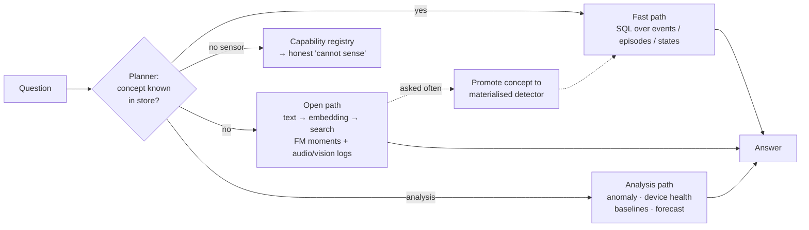

- **Fast path:** concepts already materialised (cooking, parcel, bark) → exact SQL answers.
- **Open path:** concepts not materialised → semantic search over HomeFM moment embeddings, with confidence.
- **Analysis path:** anomaly, device-health, baseline comparison and forecasting tools.
- **Promotion loop:** frequently asked open-path concepts become materialised detectors.

### 5.2 Two pipelines: training and live

HomeFM runs as **two separate pipelines**:

- **Training** happens offline on a server, once per model release. Its only output is a trained model file.
- **Live** runs all the time on the home hub. It uses that model file, and its outputs are the stored facts and vectors that the agent reads.

A common misunderstanding is that pretraining is a step each event passes through. It is not: pretraining produces the model, and the live pipeline runs the model.

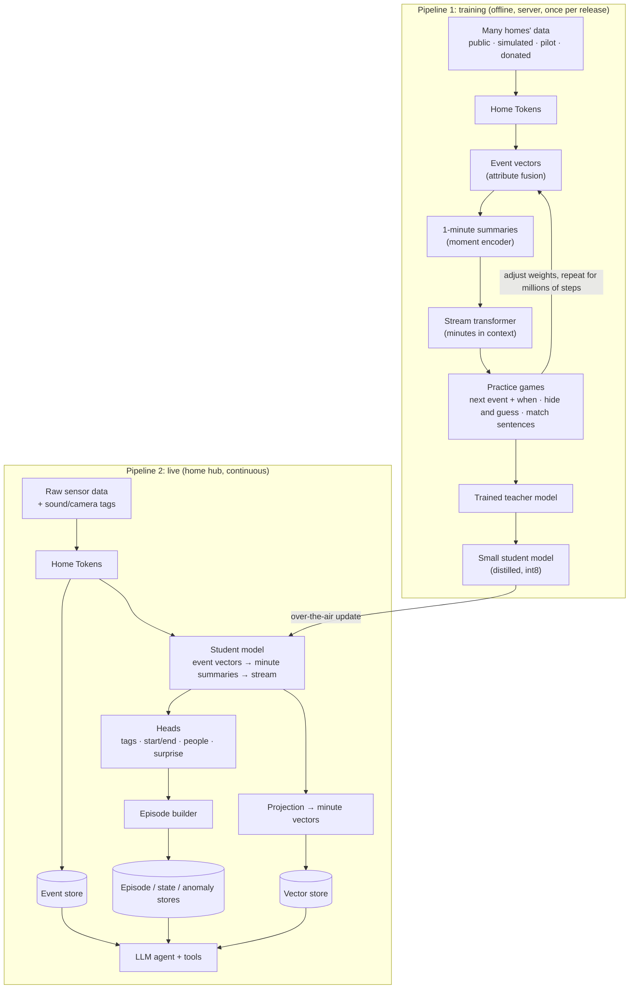

#### Pipeline 1: training (offline)

| Step | What happens | Section |
|---|---|---|
| 1. Collect data | Public datasets, simulated homes, pilot and donated homes, all converted to Home Tokens | §11 |
| 2. Encode | The same model path as live: event vectors → 1-minute summaries → stream transformer | §7 |
| 3. Play the practice games | Predict the next event and when; hide big chunks and guess their meaning; match minutes with sentences. No labels are needed except captions for the third game. | §8 |
| 4. Adjust and repeat | The model's weights are adjusted after every batch, for millions of steps | §8.2 |
| 5. Fine-tune (optional) | A few labels and user feedback improve specific heads | §8.2 Stage 4 |
| 6. Distil and ship | The large teacher trains a small student that fits on the hub, which is sent as an update | §7.3, §13 |

Nothing searchable is stored in this pipeline. It produces only the **model file**.

#### Pipeline 2: live (on the home hub)

The live pipeline works at five rhythms:

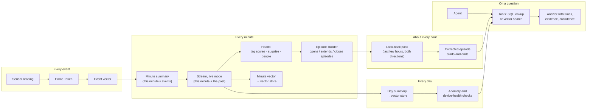

| Rhythm | What happens | What gets stored | Status |
|---|---|---|---|
| **Every event** | Raw sensor reading → Home Token → event vector | Raw event → **event store** | ✅ model path · 📐 store |
| **Every minute** | That minute's event vectors → one minute summary → the stream transformer reads it with the past minutes (live mode) → contextual minute vector → heads | Minute vector → **vector store**. Tag scores, surprise and people count for this minute | ✅ model path · 📐 heads and store |
| **Every minute** | The episode builder opens, extends or closes episodes ("cooking still going") | Closed episodes → **episode store** | 📐 |
| **About every hour** | The look-back pass re-reads the last few hours in both directions and corrects episode starts and ends (below) | Corrected **episodes** | ✅ bidirectional mode · 📐 pass |
| **Every day** | A day summary is made from the day's minutes. Anomaly and device-health checks run. | Day vector → **vector store**. Flags → **anomaly and device-health tables** | 📐 |
| **On a question** | The agent resolves the words and the time, calls tools and writes the answer | Nothing new, except feedback saved as labels | 📐 |

There are two kinds of minute vector:

- The **minute summary** is made *before* the stream transformer, from that minute's events alone.
- The **contextual minute vector** comes *after* it, and includes the past. This is the one that is projected and stored for search.

"Vectorise" is not a separate step: minute and day vectors come straight out of the model, plus a small projection that puts them on the same map as sentences (§10.1 Bridge 2).

#### Live mode and look-back mode

The stream transformer runs in two modes with the **same weights**. Only one setting changes: which minutes each minute is allowed to look at.

| | Live mode (causal) | Look-back mode (bidirectional) |
|---|---|---|
| **Runs** | Every minute | About once an hour |
| **Reads** | The new minute plus everything before it | A block of recent hours, all at once |
| **Each minute can look at** | Only earlier minutes | Earlier **and later** minutes inside the block |
| **Good for** | "What is happening now?", alarms, surprise, forecasts | Correct counts and durations for history |
| **Weakness** | Cannot know what comes next, so a pause looks like an end | Delayed: it needs time to pass first |
| **Code** | `encode(batch, causal=True)` | `encode(batch, causal=False)` |

**Look-back mode does not see the real future.** At 20:00 it re-reads 17:00–20:00, all of which has already happened. When it re-checks 18:53, it can use what happened at 18:59 because 18:59 is already history. It is like a live cricket commentator compared with the newspaper report the next morning: the report is more accurate because it is written with hindsight.

#### Worked example: one dinner

What actually happened in the kitchen:

| Time | Event |
|---|---|
| 18:30 | Stove on, cooking starts |
| 18:52 | Stove **off** (stirring, letting it rest) |
| 18:59 | Stove **on again** |
| 19:22 | Stove off, food ready |
| 19:22–19:25 | Washing a pan, wiping the counter |
| 19:26 | Kitchen empty |

The truth is **one cooking session, 18:30–19:22**.

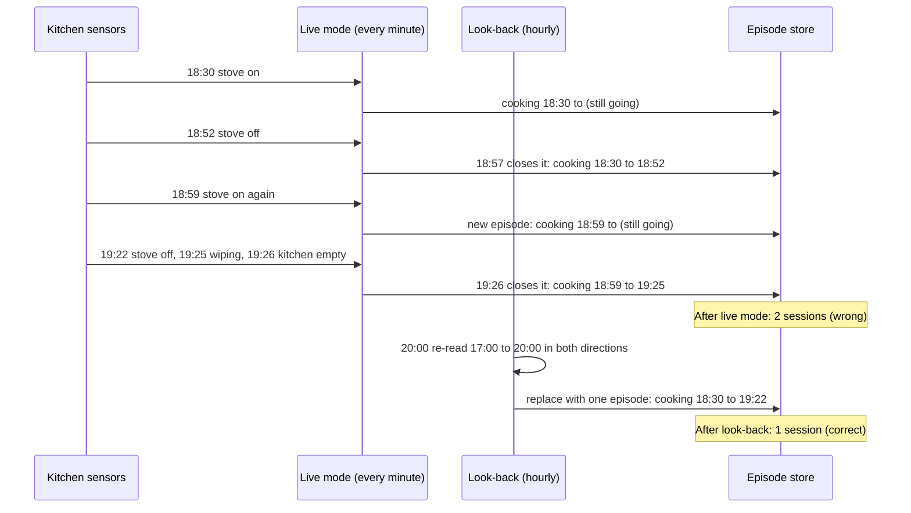

**Live mode, minute by minute.** Each guess is the best possible with what was known *at that moment*:

| Clock time | What live mode knows so far | Its guess | Episode store |
|---|---|---|---|
| 18:30 | Stove just turned on, someone in the kitchen | Cooking started | `cooking 18:30 → (still going)` |
| 18:53 | Stove turned off a minute ago | Maybe cooking ended? | `cooking 18:30 → (still going)` |
| 18:57 | Stove off for 5 minutes, kitchen quiet | Cooking ended at 18:52 | `cooking 18:30 → 18:52` ❌ |
| 18:59 | Stove on again | A **new** cooking session | `cooking 18:59 → (still going)` ❌ |
| 19:25 | Tap, cupboard, wiping | Still cooking | `cooking 18:59 → (still going)` ❌ |
| 19:26 | Kitchen empty | Cooking ended | `cooking 18:59 → 19:25` ❌ |

This is not a bug: at 18:57 nobody could know that the stove would come back on at 18:59.

**Look-back pass at 20:00.** It reads 17:00–20:00 as one block and re-checks each minute using what came before and after it:

| Minute re-checked | Before it | After it (already happened by 20:00) | New decision |
|---|---|---|---|
| 18:53 (stove off) | Cooking since 18:30 | Stove on again at 18:59 | A **pause**, not an end ✅ |
| 18:59 (stove on) | Cooking a few minutes ago | Continues until 19:22 | The **same** session continuing ✅ |
| 19:23–19:25 (tap, wiping) | Stove just turned off | Kitchen empty at 19:26 | **Cleaning up**, so cooking ended at 19:22 ✅ |

The store is corrected:

```
BEFORE (live mode):                AFTER (look-back at 20:00):
cooking  18:30 – 18:52   ❌         cooking  18:30 – 19:22   ✅
cooking  18:59 – 19:25   ❌
```

**What the user sees at different times:**

| Asked at | Question | Answer | Source |
|---|---|---|---|
| 18:57 | "Is anyone cooking?" | "Cooking from 18:30, **seems to have stopped** at 18:52." | Live mode, the best guess at that moment |
| 19:10 | "Is anyone cooking?" | "**Yes**, cooking since 18:59." | Live mode, start time still slightly wrong |
| 21:00 | "How many times did we cook tonight?" | "**Once**, 18:30–19:22." | Corrected by the 20:00 look-back ✅ |

Questions about **now** use live mode (fast, best guess). Questions about **the past** use the corrected episodes (accurate).

**Why several hours per pass:** at 20:00 the newest minutes (19:58, 19:59) have almost no "after". Each pass therefore re-reads several recent hours, overlapping the previous pass, so every minute is re-checked once enough time has passed after it.

## 6. Data model

### 6.1 Home Token (common event format)

Every signal, from any sensor or expert, becomes a Home Token:

| Field | Type | Notes |
|---|---|---|
| `ts` | float (unix seconds) | Event time, home timezone stored separately |
| `home_id` | str | |
| `entity` | Entity | See below |
| `modality` | enum | `binary`, `scalar`, `audio_tag`, `vision_det`, `embedding` |
| `state` | int ∈ {OFF, ON, NA} | For binary modality |
| `value` | float \| None | Scalar reading or patch statistic |
| `vector` | float[] \| None | Audio / vision embedding (optional) |
| `tag` | int \| None | Detector tag: a row in the tag vocabulary, e.g. "baby crying" (§6.4). The `entity` is the microphone or camera itself. *Planned.* |
| `confidence` | float ∈ [0,1] | 1.0 for physical sensors; model score for experts |
| `source` | enum | `sensor`, `expert`, `homefm` |
| `person_id` | str \| None | When known (camera, phone presence, wearable) |

**Entity** = `{entity_id, item, room, sensor_type, capability}`. The text `"{item} in {room}, {sensor_type} sensor"` is embedded with a frozen text encoder → the model never sees home-specific IDs (R8).

### 6.2 Home ontology

SAREF/Brick-inspired graph: `Home → Room → Device → Capability`, plus `Resident`, `Pet`, and aliases ("kid" → resident *Aarav*, "grandma's room" → *Bedroom 2*). The **capability registry** records which concepts are observable in this home, so the agent can refuse honestly. The **device registry** (§6.5) is part of the ontology: one row per device, with its description and the numbers the model reads.

### 6.3 Stores

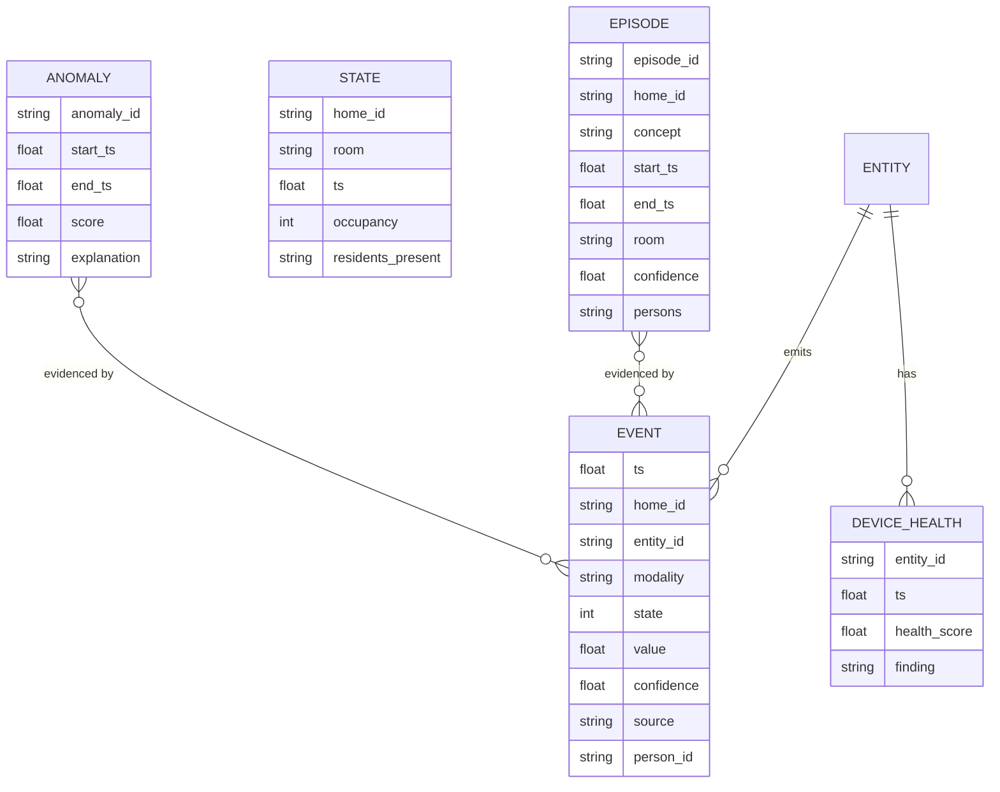

### 6.4 From raw data to Home Tokens

Raw data arrives in many shapes: dataset lines (`2012-07-20 10:12:03 M014 ON`), hub state changes (`binary_sensor.kitchen_motion → "on"`), meter readings (`180.5 W`) and detector outputs (`"baby crying", 0.87`). Conversion turns every one of them into the same Home Token (§6.1). It happens in **two phases**:

- **Setup, once per device:** the device's names become one description, and the description becomes numbers (the device registry, §6.5). Detector tags get their own small vocabulary table, set up once per detector model.
- **Every event:** the reading is converted into a Home Token that **points to** the device's row (and, for detector events, to the tag's row), instead of carrying any text.

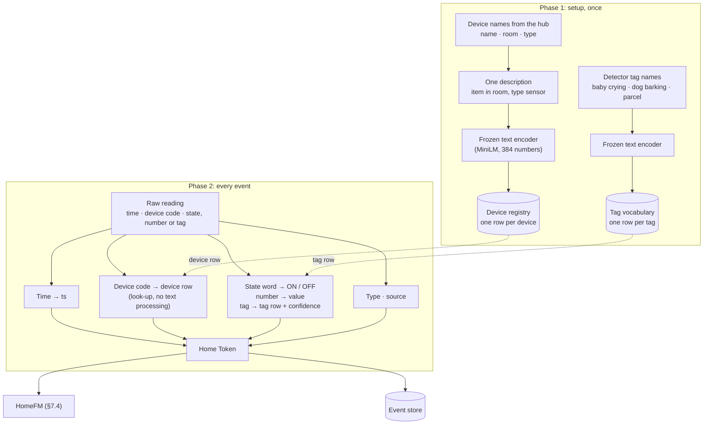

#### Phase 1: setup (once per device)

1. **Collect the names the hub already has:** name, room and type (§6.6 explains where they come from).
2. **Join them into one description** with a fixed pattern: **"{item} in {room}, {type} sensor"**.
3. **Turn the description into numbers once** with the frozen text encoder, and save the result as the device's row.

| Device code | Names from the hub | Description | Row |
|---|---|---|---|
| `M014` | Kitchen Motion · Kitchen · motion | "ceiling in kitchen, motion sensor" | 0 |
| `fridge_power` | Fridge Plug · Kitchen · power | "fridge in kitchen, power sensor" | 1 |
| `nursery_mic` | Nursery Mic · Nursery · audio detector | "microphone in nursery, audio sensor" | 2 |

Only **real devices** get a row: the microphone, not "baby crying". What a detector hears or sees is carried by each event as a **tag** that points to the tag vocabulary (below), and the activity itself ("the baby cried from 18:40 to 18:46") is a concept that HomeFM decides later from several signals (see *Devices, observations and activities* below).

4. **Tag vocabulary, once per detector model.** Each detector has a fixed list of tags it can output. Each tag name is turned into numbers once:

| Tag row | Tag | Detector |
|---|---|---|
| 17 | "baby crying" | Sound detector |
| 18 | "dog barking" | Sound detector |
| 19 | "glass breaking" | Sound detector |
| 42 | "parcel at door" | Camera detector |
| 43 | "person at door" | Camera detector |

#### Phase 2: every event

There are three kinds of raw event, and each is converted differently.

**Kind 1: on/off sensor, where the state word becomes ON or OFF.**

```
Raw:          2026-09-24 18:31:02   M014   "on"
Home Token:   ts=18:31:02   entity=row 0   state=ON   value=none
              modality=binary   confidence=1.0   source=sensor
```

Different hubs use different words for the same state, so they are mapped:

| Raw word | State |
|---|---|
| "on", "open", "detected", "motion", "unlocked" | ON |
| "off", "closed", "clear", "no motion", "locked" | OFF |

**Kind 2: meter, where the number stays a number.**

```
Raw:          2026-09-24 18:31:05   fridge_power   "180.5 W"
Home Token:   ts=18:31:05   entity=row 1   state=NA   value=180.5
              modality=scalar   confidence=1.0   source=sensor
```

The unit is removed and the number is kept. Readings are emitted only when the value changes meaningfully, not every second.

**Kind 3: detector output, where the device is the microphone or camera and the tag is what it heard or saw.**

```
Raw:          2026-09-24 18:40:05   nursery_mic   tag="baby crying"   score=0.87
Home Token:   ts=18:40:05   entity=row 2 (microphone in nursery)   tag=row 17 ("baby crying")
              modality=audio_tag   confidence=0.87   source=expert   vector=(optional detector embedding)
```

The device says **where and how** it was observed. The tag says **what** was observed. The confidence says how sure the detector is. A detector may also pass its own embedding of the sound or image in the `vector` field, so HomeFM is not limited to the detector's fixed tag list.

#### Devices, observations and activities are three different things

| Layer | What it is | Example | Where it lives |
|---|---|---|---|
| **Device** | A physical sensor or detector input | Nursery microphone, doorbell camera, kitchen motion sensor | Device registry (§6.5) |
| **Observation** | One thing a device reported, at one moment | "baby-crying sound, 0.87" at 18:40:05 · "baby moving in cot" at 18:40:10 · nursery motion ON | Home Tokens → event store |
| **Activity** | Something that happened over time, decided from **several** observations | "The baby cried, 18:40–18:46" | Concept in the ontology → HomeFM tagger → episode store (§9.1) |

A sound detector's "baby crying" tag is **evidence**, not the answer. A single tag can be wrong: the TV plays a crying baby, a sibling makes a similar sound, the microphone picks up the neighbour's child. HomeFM decides the **activity** by fusing observations from several devices in the same minutes:

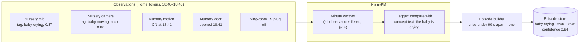

| Evidence | Pushes towards "baby crying" | Why |
|---|---|---|
| Sound tag "baby crying" in the nursery | Strongly yes | Direct evidence |
| Camera: baby moving in the cot | Yes | Awake and restless |
| A parent opens the nursery door a minute later | Yes | Someone responded |
| The same sound tag in the living room while the TV is on | Strongly no | Probably the TV |
| Sound tag, but the cot is empty on camera | No | The baby is not there |

This is audio–video fusion, and it happens **inside HomeFM**, not in the detectors. Each detector stays simple (one input, a fixed tag list), and HomeFM learns how observations from different devices combine. The same pattern applies to every detector-based activity: a parcel is a "parcel at door" tag plus a courier who leaves within seconds plus the door staying closed; a fall is a radar or camera "person fell" tag plus no movement afterwards.

#### What "points to a row" means

A Home Token never carries the description text or its numbers, only the row number. When the model reads the token, it fetches that row's numbers from the device registry (§6.5). It works like a phone's contact list: the call history stores a link to "Mum", not her full details on every call. This keeps events tiny, avoids running the text encoder thousands of times a day, and guarantees that every event from one device uses exactly the same numbers.

#### The device code is a lookup key, not an embedding

A frequent confusion: the raw file says `M014`, the device registry holds an embedding of the sentence "ceiling in kitchen, motion sensor", and it can look as if there are two different device embeddings that must somehow match. **There is only one.** The code `M014` (or its row number in the Home Token) is **never turned into numbers**. It is only used to **look up** the sentence's embedding, as a phone looks up a caller's number in its contacts to show "Mum".

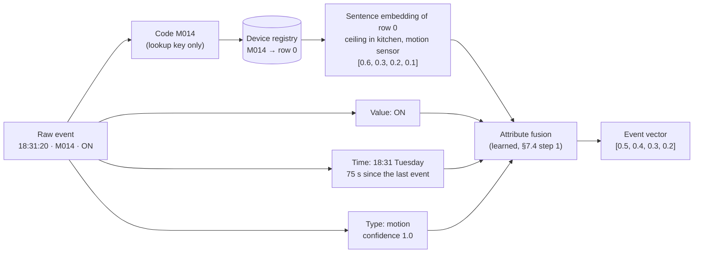

The sentence embedding and the event vector are different numbers, but they do not need to match: the sentence embedding is an **ingredient** of the event vector, like flour in a cake. The event vector adds the value, the time and the type.

| | Sentence embedding | Event vector |
|---|---|---|
| Made from | The device sentence, by the frozen text encoder | Sentence embedding **+** value + time + type, by HomeFM's attribute fusion |
| How many | One per device | One per event |
| Made when | Once, at setup | Every time an event is read (every training round, and live) |
| Learned? | No, the text encoder never changes | Yes, attribute fusion learns during training |

**Why the sentence is needed at all.** Device codes mean nothing on their own and differ between homes: `M014` is kitchen motion in hh101 but bedroom motion in hh102, and kitchen motion is `M031` in hh102 and `binary_sensor.motion_3` in a Home Assistant home. The sentence gives every home's kitchen motion sensor the **same** numbers whatever its code, and gives the bedroom sensor **different** numbers. That is what lets one model learn "kitchen motion + stove in the evening = cooking" once across 77 homes, understand a new home's devices without retraining, and make a sensible first guess about device types it never trained on (a "front door in hallway, lock sensor" lands near "front door in hallway, contact sensor"). Learning separate numbers per code instead would work only inside one home, which is why DomusFM introduced sentence-described devices and HomeFM keeps them.

#### Where text appears in raw data

| Raw data | Text in it | What happens to it |
|---|---|---|
| Device names, rooms, types | Short names ("Kitchen Motion", "Kitchen") | Joined into one description at setup, turned into numbers once |
| State words | "on", "open", "detected" | Mapped to ON / OFF |
| Detector tags | "baby crying", "parcel at door" | Looked up in the tag vocabulary. The event's device is the microphone or camera. |
| Dataset activity labels (training only) | `Cook_Begin`, `Sleep_End` | Not part of the event stream. Used as labels and turned into captions for alignment (§8.2 Stage 3) |
| Free-text messages | "Your parcel was delivered to the front door" | **Not handled yet** (open question, §15) |

Raw data rarely contains real sentences. Where it does, two options are open: map the message to a tag (kind 3), or turn the sentence into numbers with the text encoder and pass it as an `embedding`-modality token, which the Home Token already supports.

**Status:** the Home Token format (with `modality`, `confidence` and `vector`) ✅, and the CASAS and UCI converters ✅. The tag field and tag vocabulary are 📐: the scaffold's simulator currently simplifies by giving each detector tag its own entity row ("baby crying in nursery, audio sensor"), which mixes the device with the observation. The design above replaces that (§15).

### 6.5 Device registry (the device table)

The device registry is the per-home table built in §6.4 Phase 1. It has two parts:

| Part | Holds | Storage |
|---|---|---|
| **Registry rows** (text) | Device ID, item, room, type, description, text-encoder version, date added, active flag | A normal database table (for example SQLite) on the hub, as part of the ontology (§6.2) |
| **Device numbers** (vectors) | The text encoder's 384 numbers per row | Stored with the rows (a binary column or a small file), **loaded into memory as one matrix** when the model starts |

| row | device_id | item | room | type | description | encoder | added | active |
|---|---|---|---|---|---|---|---|---|
| 0 | M014 | ceiling | kitchen | motion | "ceiling in kitchen, motion sensor" | MiniLM-L6-v2 | 2026-09-01 | ✅ |
| 1 | fridge_power | fridge | kitchen | power | "fridge in kitchen, power sensor" | MiniLM-L6-v2 | 2026-09-01 | ✅ |
| 2 | nursery_mic | microphone | nursery | audio detector | "microphone in nursery, audio sensor" | MiniLM-L6-v2 | 2026-09-03 | ✅ |

It is small: 150 devices × 384 numbers × 4 bytes ≈ **230 KB**.

Next to it sits the **tag vocabulary** (§6.4): one row per tag a detector can output ("baby crying", "parcel at door"), with the tag's numbers from the same text encoder. It is shared by every home that uses the same detector models, and is equally small. Activities such as "the baby cried" are **neither** devices nor tags: they are concepts in the ontology (§6.2), decided by HomeFM from many observations and stored as episodes.

#### Where it sits

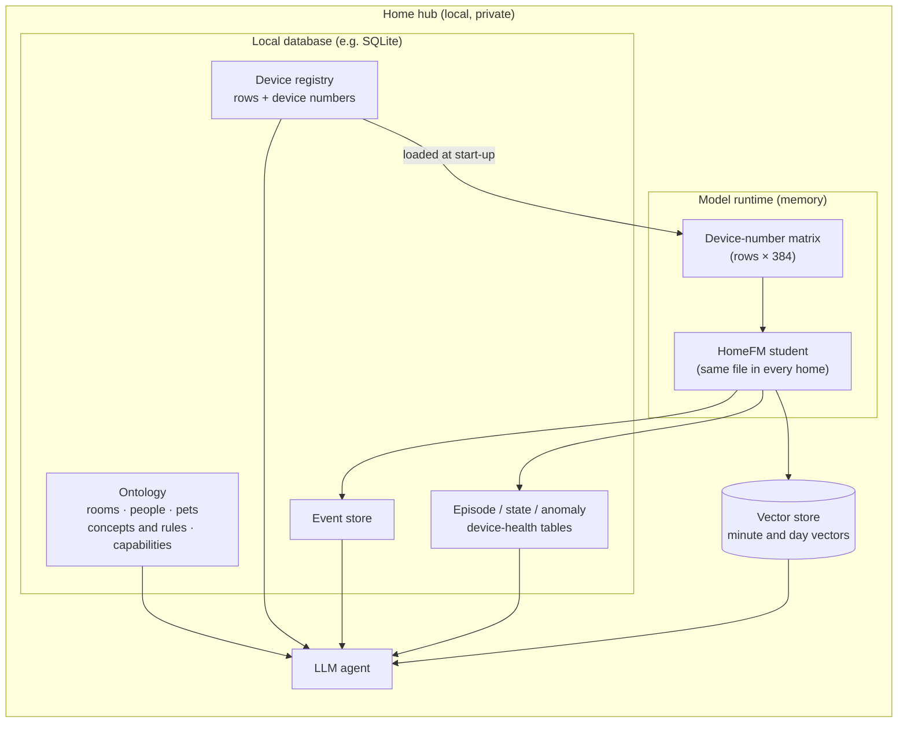

The registry lives on the hub with the rest of the home's data and never needs to leave the home. **The model reads its numbers; the agent reads its text.**

#### Where it is used

| Use | Who | How |
|---|---|---|
| **A. Reading every event** | Model, step 1 (attribute fusion, §7.4) | The token says `entity = row 0`, so the model fetches row 0's numbers as the event's "what" fact. Without the registry, "row 0" would be a meaningless number. For a detector event, the tag's numbers from the tag vocabulary become its "value" fact. |
| **B. Predicting the next device** | Next-event head (§8.2 Stage 1, surprise in §9.2) | The prediction is compared with **every row of this home's registry** and the closest wins. It can never predict a device the home does not have. |
| **C. Mapping words to devices** | Agent, capability check, device-health engine | "fridge" in a question → `fridge_power`. "No microphone in the nursery" → "I can't count crying there". Device health follows each row's events over time. |

#### Why it is kept outside the model

| | Model weights | Device registry |
|---|---|---|
| Shared across homes? | **Yes**, one model file for every home | **No**, one per home |
| Made during | Training, on the server | Setup, on the hub |
| Changes when | A new model release arrives | A device is added, renamed or moved |
| Contains | What was learned about behaviour | This home's devices, as descriptions and numbers |

This separation is what lets **one trained model work in any home**. A new device only needs a new row, with **no retraining**. It is like a chef (the model) and a pantry list (the registry): the chef's skills are the same in every kitchen, and the list says what this kitchen has.

#### Why not in the vector store

| | Device registry | Vector store |
|---|---|---|
| Rows | About 20–200 devices | Hundreds of thousands of minute vectors per year |
| Access | By row number ("give me row 0") | By similarity ("minutes near 'frying'") |
| Changes | Rarely | Every minute |
| Best tool | Plain table + a matrix in memory | A nearest-neighbour database |

#### Lifecycle

| Change | What happens |
|---|---|
| New device added | New row: description → text encoder → numbers. Used immediately, no retraining. |
| Device renamed or moved | Description updated, numbers recomputed |
| Device removed | Row marked **inactive**, not deleted, because older events still point to it |
| Text encoder upgraded (with a model release) | All rows recomputed. The encoder column records which version made them. |

#### During training

The server builds one registry per training home from each dataset's sensor layout (the CASAS and UCI converters do this automatically) and combines them into one matrix for the run. Each home's events point only to its own rows, and next-device prediction is restricted to that home's rows (`home_entity_mask`).

#### Status

| Part | Status |
|---|---|
| Device numbers as an in-memory matrix (`entity_table` in HomeFM, `text_table` in DomusFM) | ✅ |
| Building the matrix from dataset sensor layouts (converters) | ✅ |
| Uses A and B in the model (`EventEmbedder`, `NextEventHead.entity_logits` with `home_entity_mask`) | ✅ |
| Persistent registry on the hub (SQLite rows, active flag, encoder version) | 📐 |
| Tag vocabulary and a tag field on Home Tokens (the scaffold simulator still gives each tag its own entity row) | 📐 |
| **Gap:** HomeFM currently saves `entity_table` inside the model file. For deployment it must be separate, so one model file serves every home and each home loads its own registry. | 📐 (§15) |

### 6.6 Home onboarding: building the device registry

Nobody has to tag every device by hand. Smart-home platforms already store each device's name, room and type, because voice assistants and apps need them. Onboarding imports that information, cleans it up, and asks the user only about gaps.

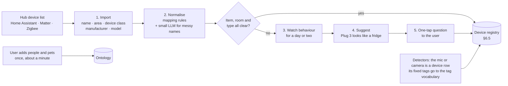

**1. Import.** A Home Assistant device, for example, already carries what the registry needs:

```
entity_id:     binary_sensor.kitchen_motion
friendly_name: "Kitchen Motion"
area:          Kitchen            ← set by the user when installing it
device_class:  motion             ← set by the device
manufacturer:  Aqara, model RTCGQ11LM
```

**2. Normalise** with mapping rules:

| Platform says | Registry field |
|---|---|
| `device_class: motion` | type = motion |
| `device_class: door` | type = contact |
| `device_class: power`, unit W | type = power |
| `area: Kitchen` | room = kitchen |
| Name "**Fridge** Plug" | item = fridge |
| Name "Kitchen Motion" (no item word) | item = ceiling (default for motion sensors) |

A small LLM handles messy names, for example "Mum's bedside lamp" → item = lamp, room = master bedroom.

**3–4. Guess from behaviour** when the name says nothing ("Plug 3"). This is the appliance-signature skill of the device-health engine (§9.3) used the other way round:

| Behaviour over a day or two | Suggestion |
|---|---|
| About 150 W, cycling on and off every ~40 min, all day | Fridge |
| About 2,000 W for ~3 min, a few times a day | Kettle |
| About 1,200 W for ~45 min, then stops | Robot vacuum or washing machine |

**5. Ask only when unsure**, with a one-tap question: *"Plug 3 behaves like a fridge. Is that right? [Yes] [No, it's a…]"*

**Who does what**

| Task | Who | Effort |
|---|---|---|
| Name devices and assign rooms | The user, already, when setting up the smart home | None extra |
| Import, normalise, encode | Automatic | None |
| Identify unclear devices | Automatic suggestion, the user confirms | A few taps |
| Add people and pets | The user, once | About a minute |
| New device added later | Automatic import, a question only if unclear | Usually none |
| Research datasets (training) | Converters, once per dataset | None per home |

**Where human effort remains:** homes with no rooms assigned (the app asks room by room), stale room assignments (detected when a "bedroom" sensor always fires with kitchen sensors, then confirmed), and people and pets, which no sensor can name.

**Status:** automatic parsing of dataset sensor names ✅ (`parse_sensor_name` in the CASAS converter). Hub import, name normalisation, behaviour-based suggestions and the onboarding questions 📐. Which hub ecosystem to target first is an open decision (§15).

## 7. HomeFM model architecture

### 7.0 In plain words

HomeFM reads the home the way a person reads a diary: individual **words** (events) form **sentences** (minutes), sentences form a **story** (hours), and stories form **chapters** (days and weeks). The model builds its understanding in the same layers. The steps below follow one example: at **18:42 in the kitchen**, the stove plug jumps to 1,800 W, kitchen motion fires and the fridge door opens.

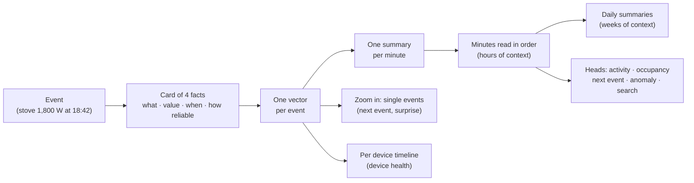

**1. Home tokens: each event becomes a card with 4 facts.**

| Fact | Example | Meaning |
|---|---|---|
| Entity text | "stove in kitchen, power sensor" | *Which* device, described **in words**, so the model understands a "stove" in any home, even one it has never seen. A frozen language model turns the words into numbers. |
| Value | ON, or 1,800 W | *What it reported*. Continuous values like power stay numbers; they are not flattened to ON/OFF. |
| Time | 18:42, Tuesday, 3 s after the previous event | *When*, plus how long since the last event |
| Meta | power reading, confidence 1.0 | *What kind of signal* and how reliable it is (an audio "baby crying" guess might be 0.8) |

**2. Attribute fusion: the 4 facts become one vector.** The facts are merged so they **influence each other**: "kitchen motion at 07:00" and "kitchen motion at 23:30" should mean different things, so the time changes how the device is read. This idea comes from DomusFM.

**3. Moment encoder (L1): one summary per minute.** Events are grouped into 1-minute slots. A few learned "reporters" read each minute's events, each looking for different things (movement, appliances, doors), and write one short summary together. A busy minute with 40 events and a quiet minute with none both become exactly one summary, so busy and quiet homes are handled the same way, and "nothing happened" is information too. Fixed minutes, rather than DomusFM's "last 30 events", make "the last 4 hours" always mean 240 steps.

**4. Stream model (L2): the minutes are read in order.** A transformer reads the sequence of minute summaries so each minute is understood in context: the stove means more if the fridge was just opened and someone has been in the kitchen for 10 minutes. It has two modes:

- **Live (causal):** each minute sees only the past, as in real time. Used for streaming, forecasting and spotting surprises.
- **Looking back (bidirectional):** each minute sees before and after. Used to summarise a finished period ("cooking from 18:42 to 19:21").

**5. Long-horizon memory (L3): days and weeks.** Each day is compressed into a few daily summary cards, and a small model reads weeks of them. Slow changes show up here: "Mum is waking later each week", "the fridge runs a little longer every day".

**Side branch A, event read-out: zooming back into single events.** After the minute-level understanding, the model returns to individual events, now informed by context. This is needed to predict **exactly which event comes next and when**, and to measure **surprise** ("the front door at 03:12 was very unlikely"), which feeds anomaly detection.

**Side branch B, entity axis: each device's own timeline.** Each device's events are also followed on their own, which gives a health signal per device, compared with its own past and with the same device type in other homes.

**6. Heads: small outputs on top for specific jobs.**

| Head | Job | Enables |
|---|---|---|
| Open-vocabulary tagger | Scores each minute against any text ("cooking", "vacuuming") | "Did anyone vacuum?", with no labels needed |
| Episode boundaries | Marks where an activity starts and ends | Counts and durations: "cooked 2 times" |
| Occupancy / identity slots | People per room, and *who* (resident, guest, dog) | "How many people are in the living room?" |
| Next event | What happens next, its value and when | Forecasts, and surprise scores |
| Anomaly score | How unusual this moment is for this home | "Anything unusual last night?" |
| Device health | Whether a device's behaviour is drifting | "Is the fridge OK?" |
| Retrieval embedding | A searchable vector per minute | The vector index behind the agent's search tool (§10.1) |

**Occupant slots.** The model keeps a few "person cards" per home (Dad, Mum, kid, dog) and assigns events to them. That is how a dog in the hallway at 2 am is told apart from an elderly person wandering.

**Sizes (§7.3).** A large **teacher** (300M–1B parameters) is trained on a server; a small **student** (20–50M) learns to copy it and runs on the home hub; a **tiny** version is used for tests.

**In one line:** event → card of 4 facts → one vector per event → one summary per minute → minutes read in order → daily summaries for weeks, with side branches that zoom into single events (prediction, surprise) and single devices (health), and small heads on top for specific jobs.

**Build status:** the scaffold implements the event cards, attribute fusion, the moment encoder, the stream model (both modes), the event read-out and the next-event head. Daily memory, the entity axis, occupant slots, and the tagger, boundary and device-health heads are not built yet.

### 7.1 Overview

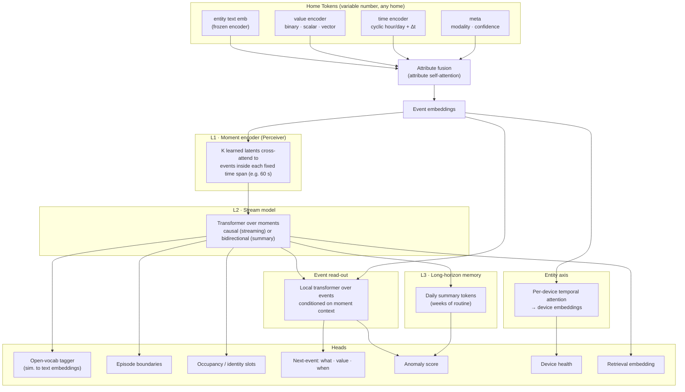

### 7.2 Components

**Event embedder.** Each token has four attribute vectors — entity (projected frozen text embedding), value (state embedding for binary; MLP on normalised scalar; linear projection for vectors), time (sin/cos harmonics of hour-of-day and day-of-week, plus `log(1+Δt)` since the previous event of the same entity and of the home), and meta (modality, confidence). A small transformer attends across the four attributes and pools them into one event embedding (DomusFM-style attribute fusion).

**Moment encoder (L1).** Time is cut into fixed spans (default 60 s). For each moment, K learned latent queries cross-attend to the events that fall inside it (Perceiver). This handles any number of sensors and any sparsity with constant cost; an empty moment attends to a learned "quiet" key.

**Why time-based moments instead of 30-event windows?** A 30-event window spans seconds in a busy kitchen and hours at night. Fixed time spans make "last 4 hours" map directly to model positions, make dense and sparse homes comparable, and give a regular grid for streaming.

**Stream model (L2).** A transformer over moment tokens with continuous-time positional information (moment start time encoded cyclically + learned relative position). Two modes share weights:

- **Causal** for streaming, forecasting and likelihood-based anomaly scoring. A carried KV cache / state keeps edge inference incremental (R9). An SSM (Mamba-style) variant is an option to evaluate for long contexts.
- **Bidirectional** for summary embeddings used in tagging, episodes and retrieval.

**Long-horizon memory (L3).** Each day is compressed into a small set of summary tokens. A lightweight transformer over the last N days models routine and drift (elderly-care trends, device degradation).

**Event read-out.** A small transformer over the raw event embeddings, where each event is conditioned on the stream context of its moment (bidirectional) or of the *previous* moment (causal). Used for event-level objectives (masked event prediction, next-event prediction).

**Entity axis.** Per-device temporal attention over the device's own tokens produces a device embedding for health monitoring (R6), compared against the device's history and across homes.

**Occupant slots (R4).** Each home learns a small set of slot embeddings (residents, pets). Slot attention assigns events to slots; supervised where camera, radar, phone presence or wearables give identity.

### 7.3 Model sizes

| Variant | Params | Where | Purpose |
|---|---|---|---|
| Teacher | 300M–1B | Server GPU | Pretraining at scale, pseudo-labels |
| Student | 20–50M (int8) | Edge hub | Streaming inference, per-home adaptation |
| Scaffold `tiny` | ~1–3M | Laptop / CI | Smoke tests, objective ablations on synthetic data |

### 7.4 Inside one minute: from Home Tokens to the transformer

This section follows one minute, **18:31**, from its Home Tokens to the stream transformer. The same steps run in training and in live use (§5.2). The only difference is that in training all three steps are adjusted together by the practice games, while in live use the weights are fixed.

**No text is produced anywhere on this path, and no LLM is involved.** Every step works on vectors (lists of numbers). The minute summary is a vector, not a sentence.

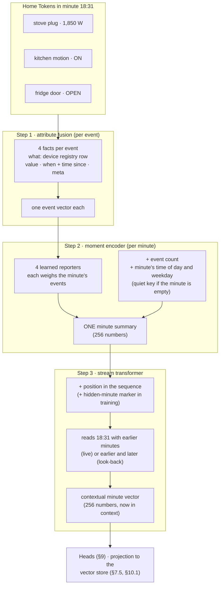

#### Step 1 · Attribute fusion: each event becomes one vector

Each Home Token supplies four facts, and one small attention layer lets them influence each other before they are pooled into one event vector (§7.2, `EventEmbedder`):

| Fact | Where it comes from | Example |
|---|---|---|
| **What** | The device registry row the token points to (§6.5), through a learned projection | "stove in kitchen, power sensor" |
| **Value** | State embedding (ON/OFF) plus a small network on the number, if there is one. For a detector event, the tag's numbers from the tag vocabulary (§6.4), and the detector's own embedding if it sends one. | 1,850 W · or "baby crying" |
| **When** | Cyclic time of day and weekday, plus the time since the previous event and since this device last fired | 18:31 Tuesday · 3 s · 20 min |
| **Meta** | Signal type and confidence | power reading · 1.0 |

Fusion matters because the same device means different things in different contexts: kitchen motion at 07:00 and at 23:30 should not look identical.

#### Step 2 · Moment encoder: one summary per minute

All event vectors of the minute are squeezed into **one minute summary**. The moment encoder works like **4 reporters** looking at the same minute. Each has *learned* (not been told) to pay attention to different things, for example movement, appliances, doors, or anything rare.

For 18:31, with three events:

1. Each reporter scores how relevant each event is to it. Reporter 2 might give the stove 0.8, motion 0.1 and the fridge 0.1.
2. Each reporter writes a weighted mix of the events, mostly the ones it cares about.
3. The four reports are averaged into one vector.
4. Two facts are added into it: **how many events** the minute had, and **the minute's time of day and weekday**.
5. A minute with **no events** still gets a proper summary, from a learned "quiet" key, so "nothing happened" is information too.

Technically this is a Perceiver-style cross-attention with K = 4 learned latent queries, computed for all minutes at once with a segment softmax (`MomentEncoder`).

#### Step 3 · Stream transformer: minutes in context

The stream transformer adds each minute's **position in the sequence** and reads the minute summaries in order. In live mode, 18:31 looks only at earlier minutes. In look-back mode, it also looks at later minutes that have already happened (§5.2). During training game 2, hidden minutes are replaced by a learned "hidden" marker. The output for 18:31 is its **contextual minute vector**: still 256 numbers, but now "18:31 in context" (someone came in at 18:28, the fridge opened at 18:29, it is dinnertime).

#### Everything packed into one minute's vector

| Added at | Information |
|---|---|
| Step 1 (per event) | Which device (from its description), value, time of day, weekday, time since the previous event, time since this device last fired, signal type, confidence |
| Step 2 (per minute) | The reporters' mix of the events, the event count, the minute's time, the "quiet" signal for empty minutes |
| Step 3 (sequence) | Position in the sequence, the hidden-minute marker (training only), and context from other minutes |

Nothing is passed alongside the vector. The time and position parts are added into the same numbers, not attached as separate fields.

#### Two kinds of minute vector

| | Minute summary | Contextual minute vector |
|---|---|---|
| Made by | Moment encoder (step 2) | Stream transformer (step 3) |
| Knows about | This minute's events only | This minute **plus** other minutes |
| Used for | Input to the transformer | Heads, episodes, and (after projection) the vector store |

#### Where language models are used, and where they are not

| Model | Used for | When | On the event path? |
|---|---|---|---|
| **MiniLM** (small, frozen text encoder) | Turning device descriptions and concept sentences into numbers | Once per device or sentence, then cached | Only through the cached registry rows |
| **Large LLM** (offline) | Writing simulator routines and training captions (§11) | Preparing training data | No |
| **Small local LLM** (the agent) | Understanding the question, calling tools, writing the answer (§10) | Question time | No |

#### Why vectors and not sentences

- **Precision:** 1,850 W and "3 seconds apart" survive exactly. A sentence would round them into vague words.
- **Speed:** mixing numbers is cheap on a home hub. An LLM call for each of 1,440 minutes a day is not.
- **Learnability:** because steps 1–3 are trained together, the moment encoder learns to pack exactly what the transformer needs. A separate text summariser could not adapt that way.

### 7.5 Making minute vectors comparable with sentences

HomeFM's contextual minute vectors are made from sensor events. Sentence vectors are made by the text encoder from words. **By nature they are different things and cannot be compared.** Position 1 of one means something unrelated to position 1 of the other. They become comparable only through training: this is the alignment of §8.2 Stage 3, the same method CLIP uses to make photos searchable by text.

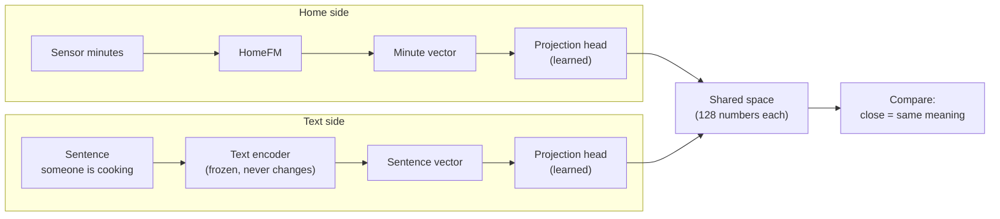

#### How the training works

1. **Pairs** of sensor minutes and a sentence that describes them, for example (02:00 bedroom quiet, bed pressure ON) ↔ "someone is sleeping", and (18:31 stove 1,850 W, kitchen motion) ↔ "someone is cooking". The sentences come from dataset labels turned into sentences, simulator captions, rule-based captions and checked LLM captions (§11.1).
2. **Rule:** pull each minute's projected vector **closer** to its own sentence and push it **away** from unrelated sentences. The loss is SigLIP, which scores every pair separately as match or no-match, so one minute can match several true sentences ("cooking", "someone in the kitchen", "dinner prep") and repeated routines are not pushed apart.
3. The text encoder is **frozen**. The two small projection heads and HomeFM itself adjust, until matching minutes and sentences land close together.

A toy example with 3 numbers instead of 128. The sentence "someone is sleeping" is `[0.0, 0.1, 0.9]`.

| | Projected vector of a 02:00 sleeping minute | Score against "sleeping" |
|---|---|---|
| Before training | `[0.4, 0.5, 0.3]`, random-ish | 0.32, meaningless |
| After training | `[0.05, 0.1, 0.95]` | **0.87**, lands near "sleeping" |

#### What this changes in the heads: a sentence instead of learned weights

A head that recognises activities compares the minute vector with **one reference vector per activity** and picks the closest. The only question is where those reference vectors come from:

| | DomusFM activity head | HomeFM tagger |
|---|---|---|
| Reference vector for an activity | A row of weights **learned from labelled examples** | The activity's **sentence**, through the text encoder and projection |
| Score | `Linear(window vector)[class]` | `σ(a · cos(P(minute vector), P(text(sentence))) + b)` |
| New activity | Collect labels, retrain | Write a sentence |
| Labels | Required for an activity to exist | Optional, to improve accuracy |
| Several activities at once | No, one class per window | Yes, each sentence is scored separately |

Toy example for minute 18:31, projected to `[0.85, 0.15, 0.05]`:

| Sentence | Sentence vector | Score |
|---|---|---|
| "someone is cooking food" | `[0.9, 0.1, 0.0]` | **0.78** ← highest |
| "someone is sleeping" | `[0.0, 0.1, 0.9]` | 0.06 |
| "someone is vacuuming" | `[0.1, 0.9, 0.1]` | 0.23 |

Adding "someone is watering plants" means encoding one more sentence. The head can score it immediately.

The comparison only works because of the alignment training above. **Bolting a sentence-comparison head onto DomusFM would not work**, because DomusFM's vectors were never trained to land near matching words. So the difference between the two models is in **two places**: how the transformer is trained, and how the head scores.

#### Limits

- Alignment only works for activities **similar to something seen in training pairs**. Caption variety is the main risk (§11, §15).
- A similarity score is not a probability. Thresholds are calibrated per group of concepts and per home.

#### Status

| Part | Status |
|---|---|
| SigLIP alignment with a projection head on each side into a shared 128-number space (`LanguageAlignment`, variant F) | ✅ per **window** (pooled minutes) |
| Per-**minute** alignment, the tagger head, calibrated thresholds | 📐 |
| Held-out-concept test (hide some activity names in training, find them from text alone) | 📐 |

## 8. Pretraining design

### 8.0 In plain words

**What pretraining is for.** We have millions of sensor events but very few labels saying "this was cooking". So before the model sees any labels, it teaches itself from the raw stream by playing self-made games (pretraining objectives). Labels come later and are used only for fine-tuning. The analogy is learning a language: before answering exam questions, a student reads thousands of books and plays "guess the missing word" or "guess what comes next". This section is about choosing good games.

#### Why "hide and guess" alone is not enough

*Masking* means hiding part of the data and asking the model to fill it in. DomusFM uses a version of it. On home data it is often too easy, or aimed at the wrong thing:

| # | Problem | In simple terms | Fix |
|---|---|---|---|
| 1 | Too easy to guess | Motion sensors fire ON then OFF seconds later. Hide the OFF and the model guesses it from the ON, learning sensor mechanics rather than behaviour. | Hide **bigger chunks**: a 5-minute block, one device, a whole room, all audio |
| 2 | Guessing exact details wastes effort | Like recalling a book's page number instead of its plot | Guess the **meaning** (a summary vector), not raw values (JEPA) |
| 3 | Similar things treated as different | "This window differs from every other window in the batch", yet two nights of sleep *are* the same behaviour | Treat matching windows as the same (SigLIP), or use games without "different" pairs |
| 4 | Looks at the future | A live home has no future; anomaly detection needs "how likely was what just happened?" | **Predict the next event** from the past only |
| 5 | Ignores timing | A 3-second and a 30-minute bathroom visit look alike if only order matters | Also predict **when** |
| 6 | Common sensors dominate | Most events are motion; a door at 3 am or a leak is hardly practised | Hide rare events more often and weight them more |
| 7 | Learns sensor IDs | "M003" means nothing in another home | Predict the device's **description** ("stove in kitchen") |
| 8 | No link to language | Hide-and-guess never teaches what "guest arrived" means | Align with text (Stage 3) |

**Evidence from our real-data runs** ([DOMUSFM_REPRODUCTION.md](DOMUSFM_REPRODUCTION.md)) is consistent with problems 1 and 3. DomusFM's contrastive loss fell to about 0.001 almost immediately, even on the 27M-event corpus. Pretraining gave no benefit on UCI B or hh101, and lowered hh101 activity F1 at 5 % labels (0.49 vs 0.57 without pretraining).

#### The proposed recipe: four stages

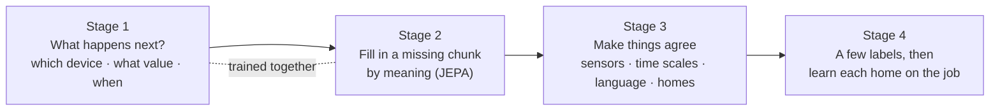

**Stage 1: "What happens next?" (the main game).** Given everything so far, predict the next event: which device, what value, and how long until it happens. *Example:* fridge door opened and stove on at 18:42 → "kitchen motion within about 10 s". It is the main game because it matches how the model runs live (past only), gives **forecasts** for free, and gives **surprise** for free: if the model expected nothing until 07:00 and the front door opens at 03:12, that surprise is the anomaly signal.

**Stage 2: "Fill in the missing chunk, by meaning" (JEPA).** Hide a big, structured piece (10 minutes, all kitchen sensors, all audio) and predict the **summary** of what was hidden, not the exact events. A slowly updated copy of the model provides the target summaries, which keeps the game stable. This teaches cross-sensor reasoning: "no kitchen sensors visible, but the stove plug drew power, so probably cooking".

**Stage 3: Make things agree.**

- *Across sensor types:* the motion view and the audio view of the same minute should agree.
- *Across time scales:* a minute's summary should fit its hour, and the hour its day.
- *With language:* a cooking window should land near the text "someone is cooking". This later lets the system answer "did anyone vacuum?" with no labels.
- *Across homes:* a small adversary tries to guess which home a window came from, and the model is trained to make that impossible, so it learns general knowledge instead of home-specific quirks.

**Stage 4: A few labels, then learn each home on the job.** Use the labels available (public datasets, simulated faults, user corrections). After installation, keep playing the Stage 1 and 2 games on **that home's own data** every day, adjusting only small per-home parts, so the model gets used to this family's routine without anyone labelling anything.

**Cheap extra games:** guess the time of day from a window (teaches routines); guess which events come next regardless of order (DomusFM's task; cooking steps can happen in any order); consistency checks (stove power should mean someone is in the kitchen).

#### The fair comparison (A–F)

Rather than assume Stage 1 + 2 is better, we test it. Model, data and compute stay the same; only the game changes.

| Variant | Game | Plain meaning |
|---|---|---|
| A | DomusFM contrastive | "Is this the same window with bits hidden?" (baseline) |
| B | Random masking | "Guess the hidden events" (BERT-style) |
| C | Structured chunks by meaning | Stage 2 only |
| D | Next event | Stage 1 only |
| E | D + C | **Proposed** |
| F | E + language + home-invariance | Full version; adds "search with any words" |
| G | F + harder, safer games (§8.4) | Proposed refinement: hide on/off pairs together, raise difficulty automatically, predict the next 1/10/60 minutes, treat routine repeats as matches, guard against collapse |

They are scored on activity recognition, exact counts, detecting injected faults, forecasting, finding never-labelled concepts from text, and learning from only 1–5 % of labels.

**Status:** A–F run end to end on simulated homes. On real data, DomusFM (A) is training on the 77-home corpus; the HomeFM E comparison on the same data and protocol is ready to run (`scripts/run_homefm_corpus.sh`).

### 8.1 Why masking alone is not enough

DomusFM uses masking as an **augmentation** for contrastive learning. Plain masking (either BERT-style reconstruction or masked-view contrastive) has specific failure modes on smart-home data:

| # | Problem | Consequence | Fix |
|---|---|---|---|
| 1 | Masked events are easy to guess (PIR ON→OFF pairs) | Learns sensor mechanics, not behaviour | Structured masks: time blocks, entity spans, rooms, modalities |
| 2 | Reconstruction in input space | Capacity wasted on noise (exact seconds, noisy values) | Predict **latents** (JEPA with EMA target encoder) |
| 3 | Contrastive false negatives | Repetitive routines: two "sleeping" windows pushed apart | Structural positives, SigLIP-style losses, non-contrastive options |
| 4 | Bidirectional only | No likelihood of the future → weak anomaly/forecast | **Causal next-event prediction** |
| 5 | Timing ignored | 3 s vs 30 min bathroom visit look the same | Predict Δt distribution |
| 6 | Frequent sensors dominate | Rare important events under-trained | Information-weighted masking, inverse-frequency loss weights |
| 7 | Predicting sensor IDs | Does not transfer | Predict semantic entity embeddings |
| 8 | No language grounding | No open vocabulary | Language alignment |

### 8.2 Proposed four-stage recipe

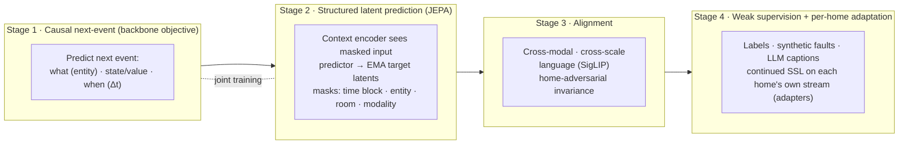

**Stage 1 — Causal next-event prediction (marked temporal point process).** For each event *i*, given all events before it, predict event *i+1*:

- **what:** entity, scored as similarity between the predicted vector and the semantic entity embeddings of the home (transfers across homes)
- **state / value:** categorical state for binary; Gaussian or quantile loss for scalars
- **when:** log-normal mixture over `Δt = t_{i+1} − t_i`

Loss: `L_next = CE(entity) + CE(state) + λ_v · L_value + NLL_{LogNormMix}(Δt)`.

This one objective gives streaming inference, forecasting, and **anomaly scores as negative log-likelihood** — capabilities masking cannot provide.

**Stage 2 — Structured latent prediction (JEPA).** A context encoder (bidirectional) sees the input with structured masks; a predictor predicts the **latent moment embeddings** produced by an EMA target encoder on the unmasked input. Loss on masked moments only: `L_jepa = SmoothL1(norm(pred), norm(target))`.

Mask families (sampled per batch):

| Mask | What is hidden | Forces the model to learn |
|---|---|---|
| Time block | All events in a contiguous span of moments | Behaviour over minutes |
| Entity span | All events of 1–3 entities over the window | Cross-sensor redundancy (e.g. stove ↔ kitchen PIR) |
| Room | All entities in one room | Spatial reasoning, occupancy |
| Modality | All audio or all scalar tokens | Robustness to missing modalities |
| Info-weighted | Events sampled ∝ 1/frequency(entity) | Rare but important events |

**Stage 3 — Alignment.**

- *Cross-modal:* sensor-only, audio-only and vision-only views of the same moment should agree.
- *Cross-scale:* a moment embedding should be predictable from its hour, and the hour from its day.
- *Language:* window/episode embeddings aligned with captions using a **SigLIP sigmoid loss** (tolerates many positives per batch → fixes false negatives in repetitive routines).
- *Home invariance:* a home classifier behind a gradient-reversal layer strips home identity from shared embeddings; per-home detail lives in adapters.

**Stage 4 — Weak supervision and per-home adaptation.** Supervised heads on dataset labels, synthetic faults, and filtered LLM captions. After deployment, continue Stage 1 + 2 on each home's own unlabelled stream, updating only per-home adapters (test-time training).

**Auxiliary tasks (cheap):** predict time-of-day from a window; predict the unordered bag of next-k events (DomusFM's task, tolerant to partial order); cross-sensor consistency (stove power ⇒ kitchen presence).

### 8.3 Objective ablation matrix

Same backbone, data and compute budget; only the objective changes.

| Variant | Objective | Config |
|---|---|---|
| A | DomusFM-style dual contrastive (attribute mask → event mask, InfoNCE) | `configs/objectives/A_contrastive.yaml` |
| B | BERT-style random event masking + reconstruction | `configs/objectives/B_masked_recon.yaml` |
| C | Structured latent masking (JEPA) | `configs/objectives/C_latent_mask.yaml` |
| D | Causal next-event (temporal point process) | `configs/objectives/D_next_event.yaml` |
| E | D + C (proposed) | `configs/objectives/E_next_event_latent.yaml` |
| F | E + language alignment (SigLIP) + home-adversarial | `configs/objectives/F_full.yaml` |

Evaluated on (§12): activity F1 (linear probe and fine-tune), episode-count exact match, anomaly AUROC on injected faults, forecast NLL, open-vocab retrieval on held-out concepts, 1 %/5 % few-shot adaptation.

| G | F + the refinements in §8.4 | not implemented yet |

**Hypothesis (to be tested, not assumed):** E beats A–D on anomaly, forecasting and counting and matches A on activity recognition; F adds zero-shot capability; G trains more stably than E/F and keeps a non-trivial loss on real data.

### 8.4 Proposed refinements (variant G)

The four-stage recipe (§8.2) addresses the problems in §8.1. Our real-data reproduction shows one failure most clearly: **the game becomes too easy**. DomusFM's contrastive loss fell to about 0.001 almost immediately, and pretraining gave no benefit ([DOMUSFM_REPRODUCTION.md](DOMUSFM_REPRODUCTION.md)). The five refinements below target that failure directly. They are proposals, not yet implemented, and are tested as variant G against A, E and F.

| # | Refinement | In simple words | Fixes (§8.1) |
|---|---|---|---|
| G1 | Pair-aware masking | If "motion ON" is hidden, also hide its matching OFF, and the other way round | #1 easy guesses |
| G2 | Adaptive mask difficulty | If the loss collapses, hide bigger chunks automatically (1 → 5 → 15 min; one device → whole room) | #1, and the collapse seen in the reproduction |
| G3 | Multi-horizon latent forecasting | Predict the *summary* of the next 1, 10 and 60 minutes, from the past only | #4, #5; links Stage 1 and Stage 2 |
| G4 | Routine-aware positives | Treat the same home at the same time of day on different days as "probably similar", not "different" | #3 false negatives |
| G5 | Collapse guard | A small penalty that keeps summaries varied, so the model cannot cheat by making them all the same | Stability of Stage 2 (JEPA) |

**G1 · Pair-aware masking.** Many sensors emit paired events: a PIR ON is followed by an OFF seconds later, and a door OPEN by a CLOSE. Hiding only one half of a pair lets the model recover it from the other half without learning anything about behaviour. G1 extends every mask family in §8.2 so that when one half of a pair is hidden, its partner inside the window is hidden too. Pairs are found from the entity's state type in the ontology; no labels are needed. Cost: negligible.

**G2 · Adaptive mask difficulty (curriculum).** A fixed masking rate is either too easy for some homes or too hard for others. G2 tracks the Stage 2 loss during training. If the loss drops below a threshold for a set number of steps, the sampler moves to a harder level: longer time blocks, more entities per span, then whole rooms and whole modalities. If the loss stops falling, it steps back. This keeps the game challenging throughout training, like a video game that raises its level as the player improves. The current level is logged, so an early collapse is visible instead of silent.

**G3 · Multi-horizon latent forecasting (causal JEPA).** Stage 1 predicts the very next event, which is local ("kitchen motion in 10 s"). Stage 2 fills in hidden chunks using both past and future. G3 adds a middle game: from the causal stream state at minute *t*, predict the EMA target summaries of the windows *t+1*, *t+10* and *t+60* minutes ahead. Loss: `L_future = Σ_h SmoothL1(norm(pred_h), norm(target_h))` for h ∈ {1, 10, 60}. This teaches routines ("dinner is coming") in the live, past-only setting that deployment uses, and directly supports questions like "Will Dad be up soon?" and "Is breakfast late?".

**G4 · Routine-aware positives.** In-batch contrastive learning treats every other window as a negative, so two normal nights of sleep are pushed apart (§8.1 #3). G4 marks windows from the same home at the same time of day on different days (within ±30 min) as soft positives, with a lower weight than true positives. It applies wherever a contrastive or SigLIP-style loss is used (Stage 3). The alternative is to rely on non-contrastive objectives only, which variant E already does for Stages 1–2.

**G5 · Collapse guard.** Predicting latent targets (JEPA) can collapse: the model outputs the same summary for every input and the loss is trivially low. The EMA target encoder reduces this risk but does not rule it out. G5 adds a VICReg-style variance term that penalises any embedding dimension whose standard deviation across the batch falls below a floor: `L_var = mean_d max(0, γ − std(z_d))`. It is cheap and also serves as a health metric during training.

**Combined objective for variant G:**

`L_G = L_next + λ_f · L_future + λ_j · L_jepa(pair-aware, adaptive, info-weighted masks) + λ_v · L_var + Stage 3 alignment (with routine-aware positives)`

followed by Stage 4 (weak supervision and per-home adaptation) unchanged.

**How we will know it works.** Same backbone, data and compute as A–F; only the objective changes. Success means:

- **Training health:** the loss falls steadily rather than collapsing to near zero in the first few hundred steps, and embedding variance stays above the floor.
- **Downstream:** G is at least as good as E/F on activity F1 at 1–5 % labels, and better on forecasting (NLL at 10 and 60 minutes), missed-routine detection, and anomaly AUROC on injected faults.
- **Real data:** pretraining gives a measurable gain over no pretraining on UCI B and hh101, which DomusFM's objective did not.

**Implementation notes.** G1 and G2 extend `structured_mask` in `src/homefm/objectives/masking.py`; G3 adds a head on the causal stream in `src/homefm/objectives/next_event.py` and reuses the EMA target from `latent_mask.py`; G4 changes the positive mask in `alignment.py`; G5 is a small loss term shared by the latent objectives. A `configs/objectives/G_refined.yaml` config would select them.

### 8.5 Setup and training, step by step

This section walks through pretraining from raw dataset files to a trained model file, with one tiny example. It covers **setup and training only**. What happens in a home after the model is shipped is in §5.2.

**The big idea.** Training shows the model millions of short stretches of real home history and makes it **play guessing games** on each one. The answer to every guess is already in the data, so no human labels are needed. After each round, the model's learnable numbers are nudged so it would guess better next time. After many rounds it has learned how homes behave.

There are two parts:

- **Preparation** (steps 1–3): done **once**, and saved to disk.
- **The training loop** (steps 4–9): repeated **thousands of times**.

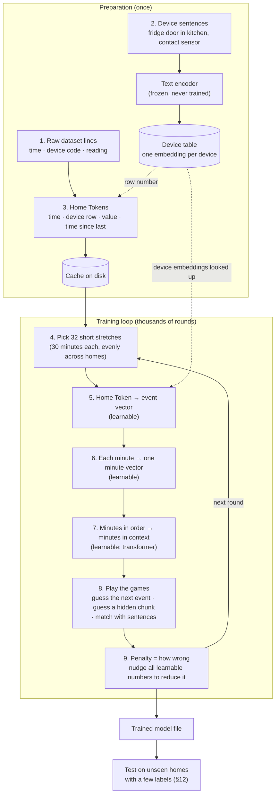

#### Preparation (once)

**Step 1 · Raw events from the dataset file.** Home hh102, Tuesday evening, 4 events over 3 minutes:

```
2012-07-24 18:29:10   Kitchen_D002   OPEN      (fridge door)
2012-07-24 18:29:14   Kitchen_M014   ON        (kitchen motion)
2012-07-24 18:30:05   Kitchen_P001   1850      (stove plug, watts)
2012-07-24 18:31:20   Kitchen_M014   ON        (kitchen motion)
```

Activity labels in the file (for example `Cook_Begin`) are kept aside. They are not used by games 1 and 2, only turned into sentences for game 3 and used for testing.

**Step 2 · Describe each device in words, and turn the words into numbers once.** The codes are split into item, room and type (the CASAS converter does this automatically), joined into a sentence, and passed through the frozen text encoder. The toy vectors below have 4 numbers; the real ones have 384.

| Code | Sentence | Embedding |
|---|---|---|
| Kitchen_D002 | "fridge door in kitchen, contact sensor" | [0.2, 0.7, 0.1, 0.4] |
| Kitchen_M014 | "ceiling in kitchen, motion sensor" | [0.6, 0.3, 0.2, 0.1] |
| Kitchen_P001 | "stove in kitchen, power sensor" | [0.1, 0.2, 0.9, 0.3] |

This is the device table (§6.5). The text encoder is only used here, once per device, and is never trained.

**Step 3 · Turn each line into a Home Token.** The same information in one standard format, with the device code replaced by its row in the device table (a lookup key, §6.4):

| Time | Device row | State | Value | Time since previous event |
|---|---|---|---|---|
| 18:29:10 | fridge door | ON (open) | — | 2 min |
| 18:29:14 | kitchen motion | ON | — | 4 s |
| 18:30:05 | stove | — | 1,850 W | 51 s |
| 18:31:20 | kitchen motion | ON | — | 75 s |

The tokens are saved to a cache on disk, so the slow parsing happens once. Preparation also holds out whole test homes that pretraining never sees (the 7 held-out homes in §12) and cuts each home's history into 30-minute windows, one every 10 minutes.

#### The training loop (repeated)

**Step 4 · Pick short stretches.** The model cannot read months at once, so each round takes **32 stretches of 30 minutes** (our example uses 3 minutes), chosen **evenly across homes**: first a home at random, then a stretch inside it. Otherwise a huge home (hh113 has 2.3 million events) would dominate.

**Step 5 · Turn each Home Token into an event vector (learnable).** Each token's four facts are combined by attribute fusion (§7.4 step 1):

| Fact | For the stove token |
|---|---|
| What device | The stove's embedding, looked up in the device table: [0.1, 0.2, 0.9, 0.3] |
| Value | 1,850 W |
| When | 18:30 Tuesday, 51 s after the previous event |
| Type and confidence | Power reading, 1.0 |

```
stove token  →  event vector [0.3, 0.1, 0.8, 0.5]
```

**Step 6 · Squeeze each minute into one vector (learnable).** The events are grouped by minute, and the moment encoder (§7.4 step 2) makes one vector per minute. A minute with no events still gets a "nothing happened" vector.

```
minute 18:29 : fridge door + kitchen motion  →  [0.4, 0.5, 0.2, 0.2]
minute 18:30 : stove                         →  [0.2, 0.2, 0.8, 0.4]
minute 18:31 : kitchen motion                →  [0.5, 0.3, 0.3, 0.1]
```

**Step 7 · Read the minutes in order (learnable: the transformer).** The stream transformer changes each minute's vector to include what is around it:

```
18:30 alone:       "stove on"
18:30 in context:  "stove on, just after the fridge opened and someone came into the kitchen"
                   → [0.2, 0.3, 0.9, 0.6]
```

**Step 8 · Play the games: guess, then check.** The answers are already in the data.

*Game 1, guess the next event.* Reading forwards only, after each event the model guesses the next one: which device, what value, and how long until it happens.

| After seeing | The model guesses | What actually came next | Result |
|---|---|---|---|
| Fridge door open | Kitchen motion, in about 5 s | Kitchen motion after 4 s | Close |
| Kitchen motion | Fridge closes, in about 20 s | **Stove on** after 51 s | Wrong |
| Stove on | Kitchen motion, in about 1 min | Kitchen motion after 75 s | Close |

*Game 2, guess a hidden chunk.* Minute 18:30 is hidden completely:

```
18:29  fridge + motion    |    18:30  [HIDDEN]    |    18:31  motion
```

The model guesses what 18:30 was like. The correct answer comes from a slowly updated copy of the model that saw 18:30. Something like "activity in the kitchen, probably cooking-related" scores well.

*Game 3, match with a sentence* (variant F only). If the stretch has a label, for example `Cook` turned into "a resident is cooking in the kitchen", the stretch's vector is pulled towards that sentence and pushed away from non-matching ones.

Each game gives a **penalty**: how wrong the guesses were.

```
penalty this round = penalty(game 1) + penalty(game 2) [+ penalty(game 3)] = 2.7
```

**Step 9 · Nudge the numbers, and repeat.** The training algorithm (backpropagation with the AdamW optimiser) works out how to change each of the model's roughly 8 million learnable numbers so the penalty would be smaller, changes them a tiny bit, and goes back to step 4 with 32 new stretches. The slowly updated copy used in game 2 moves 0.4 % of the way towards the model after each round. **Only the learnable parts change**: steps 5, 6 and 7 and the game heads. The text encoder of step 2 never changes. A healthy run looks like this (illustrative numbers):

```
round      1 :  penalty 5.8   (random guessing)
round  1,000 :  penalty 3.1   (learned: motion follows door openings)
round 10,000 :  penalty 2.2   (learned: stove + evening → kitchen stays busy)
round 20,000 :  penalty 1.9   (learned: routines of many homes)
```

A penalty that falls gradually is the sign of real learning. DomusFM's penalty fell to about 0.001 within 1,000 rounds, the sign of a game that was too easy (§4.1 L11).

#### After training

The trained model is saved to a file, together with the version of the text encoder it was trained with. The device tables are not inside it; each home builds its own (§6.5). The model is then **tested** on homes it never saw: it is given a few labelled examples (5 % or 30 %) and compared with the same model without pretraining and with DomusFM (§12). Later, a large teacher trains a small student that fits on the home hub (§7.3).

#### The three games

| | Game 1 | Game 2 | Game 3 |
|---|---|---|---|
| **In one line** | Predict what comes next, and when | Hide a big chunk and guess its meaning | Match stretches of activity with sentences |
| **Example** | After "fridge open, stove on": "kitchen motion in about 30 s" | 18:30–18:36 hidden between "fridge opened" and "dining light on": "probably cooking" | Stove + kitchen motion ↔ "someone is cooking" (together), ↔ "someone is sleeping" (apart) |
| **The answer comes from** | The event that actually came next | A slowly updated copy of the model that saw everything | The sentence paired with the stretch |
| **Needs labels?** | No | No | Needs sentences |
| **Teaches** | Routines and timing | How the parts of a home fit together | Words for activities |
| **Enables later** | "When" forecasts, the surprise score for anomalies (L6, L7) | Robust understanding, filling gaps | Naming new activities, search by meaning (L1, L8) |
| **What gets hidden or predicted** | The next event | A block of minutes, a device, a room, a signal type, or rare devices | Nothing hidden |
| **Technical name** | Marked temporal point process (next event) | JEPA, structured latent masking | SigLIP language alignment |
| **Variant** | D | C | added in F |

Variant **E** = games 1 + 2 (the planned comparison against DomusFM). Variant **F** = games 1 + 2 + 3. DomusFM plays a single game ("hide a few events, then find your own copy among others"), which is too easy on home data (§8.1).

#### Real settings for the corpus run

| Setting | Value (`configs/homefm_corpus.yaml`) |
|---|---|
| Training homes | 77: all 84 homes (81 labelled CASAS homes + Milan + Aruba + UCI B) minus the 7 test homes. The same pool as the DomusFM run. |
| Stretch length | 30 minutes of 60-second minutes, at most 256 events |
| Stretches start every | 10 minutes |
| Stretches per round | 32 |
| Rounds | 20,000 (the first 500 with a smaller learning rate) |
| Learning rate | 0.0003 |
| Model size | 256 numbers per vector, 6 transformer layers, about 8 million learnable numbers |
| Games | 1 + 2 (variant E). Game 2 hides 3–10 minutes at a time, or a device, room or signal type. |
| Slowly updated copy | 99.6 % old + 0.4 % new after each round |

#### Status

| Step | Status |
|---|---|
| Preparation: converters, device tables, Home Tokens, cache (84 homes), held-out split, windows | ✅ |
| Labels turned into sentences for game 3 | ✅ basic, small data · 📐 corpus scale |
| Training loop with games 1 + 2 (variant E) | ✅ code, tested on small data · the corpus run has not started |
| Game 3 (variant F) | ✅ code, small data only |
| Fine-tune and test protocol | ✅ (shared with the DomusFM run) |
| Teacher → student | 📐 |

### 8.6 DomusFM masking vs HomeFM games, on one window

§8.1 explains in general why masking alone is not enough. This section compares the two approaches on one concrete window, and states exactly what pretraining changes.

#### What pretraining trains, and what it does not

| Part | Trained during pretraining? |
|---|---|
| Device sentence embeddings (frozen text encoder, §6.5) | ❌ Never. Made once at setup. |
| Event embedding (attribute fusion: device + value + time + type) | ✅ Learned |
| Minute summary (moment encoder) | ✅ Learned |
| Stream transformer (minutes in context) | ✅ Learned |
| Game heads (the parts that make the guesses) | ✅ Learned |

"Pretraining the embeddings" means teaching the learnable parts to turn Home Tokens into useful vectors. Without labels, the only way is a game: the vectors improve because better vectors win the game. **The game therefore decides what the vectors learn**, and this is where DomusFM and HomeFM differ.

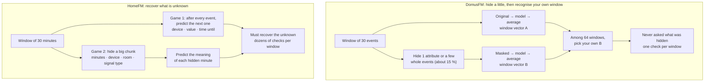

#### DomusFM's game

Each DomusFM event has five attributes: item, sensor type, room, status and time.

- **Phase 1, attribute masking:** for about 15 % of events, one attribute is hidden. `18:29 fridge door · contact · kitchen · OPEN` becomes `18:29 fridge door · contact · kitchen · ???`.
- **Phase 2, event masking:** for about 15 % of events, all attributes are hidden. `18:30 stove · power · kitchen · ON` becomes `??? · ??? · ??? · ???`. The event-level layers are frozen in this phase.

In both phases the game is the same. The original window and the masked window each go through the model and are averaged into window vectors A and B. In a batch of 64 windows, each A must pick out its own B (InfoNCE). **The model is never asked what the hidden attribute or event was.** The masking is damage, and the task is to recognise the window despite it.

Why this teaches little on home data:

1. **Recognising yourself is easy.** 28 of 30 events are untouched, so A and B are nearly identical.
2. **Timestamps give it away.** Every window has unique times, which act as a fingerprint even when some bits are hidden.
3. **Nothing forces understanding.** Because the hidden part never has to be recovered, knowing that "the stove usually follows the fridge" gives no advantage.
4. **Similar routines are pushed apart.** Two ordinary nights of sleep in one batch count as different windows (false negatives).

#### HomeFM's games on the same window

```
18:28 kitchen motion · 18:29 fridge OPEN · 18:30 stove 1,850 W · 18:31 kitchen motion · … · 18:37 stove OFF · 18:38 dining light ON
```

**Game 1, predict the next event.** After every event, the model must state what actually comes next: which device, what value and how long until it happens.

| After seeing | Must predict | Actual |
|---|---|---|
| Kitchen motion | Device, value, time until | Fridge OPEN, 60 s later |
| Fridge OPEN | … | Stove **1,850 W**, 51 s later |
| Stove ON | … | Kitchen motion, 75 s later |

Every event is a question, so one window gives dozens of guesses. The future is genuinely unseen, so there is no copy to peek at and no fingerprint to exploit. To win, the vectors must encode routines, order, values and timing.

**Game 2, recover the meaning of a big hidden chunk.** For example, 18:30–18:36 is hidden entirely (or every kitchen event, or every power reading):

```
18:28 kitchen motion · 18:29 fridge OPEN · [ 18:30–18:36 HIDDEN ] · 18:37 stove OFF · 18:38 dining light ON
```

The model must predict each hidden minute's vector, as produced by a copy of the model that saw everything. Unlike DomusFM, it **has to recover the hidden part**. The chunk is large and structured, so no ON/OFF partner is left to copy from, and the model has to reason from context ("fridge before, stove off and dining light after: the gap was cooking"). The answer is per minute rather than one averaged window, and there are no negatives, so similar nights are never pushed apart.

#### Side by side

| | DomusFM masking | HomeFM game 1 | HomeFM game 2 |
|---|---|---|---|
| **What is hidden** | 1 attribute, or a few whole events (about 15 %) | The future: the next event | A big block: minutes, a device, a room or a signal type |
| **Must it recover the hidden thing?** | ❌ No, only recognise its own window | ✅ Device, value and time | ✅ The meaning of each hidden minute |
| **Guesses per window** | 1 (the whole window) | One per event (dozens) | One per hidden minute |
| **Cheap shortcuts** | Timestamps, untouched events, ON/OFF pairs | None: the future is unseen | Few: neighbours are hidden too |
| **Similar routines** | Pushed apart (false negatives) | No negatives | No negatives |
| **Loss in practice** | About 0.001 within 1,000 of 40,000 steps (solved) | Expected to fall gradually | Expected to fall gradually |
| **What the vectors learn** | To stay stable when bits are removed | Routines, order, timing, values | How the parts of a home fit together |

#### How it should help the real tasks

| Real task | Why HomeFM's games should help |
|---|---|
| Recognising activities with few labels | The vectors already encode "fridge → stove → evening", so a few labels only attach the name "cooking" |
| "When will Dad be up?" | Game 1 directly trains "how long until the next event" |
| "Anything unusual?" | Game 1's guesses give the surprise score: a door at 03:12 is a very wrong guess, so it is flagged |
| Counting, starts and ends | Game 2's per-minute answers make every minute's vector meaningful |
| Missing or broken sensors | Game 2 hides whole devices and rooms, so the model learns to cope when one is silent |

DomusFM's game trains none of these directly, which fits its measured results.

#### Evidence so far

The 77-home DomusFM run (2026-09-24), activity recognition with 5 % of labels on held-out homes, 6 of 7 finished:

| Test home | With DomusFM pretraining | Without pretraining |
|---|---|---|
| UCI B | 0.25 | 0.22 |
| hh101 | 0.49 | **0.56** |
| hh103 | 0.54 | **0.68** |
| hh105 | 0.36 | **0.41** |
| hh110 | 0.32 | 0.33 |
| hh119 | 0.35 | **0.41** |

DomusFM's game is solved almost immediately and gives no gain, and mostly a loss (full results in [DOMUSFM_REPRODUCTION.md](DOMUSFM_REPRODUCTION.md)). The HomeFM games are **reasons to expect** better results, not proof. Variant E (games 1 + 2) is implemented and tested on small data, and the 77-home comparison is the next run. It succeeds if the HomeFM loss falls gradually rather than collapsing, and pretrained HomeFM beats HomeFM without pretraining on the held-out homes, especially with 5 % of labels.

### 8.7 Why games 1 and 2 (the rationale for variant E)

The pretraining games were chosen by starting from **what the home system has to do**, not from what worked in other fields. Each game trains specific skills, and the two cover each other's weak spots.

#### Start from the jobs, and from the two modes

| Job | Example question |
|---|---|
| Understand **now**, in real time, using only the past | "Is anyone cooking right now?" |
| Know **what comes next and when** | "Will Dad be up soon?" |
| Notice **unusual** things | "Anything strange last night?" |
| Understand **whole periods**, and where activities start and end | "How many times did we cook today?" |
| Cope with **missing or broken** sensors | A motion sensor's battery dies |
| Work in **any home**, with few or no labels | A new customer's home |

The system also runs the same model in **two modes** (§5.2): **live** reads only the past, and **look-back** re-reads recent hours in both directions. A game is needed for each mode. That is the core reason for two games.

```mermaid
flowchart LR
    subgraph JOBS["What the system must do"]
        J1["Understand now,<br/>past only"]
        J2["Forecast what<br/>and when"]
        J3["Surprise and<br/>anomalies"]
        J4["Whole periods,<br/>starts and ends"]
        J5["Missing or<br/>broken sensors"]
        J6["Any home,<br/>no labels"]
    end
    subgraph GAMES["Pretraining games"]
        G1["Game 1<br/>predict the next event<br/>device · value · time until"]
        G2["Game 2<br/>hide a big chunk,<br/>predict its meaning"]
    end
    subgraph MODES["Modes (§5.2)"]
        LIVE["Live mode<br/>(causal)"]
        LB["Look-back mode<br/>(bidirectional)"]
    end
    J1 --> G1
    J2 --> G1
    J3 --> G1
    J4 --> G2
    J5 --> G2
    J6 --> G1
    J6 --> G2
    G1 --> LIVE
    G2 --> LB
```

#### Why game 1: predict the next event

- **It trains exactly what live mode needs.** Live mode understands the present from the past only, and game 1 is "given the past, what happens next?"
- **It gives forecasting and surprise directly.** Predicting how long until the next event trains "when" forecasts (L7). How wrong a guess was is the surprise score used by the anomaly engine (L6). No other game provides these.
- **It cannot be cheated.** The future is genuinely unseen: there is no copy to compare against and no timestamp fingerprint.
- **It gives a dense signal.** Every event is a question, so a 30-minute window yields dozens of guesses.
- **It is proven elsewhere.** Next-item prediction is how GPT-style language models learn, and next-event-with-timing is an established method for event data (temporal point processes).

Its weak spots: it only looks backwards, it is short-sighted (much of it is predicting the next few seconds, such as "motion OFF after motion ON"), and it learns events rather than whole periods.

#### Why game 2: hide a big chunk and predict its meaning

- **It trains exactly what look-back mode needs.** Filling a gap from both sides ("fridge before, dining light after, so the gap was cooking") is the look-back skill.
- **It fixes game 1's short-sightedness.** Hiding 5–10 minutes, a whole room or a whole signal type forces reasoning over longer stretches and across rooms.
- **It makes every minute's vector meaningful.** Each hidden minute must be described, which is what the tagger and start/end detection need later (L5).
- **It trains robustness.** Hiding a whole device or room is what happens when a sensor breaks, so the model learns to fill in from the rest of the home.
- **It predicts meaning, not exact events.** Many details are unpredictable noise, such as the exact second a motion sensor fires or whether the cupboard or the fridge came first. Reproducing raw events wastes effort on that noise. Predicting the vector that a model seeing everything would produce focuses on what matters. This is the idea behind Meta's JEPA models for images and video.
- **It hides big, structured chunks, not random bits.** Small random holes are filled by copying neighbours (a hidden motion ON next to its motion OFF), which is exactly DomusFM's shortcut. Big chunks remove the neighbours too.

Its weak spot: on its own it trains neither live use, forecasting nor surprise. That is what game 1 is for.

#### Why both together

| | Game 1 | Game 2 | Together |
|---|---|---|---|
| Reading direction | Past only (live) | Both sides (look-back) | Both modes the system uses |
| Time scale | Seconds to minutes | 5–10 minutes, rooms, signal types | Short and long |
| Level | Single events | Whole minutes | Both |
| Forecasting and surprise | ✅ | ❌ | ✅ |
| Meaningful minute vectors | Partly | ✅ | ✅ |
| Robust to missing sensors | ❌ | ✅ | ✅ |
| Needs labels | No | No | No, so all 77 training homes can be used |

**Game 1 teaches "what happens next". Game 2 teaches "what was going on". A home system needs both.**

#### Alternatives considered

| Option | Why it is not the base |
|---|---|
| **A**, DomusFM's contrastive game ("recognise your own window") | Never asks what was hidden. Solved through timestamps and ON/OFF pairs. Pushes similar routines apart. The 77-home run showed no gain, and mostly a loss (§8.6). |
| **B**, fill in exact hidden events (BERT-style) | Spends effort on unpredictable noise. With small holes it is still cheatable through ON/OFF pairs. |
| **Game 3 alone** (match with sentences) | Needs sentences, which are scarce (about 35 activity names in CASAS). Useful as an addition on top (variant F), not as the foundation. |
| **D**, game 1 alone | Short-sighted and past only |
| **C**, game 2 alone | No forecasting, no surprise, no live-mode training |
| **E**, games 1 + 2 | Covers both modes and both time scales, and needs no labels. **Chosen base.** |

#### A choice to be tested, not assumed

The comparison of variants A–F (§8.3) keeps the model, data and compute fixed and changes only the games. An early, **weak** hint comes from a tiny synthetic smoke test (simulated homes, 10–25 seconds of training), far too small to rely on:

| Variant | Activity F1 (probe) | Exact counts correct |
|---|---|---|
| A (DomusFM-style) | 0.82 | 40 % |
| C (game 2 alone) | 0.81 | 40 % |
| D (game 1 alone) | 0.84 | 48 % |
| **E (games 1 + 2)** | **0.85** | **49 %** |

In that test game 1 did most of the work, game 2 alone did not help, and the two together were best by a small margin. The real test is variant E against DomusFM on the 77 training homes and 7 held-out homes (`scripts/run_homefm_corpus.sh`). E is kept as the base only if its loss falls gradually rather than collapsing, and pretrained E beats E without pretraining on the held-out homes, especially with 5 % of labels.

## 9. Downstream heads and analytics engines

### 9.1 Episodes (counting and duration)

```mermaid
flowchart LR
    M["Moment embeddings"] --> TAG["Tagger: sim(moment, text(concept))<br/>→ per-moment probability"]
    M --> BND["Boundary head<br/>start / end probability"]
    TAG --> SM["Smoothing + hysteresis<br/>(on > θ_on, off < θ_off)"]
    BND --> SM
    SM --> MG["Merge gaps < g(concept)<br/>drop < min_duration(concept)"]
    MG --> EP[("Episodes<br/>concept · start · end · conf")]
```

What counts as "one time" is concept-specific (e.g. cries < 60 s apart = one episode). `g` and `min_duration` live in the ontology per concept and can be tuned per home from feedback. This is the single biggest driver of count accuracy.

### 9.2 Anomaly engine

`score = w1 · surprise + w2 · rarity + w3 · routine_drift`

- **Surprise:** −log p(event | history) from the Stage 1 head.
- **Rarity:** density of the window embedding under this home's history (kNN distance).
- **Routine drift:** deviation of episode timing/duration/frequency from the per-person baseline.

Every flag carries an explanation ("front door opened at 03:12; normally no door events after 23:00").

### 9.3 Device-health engine

- **Sensor faults:** silence, stuck-on, battery decay, RSSI drop, event rate inconsistent with neighbouring sensors.
- **Appliance faults:** per-appliance power signature embeddings (entity axis) vs own history and vs same-type fleet — longer compressor cycles, changed wash-cycle shape, standby creep.

### 9.4 Occupancy and identity

Per-room occupancy regression from moment embeddings, supervised by camera/radar counts when available; occupant slots for "who". PIR-only homes get calibrated uncertainty rather than a point estimate.

## 10. Query agent

```mermaid
sequenceDiagram
    actor U as User
    participant A as LLM agent
    participant O as Ontology / capabilities
    participant T as Time resolver
    participant S as Stores (SQL)
    participant V as Embedding index
    U->>A: "How many times did the kid cry today?"
    A->>O: resolve("kid", "cry")
    O-->>A: resident=Aarav, concept=baby_cry (materialised)
    A->>T: resolve("today", tz=home)
    T-->>A: [2026-09-22 00:00, now)
    A->>S: count_episodes(concept=baby_cry, range)
    S-->>A: 3 episodes (07:12, 13:40, 19:05)
    A-->>U: "3 times — 07:12, 13:40, 19:05 (high confidence)"
    Note over A,V: Unknown concept → semantic_search(text, range) on V,<br/>answer with candidates + confidence
```

**Tools:** `query_events`, `query_episodes`, `get_state`, `semantic_search(text, range)`, `compare_baseline`, `detect_anomalies`, `device_health(entity)`, `energy_breakdown`, `forecast`, `list_capabilities`.

**Rules:**

- The LLM never produces numbers; tools do.
- Time expressions are resolved in code, in the home's timezone.
- Every answer includes evidence and confidence.
- If the capability registry says a concept is unobservable, say so.

**Model:** small local LLM (3–8B, function calling) on the hub by default; optional cloud model if the household opts in.

### 10.1 How the agent reads HomeFM outputs

HomeFM's contextual embeddings are **not text embeddings**, and the LLM **never reads them**. The LLM only sees text and JSON. HomeFM's outputs reach it through two bridges.

```mermaid
flowchart TB
    subgraph FM["HomeFM (vectors)"]
        EV["Raw events"] --> ENC["Encoder"]
        ENC --> ME["Per-minute moment embeddings<br/>(128-d, not readable)"]
    end

    subgraph B1["Bridge 1 · Materialise facts (main path)"]
        TAG["Tagger: sim(moment, text(concept))<br/>for every concept in the ontology"]
        EPR["Episode rules<br/>merge gaps · min duration"]
        HEADS["Occupancy · anomaly · device-health heads"]
        ROWS[("Rows with text labels<br/>EPISODES · STATES · ANOMALIES · DEVICE_HEALTH")]
        TAG --> EPR --> ROWS
        HEADS --> ROWS
    end

    subgraph B2["Bridge 2 · Shared text–moment space (open path)"]
        PROJ["Language-aligned projection<br/>(SigLIP, §8.2 Stage 3)"]
        VIDX[("Vector index<br/>1 vector per minute per home")]
        PROJ --> VIDX
    end

    RAW[("Event store<br/>raw rows")]
    ONT[("Ontology · concept list<br/>capability registry")]

    EV --> RAW
    ME --> TAG
    ME --> HEADS
    ME --> PROJ
    ONT -. "concept texts" .-> TAG

    subgraph AG["Query agent (text / JSON only)"]
        LLM["LLM"]
        SQL["SQL tools<br/>count · sum · state · last-time"]
        SS["semantic_search(text, range)<br/>text in → JSON out"]
        LLM <--> SQL
        LLM <--> SS
        LLM <--> ONT
    end

    SQL --> ROWS
    SQL --> RAW
    SS --> VIDX
    SS -. "supporting evidence" .-> RAW
    SS -. "frequently asked → promote" .-> ONT
```

#### Bridge 1: HomeFM's heads turn vectors into stored facts (main path)

The embeddings are an intermediate result. HomeFM's heads convert them into rows with text labels as data arrives:

| Head | Output row |
|---|---|
| Tagger + episode rules | `EPISODE {concept:"cooking", start:18:42, end:19:21, room:"kitchen", conf:0.91}` |
| Occupancy head | `STATE {room:"living room", ts:…, occupancy:3}` |
| Next-event surprise + anomaly engine | `ANOMALY {start:03:12, score:0.97, explanation:"front door opened; unusual after 23:00"}` |
| Device-health engine | `DEVICE_HEALTH {entity:"fridge", score:0.3, finding:"compressor cycles 2× longer than baseline"}` |

The LLM answers with tools such as `count_episodes(concept="cooking", start=…, end=…)`: plain SQL over strings and timestamps, with no vectors involved.

**What gets stored is decided explicitly, from three sources:**

1. **The ontology's concept list.** It is a list of **text strings** covering the question taxonomy (§3.1): cooking, sleeping, baby crying, dog barking, parcel delivered, guest visit, away from home, … HomeFM tags every minute against every listed concept and stores the resulting episodes continuously.
2. **Raw events are always stored.** Energy readings, door openings and device telemetry go straight to the event store. "How much energy in the last hour?" is a sum over meter rows and needs no model.
3. **The promotion loop.** When a concept keeps being asked through Bridge 2, it is added to the concept list and stored from then on (§5.1).

The tagger is itself text-matched (moment embedding compared with the concept's text embedding), so stored concepts and open-path concepts use **one mechanism**. There is no separate classifier to keep in sync.

#### Bridge 2: a shared vector space for concepts that were not stored

Stage 3 of pretraining (language alignment) trains projections so that moment embeddings and text embeddings land in **the same vector space**: a minute of cooking lands near the text "someone is cooking", as CLIP does for images and captions.

Every minute's projected embedding is kept in a vector index. Storage is small: 1,440 minutes/day × 128 dims × 2 bytes (fp16) ≈ **370 KB per home per day**.

```mermaid
sequenceDiagram
    actor U as User
    participant A as LLM agent
    participant O as Ontology
    participant S as semantic_search tool
    participant V as Vector index
    participant E as Event store
    U->>A: "Did anyone vacuum today?"
    A->>O: is "vacuuming" a stored concept?
    O-->>A: no (open path), vacuum plug exists
    A->>S: semantic_search(text="someone vacuuming", range=today)
    Note over S: text encoder → projection → cosine similarity<br/>(the tool does the vector maths, not the LLM)
    S->>V: top-k minutes above calibrated threshold
    V-->>S: 10:05–10:38 living room, score 0.78
    S->>E: supporting raw events for that span
    E-->>S: vacuum plug 1.2 kW, living-room motion every 30 s
    S-->>A: JSON {start, end, room, score, evidence[]}
    A-->>U: "Probably yes: ~10:05–10:38 in the living room (medium confidence)"
```

The LLM passes only text into `semantic_search` and receives only JSON back, including the supporting raw events rendered as text.

Because minute vectors are kept, **adding a concept later is cheap and retroactive**: add its text to the concept list and re-run the tagger over the stored vectors to get its full history, without reprocessing raw data.

#### What is stored, and who reads it

| Stored | Format | Read by |
|---|---|---|
| Raw events | Rows (time, device, value) | SQL tools: energy, door counts, telemetry, evidence |
| Episodes, states, anomalies, device health | Rows with **text** labels and explanations | SQL tools: most questions |
| Per-minute projected embeddings | Vectors (fp16) | `semantic_search` only: text in → JSON out |
| Ontology, concept list, capability registry | Text | The LLM, to map "kid" → resident and concept, or to answer "no sensor for that" |

#### Caveats

- Bridge 2 is only as good as the language alignment, which depends on caption quality (§11). Its results carry a confidence score and are less accurate than stored episodes, which is why frequent concepts are promoted to Bridge 1.
- Similarity thresholds for the open path are calibrated per concept family on held-out data, and tuned per home from user feedback.
- Minute vectors are tied to a model version. A HomeFM upgrade re-embeds the retained history (or keeps the old index until it expires) so old and new vectors are never mixed.
- Scaffold status: alignment training exists (the `language` objective in variant F). The tagger → episodes pipeline, the vector index and the `semantic_search` tool are not built yet (§16).

### 10.2 End-to-end example: counting cooking

This traces one question from sensor to answer: **"How many times did cooking happen in the last 4 hours?"**, asked at 20:00.

**Home:** kitchen stove smart plug, kitchen motion sensor, fridge door contact, microwave plug, and an optional kitchen microphone whose audio stays on the hub.

**What happened between 16:00 and 20:00:** the microwave ran for 1 minute at 16:20. Someone made tea from 17:05 to 17:25. Dinner was cooked from 18:30 to 19:25, with the stove switched off for 6 minutes in the middle.

The flow has three phases. **A** happens once, **B** runs all the time, and **C** runs only when someone asks.

```mermaid
sequenceDiagram
    participant D as Sensors and experts
    participant I as Ingestion
    participant E as Event store
    participant F as HomeFM
    participant H as Heads and episode builder
    participant S as Episode store
    actor U as User
    participant A as LLM agent
    participant O as Ontology and time resolver
    Note over D,S: Phase B, continuous, before anyone asks
    D->>I: 18:31:02 plug_07 power=1850
    I->>E: Home Token (stove in kitchen, 1850 W)
    I->>F: token vector
    F->>F: minute vector, then minute-in-context vector
    F->>H: p(cooking)=0.93 at 18:31
    H->>S: episode cooking 18:30 to 19:22, conf 0.94
    Note over U,S: Phase C, at 20:00
    U->>A: How many times did cooking happen in the last 4 hours?
    A->>O: resolve cooking and last 4 hours
    O-->>A: concept=cooking (stored), range 16:00 to 20:00
    A->>S: query_episodes(cooking, 16:00, 20:00)
    S-->>A: 17:05 to 17:25 (0.78), 18:30 to 19:22 (0.94)
    A-->>U: 2 times, with times and evidence
```

#### Phase A: setup (once)

**A1. Pretrain HomeFM** (§8). This is offline, on the public corpus. The home itself is never used. The model learns general patterns such as "stove power, kitchen motion and evening usually go together". Nobody labels "cooking" at this stage.

**A2. Register the home's devices** (§6.1). Each device is described by text, not by an ID:

| entity_id | Text the model sees |
|---|---|
| `plug_07` | "stove in kitchen, power sensor" |
| `pir_03` | "ceiling in kitchen, motion sensor" |
| `door_12` | "fridge in kitchen, contact sensor" |

Because the model reads "stove in kitchen", it works in a new home without retraining.

**A3. Define the concept in the ontology** (§6.2, §9.1):

| Field | Value for `cooking` |
|---|---|
| Description text | "someone is cooking food in the kitchen" |
| Merge gap `g` | 10 min: two bursts less than 10 min apart are one session |
| `min_duration` | 3 min: anything shorter is not cooking |
| Observable here? | Yes: stove plug and kitchen motion, plus audio if present |

#### Phase B: live processing (continuous)

Follow one moment, **18:31**, during dinner.

**B1. A sensor fires.** The Zigbee hub sends `18:31:02  0x00158d0001a2  {"power": 1850}`.

**B2. Normalise to a Home Token** (§6.1): `ts=18:31:02, entity=plug_07, modality=scalar, value=1850 W, confidence=1.0, source=sensor`. If a microphone is present, the audio expert adds its own token, such as `audio_tag="sizzling", confidence=0.82, source=expert`. The raw audio is discarded.

**B3. Store the raw event** in the event table. This keeps the evidence and answers exact questions ("when was the fridge opened?") without the model.

**B4. Token to vector** (§7.2). The token becomes one vector made of four parts:

- **what:** the device text, through the frozen text encoder (cached)
- **value:** 1850 W, scaled
- **when:** Tuesday at 18:31, as cyclic features
- **meta:** modality, source and confidence

**B5. Minute summary** (moment encoder). At 18:32, every token from 18:31 is combined into one moment vector: 5 stove readings, 2 motion events, 1 fridge open, 1 "sizzling". A busy minute stays one vector, and a quiet minute becomes a "nothing happened" vector.

**B6. Add context** (causal stream transformer). The 18:31 moment is read with the moments before it: someone entered the kitchen at 18:28, the fridge opened at 18:29, the stove came on at 18:30, it is dinnertime, and this home usually cooks now. The output is a contextual moment vector meaning "18:31 in context".

**B7. Heads read the vector** (§9). This is where vectors become facts:

| Head | Output for 18:31 |
|---|---|
| Tagger | Similarity to the text "someone is cooking food…" gives **p(cooking) = 0.93**. Also p(eating) = 0.10 and p(cleaning) = 0.05 |
| Boundary | High probability that cooking started at 18:30 |
| Occupancy | Kitchen: 1 person |
| Surprise | Low: a normal routine, so no anomaly |
| Embedding index | The vector is also written to the vector index, for open questions (§10.1, Bridge 2) |

**B8. Episode builder: minutes become "times"** (§9.1). It applies smoothing with hysteresis (on above 0.6, off below 0.4), then the concept's merge and drop rules:

| Time | p(cooking) | Result |
|---|---|---|
| 16:20 | 0.71 | On for 1 min, shorter than 3 min: **dropped** |
| 17:05–17:25 | 0.65–0.85 | On for 20 min: **episode 1** |
| 18:30–18:52 | 0.80–0.95 | On |
| 18:53–18:58 | 0.20 (stove off, stirring) | Off for 6 min, shorter than the 10 min gap: **merged** |
| 18:59–19:25 | 0.85–0.93 | On: **episode 2, 18:30–19:25** |

**B9. Refine later** (bidirectional pass). About once an hour, a pass reads the recent hours in both directions. It now knows how dinner ended, so it can correct boundaries. Here the end moves from 19:25 to 19:22, because the last 3 minutes were cleaning up.

**B10. Write the episode table:**

```
ep_881  cooking  17:05  17:25  kitchen  conf=0.78  evidence=[plug_07, pir_03, mic]
ep_884  cooking  18:30  19:22  kitchen  conf=0.94  evidence=[plug_07, pir_03, door_12, mic]
```

All of Phase B is done before anyone asks.

#### Phase C: the question (20:00)

**C1.** The user asks: *"How many times did cooking happen in the last 4 hours?"*

**C2. Resolve the words.** `resolve("cooking")` returns `concept=cooking, stored=yes, observable=yes`. If the home had no stove plug and no kitchen sensors, the capability registry would say so, and the agent would say it cannot tell rather than guess.

**C3. Resolve the time in code.** `resolve("last 4 hours", tz=home)` returns `[16:00, 20:00)`.

**C4. Query the facts.** `query_episodes(concept="cooking", start=16:00, end=20:00)` returns two episodes: 17:05–17:25 (confidence 0.78) and 18:30–19:22 (confidence 0.94). This is a plain database lookup that takes milliseconds. The model does not run at question time.

**C5. The LLM writes the answer**, using only the tool's numbers:

> **2 times** in the last 4 hours: 17:05–17:25 (20 min) and 18:30–19:22 (52 min). A 1-minute microwave use at 16:20 was not counted as cooking.

**C6. Feedback (optional).** The user replies: *"The 17:05 one was just making tea."* This is stored as a label for this home. The quick fix is to raise `min_duration` or add a `tea` concept, so short kettle-only sessions stop counting. Later, the label is one of the few per-home examples used for Stage 4 adaptation (§8.2).

#### The same question for a concept that is not stored

For *"How many times did we fry something today?"*, there is no `frying` concept and no stored episodes, so the agent uses Bridge 2 (§10.1):

1. `semantic_search("frying food in a pan", today)` turns the text into a vector in the same space as the moment vectors.
2. The index returns the closest minutes, for example 18:35–18:50 at similarity 0.71.
3. The agent answers more cautiously: *"Probably once, around 18:35–18:50 (medium confidence). I don't track frying directly."*

#### What the example shows

- **The model works before the question.** At question time only a lookup runs, so answers are fast, repeatable and backed by evidence.
- **Counting accuracy comes from two places:** the tagger's probabilities (the model) and the merge and drop rules (the ontology). The rules are simple, per concept and tunable per home.
- **The LLM never counts or does arithmetic.** Tools produce every number, and the LLM only puts it into words.

## 11. Data strategy

Data, not compute, limits scaling in this domain. No single public dataset covers the question list, so training data is a mix of four kinds: **public datasets, simulated homes, pretrained audio/vision experts with their datasets, and real opt-in homes.** All sources are converted to Home Tokens with the shared ontology.

```mermaid
flowchart LR
    subgraph SRC["Sources"]
        PUB["Public datasets<br/>ADL · multi-occupant · energy · audio · vision"]
        SIM["Simulated homes<br/>LLM routines → simulator<br/>+ injected faults"]
        EXP["Pretrained experts<br/>CLAP / YAMNet · open-vocab detectors"]
        REAL["Real homes<br/>pilots · Home Assistant data donation"]
    end
    CONV["Converters → Home Tokens<br/>+ shared ontology"]
    PUB --> CONV
    SIM --> CONV
    EXP --> CONV
    REAL --> CONV
    CONV --> S12["Stages 1–2<br/>self-supervised<br/>(unlabelled streams)"]
    CONV --> S3["Stage 3<br/>alignment<br/>(captions, paired modalities)"]
    CONV --> S4["Stage 4<br/>supervised + adaptation<br/>(labels, faults, feedback)"]
    CONV --> EVAL["Evaluation<br/>held-out homes / datasets<br/>+ SmartHomeQA"]
```

### 11.1 Data by training stage

| Stage | Needs labels? | Data |
|---|---|---|
| **Stages 1–2: self-supervised pretraining** (next-event, latent masking) | No, only raw event streams | Every home's events, labelled or not: public smart-home datasets, energy datasets as scalar tokens, simulated homes, pilot and donated homes. **The number of homes matters more than labels.** |
| **Stage 3: alignment** (language, cross-modal) | Captions | Activity labels → sentences, MuRAL natural-language annotations, simulator captions, filtered LLM-written captions; windows where sensors and audio/video were recorded together |
| **Stage 4: supervised tuning** | Yes | Labelled activity datasets, simulated homes with injected faults, user corrections from pilots |
| **Evaluation** | Yes | Whole datasets or homes held out from pretraining (leave-one-dataset-out / leave-one-home-out), and SmartHomeQA generated from their labels |

### 11.2 Public datasets by domain

| Domain | Datasets | What they give us |
|---|---|---|
| **Activities (ambient sensors)** | **CASAS**: Milan, Aruba and the larger HH-series of homes (many unlabelled); **Kasteren** A/C; **UCI ADL** Home B; **Orange4Home** | Main pretraining corpus. Orange4Home adds continuous power, water, CO₂ and noise readings |
| **Multiple occupants** | **ARAS** (2 houses, 2 residents each), **MuRAL** (2–4 people, natural-language annotations), **MARBLE** (several residents, smartwatch + environment sensors) | Occupancy and attribution heads, captions |
| **Multi-modal home** | **SPHERE** (environment sensors, wearables, video features) | Cross-modal agreement |
| **Energy and appliances** | **REFIT** (20 UK homes, per-appliance, ~2 years), **UK-DALE**, **REDD**, **ECO**, **AMPds**; Pecan Street (licence-restricted) | Appliance power signatures, energy questions, the normal baseline for device health |
| **Home audio** | **AudioSet** (baby cry, bark, doorbell, smoke alarm, glass breaking), **FSD50K**, **ESC-50**, **UrbanSound8K**, **DCASE SINS** (real home recordings of daily activities) | Fine-tuning the audio expert; HomeFM sees only its tags and embeddings |
| **Vision** | **COCO**, **Open Images** (people, boxes, bags); pretrained open-vocabulary detectors (OWL-ViT / Grounding DINO) | People counting, parcel and courier detection |

Audio and vision experts are **not trained from scratch**: we start from pretrained models and fine-tune them for home events.

### 11.3 Gaps no public dataset covers

| Gap | Why | Source |
|---|---|---|
| **Pets** in event streams | No public dataset has labelled pet-triggered sensor events | Simulator (pet motion, barking) + pilot homes with pets |
| **Baby crying in context** | Audio clips exist, but not inside a home event stream | Simulator places audio-expert outputs into daily routines; pilots |
| **Parcels and guests** | Not in any activity dataset | Simulator + doorbell-camera footage from pilots, annotated in-house |
| **Device faults** | Almost no public labelled appliance-fault data | **Faults injected into real appliance signals**: stretched REFIT fridge cycles, stuck sensors, battery decay, silent sensors |
| **Elderly decline over weeks** | Few long-term datasets, rarely labelled | Gradual drift in simulated routines, the longest CASAS homes, then consenting pilots |
| **Modern devices** (Matter, locks, cameras, robot vacuums) | Public datasets use older sensor setups | Pilot and donated Home Assistant histories |

**The simulator is central.** An LLM writes daily routines for several residents, babies and pets; the simulator turns them into sensor, audio and camera events. It provides dense labels and captions for free, the rare events and faults real data lacks, and control over difficulty. The scaffold's simulator (`homefm.data.synthetic`) is a starting point: it needs more devices and more realistic timing, and should be calibrated against pilot data.

### 11.4 Real homes: the main lever for scale

- **Pilot homes:** 10–30 consenting households with our sensor setup (cameras and microphones where allowed). They provide real noise, test data and feedback labels.
- **Data-donation programme:** many Home Assistant users already have months to years of local history. An opt-in, anonymised export tool mapped to our ontology could provide hundreds of modern homes of unlabelled streams, which is exactly what Stages 1–2 need. This takes the corpus from dozens of homes to hundreds.

### 11.5 Data-handling rules

- **Hold out whole homes or datasets**, never random windows; otherwise the model memorises the home and results are inflated.
- **Balance datasets** in pretraining (DomusFM oversamples small datasets) so CASAS or simulated homes do not dominate.
- **Mix simulated and real data** at a controlled ratio; always report results on **real held-out homes only**.
- **Licences and privacy:** verify each dataset's terms in M1 (CASAS asks for citation, Pecan Street is restricted, AudioSet is distributed as YouTube IDs). Pilot and donated data need consent, anonymisation and local-first storage.

### 11.6 M1 starting set

CASAS (Milan, Aruba, several HH homes), Kasteren, UCI B, Orange4Home, ARAS and MuRAL for events; REFIT for appliances; plus the simulator. This covers the DomusFM reproduction and a first HomeFM pretraining run. Audio, vision and pilot data arrive with the perception experts (Phase 2). Availability and licence terms of each dataset are the first M1 task.

## 12. Evaluation plan

| Area | Metric | Protocol |
|---|---|---|
| Activity recognition | Weighted F1 | Leave-one-dataset-out and leave-one-home-out; linear probe + fine-tune; 1/5/10/30 % labels |
| Counting | Episode-count exact match, MAE | Per concept, per question range |
| Durations | Mean absolute error (min) | Per concept |
| Open vocabulary | Retrieval mAP / tagging F1 on held-out concepts | Concepts never seen in training |
| Anomaly | AUROC, false alarms per home-week | Injected + real faults |
| Device health | Detection lead time, precision | Injected degradation, real faults |
| Occupancy | Count MAE, identity accuracy | Camera/radar ground truth |
| Forecasting | NLL, next-k multiset F1 | Next 5 min and next k events |
| End-to-end QA | Answer accuracy on **SmartHomeQA** | Generated + human-paraphrased questions over labelled data |
| Edge | Latency, RAM, energy | Hub-class device |

**Baselines:** DomusFM reproduction (primary), DeepCASAS, Chronos, GPT-2-style event model, zero-shot LLM.

## 13. Deployment, privacy and edge

```mermaid
flowchart LR
    subgraph HOME["Home hub (edge)"]
        PE["Perception experts"] --> STU["HomeFM student<br/>(int8, streaming)"]
        STU --> DB[("Local stores")]
        DB --> AG["Local agent"]
        STU --> AD["Per-home adapters<br/>(continued SSL)"]
    end
    subgraph CLOUD["Training cluster (opt-in data only)"]
        TE["HomeFM teacher"] -->|distill| STU_R["Student release"]
    end
    STU_R -->|OTA update| STU
    AD -. "opt-in, anonymised gradients / feedback" .-> TE
```

- Raw audio/video never leaves the device; only events and embeddings are stored.
- Retention limits per data class; user-visible and deletable history.
- Federated or opt-in feedback for improving the teacher.
- Teacher → student distillation per release; int8 quantisation; ONNX runtime on the hub.

## 14. Roadmap

```mermaid
gantt
    title HomeFM roadmap (model track)
    dateFormat  YYYY-MM-DD
    axisFormat  %b
    section Foundation
    M1 Baseline + data pipeline          :m1, 2026-10-01, 6w
    section Model
    M2 HomeFM v0 (moments, stream)       :m2, after m1, 8w
    Objective ablation A–F               :abl, after m2, 3w
    M3 Continuous + device health        :m3, after abl, 6w
    M4 Language alignment                :m4, after m3, 6w
    M5 Long horizon + multi-occupant     :m5, after m4, 8w
    M6 Edge distillation                 :m6, after m5, 4w
    section System
    Perception experts                   :pe, 2026-10-15, 8w
    Stores + query agent                 :qa, after pe, 6w
    SmartHomeQA benchmark                :bm, 2026-11-01, 10w
```

| Milestone | Exit criterion |
|---|---|
| M1 | Common token format, dataset converters, DomusFM reproduction within ±0.03 F1 of the paper |
| M2 | HomeFM v0 beats DomusFM reproduction on leave-one-dataset-out |
| Ablation | A–F matrix complete; pretraining recipe fixed with evidence |
| M3 | Device-health detection on injected faults; continuous tokens without binarisation |
| M4 | Zero-shot tagging on held-out concepts above agreed threshold |
| M5 | Routine drift + occupancy heads; multi-resident datasets |
| M6 | Student < 500 MB, < 20 ms per moment on hub |

**First end-to-end demo (~8 weeks):** one home (real or simulated) answering one question per domain using off-the-shelf experts and rule-based episodes; HomeFM swapped in as it matures.

## 15. Risks and open questions

| Risk | Mitigation |
|---|---|
| Pretraining data too small / homogeneous | Synthetic homes, more CASAS homes, pilots, distillation |
| "One occurrence" is ambiguous | Per-concept episode rules in ontology; feedback tuning |
| Multi-occupant attribution | Identity-bearing sensors where allowed; calibrated uncertainty otherwise |
| False alarms (elderly care, security) | Per-home calibration, alert budgets, human-in-the-loop confirmation |
| Synthetic-to-real gap | Domain-adversarial training, real pilot validation |
| Privacy / trust | Edge-only default, event-only storage, transparent history |

**Open decisions**

1. Edge-only vs edge + cloud (LLM size, expert placement).
2. Target sensor ecosystem (Home Assistant / Matter / vendor-specific).
3. v1 priority domains (recommend 2–3 deep, e.g. activity + energy/device health + security).
4. Access to real pilot-home data.
5. Free-text messages in raw data (delivery notifications, calendar entries, speaker transcripts): map to tags, or pass as text-embedding tokens (§6.4).
6. Keep the device registry out of the model file: the scaffold currently saves `entity_table` inside the HomeFM checkpoint, and deployment needs one shared model file plus a per-home registry (§6.5).
7. Onboarding: which hub to import from first, and how far behaviour-based device suggestions can be trusted without confirmation (§6.6).
8. Detector tags: add a tag field and tag vocabulary to the Home Token and embedder, and change the simulator, which currently gives each tag ("baby crying") its own entity row and so mixes the device with the observation (§6.4).

## 16. Repository layout

```
F:/Foundation_Model/
├── docs/DESIGN.md                 ← this document
├── configs/
│   ├── base.yaml                  model / data / training defaults
│   └── objectives/                A–F ablation variants
├── src/homefm/
│   ├── schema/                    Home Token, Entity, Episode, ontology
│   ├── data/
│   │   ├── synthetic.py           simulator with episodes, captions, injected faults
│   │   ├── converters/            CASAS (+ stubs for other datasets)
│   │   ├── text_encoder.py        frozen entity/caption text encoders
│   │   └── windowing.py           time-based windows → tensors
│   ├── model/
│   │   ├── embedder.py            attribute fusion event embedder
│   │   ├── moment_encoder.py      Perceiver moment encoder
│   │   ├── stream.py              causal / bidirectional stream model
│   │   ├── readout.py             event read-out
│   │   ├── heads.py               next-event TPP, projections
│   │   └── homefm.py              assembled model
│   ├── objectives/                masking + A–F objective implementations
│   ├── train/pretrain.py          training CLI
│   └── eval/                      metrics, linear probe, anomaly AUROC
├── scripts/run_ablation.py        runs A–F on synthetic data, prints comparison
└── tests/                         smoke + unit tests
```
