# HomeFM — A Foundation Model for Smart-Home Understanding

**Design document** · v0.1 · 2026-09-22 · Status: Draft for review

---

## Table of contents

1. [Overview](#1-overview)
2. [Goals and non-goals](#2-goals-and-non-goals)
3. [Requirements](#3-requirements)
4. [Prior work: DomusFM and its gaps](#4-prior-work-domusfm-and-its-gaps)
   - [4.1 Limitations of DomusFM against our requirements, with scenarios](#41-limitations-of-domusfm-against-our-requirements-with-scenarios)
5. [System architecture](#5-system-architecture)
6. [Data model](#6-data-model)
7. [HomeFM model architecture](#7-homefm-model-architecture)
   - [7.0 In plain words](#70-in-plain-words)
8. [Pretraining design](#8-pretraining-design)
   - [8.0 In plain words](#80-in-plain-words)
   - [8.4 Proposed refinements (variant G)](#84-proposed-refinements-variant-g)
9. [Downstream heads and analytics engines](#9-downstream-heads-and-analytics-engines)
10. [Query agent](#10-query-agent)
   - [10.1 How the agent reads HomeFM outputs](#101-how-the-agent-reads-homefm-outputs)
   - [10.2 End-to-end example: counting cooking](#102-end-to-end-example-counting-cooking)
11. [Data strategy](#11-data-strategy)
12. [Evaluation plan](#12-evaluation-plan)
13. [Deployment, privacy and edge](#13-deployment-privacy-and-edge)
14. [Roadmap](#14-roadmap)
15. [Risks and open questions](#15-risks-and-open-questions)
16. [Repository layout](#16-repository-layout)

---

## 1. Overview

Users should be able to ask a smart home **any question in natural language** and get a correct, evidence-backed answer:

- *"How much energy was consumed in the last hour?"*
- *"How many times did my kid cry today?"*
- *"How many times did cooking happen in the last 4 hours?"*
- *"How many parcels did we receive yesterday?"*
- *"How many people are in the living room?"*
- *"Is anything wrong with the fridge?"* · *"Did grandma eat lunch?"* · *"Anything unusual last night?"* · *"Did the dog bark while we were out?"*

Questions span activity recognition, security events, pets, childcare, elderly care, device defects, energy and anomaly detection. The domain list is open-ended, so the system is designed around a **small set of question types** and an **open-vocabulary foundation model**, not around per-question detectors.

**Core principle:** the foundation model and perception experts *understand* the home and turn raw signals into structured, searchable facts (events, episodes, states, scores). A database *counts*. An LLM agent *plans* which tools to call. Numbers in answers always come from tools, never from the LLM.

## 2. Goals and non-goals

**Goals**

- G1. One pretrained model (**HomeFM**) that transfers to unseen homes with arbitrary device sets.
- G2. Open-vocabulary: recognise and search for concepts that were never labelled ("vacuuming", "guest arrived").
- G3. Handles binary events, continuous telemetry, and audio/vision detector outputs in one representation.
- G4. Reasons over seconds → hours → weeks (cries, cooking, routines, device degradation).
- G5. Produces exact counts/durations via episode segmentation, calibrated anomaly and device-health scores, and forecasts.
- G6. Runs streaming on an edge hub; raw audio/video never leaves the home.

**Non-goals (v1)**

- Processing raw video or raw audio inside HomeFM (handled by edge perception experts, see §5).
- Home automation control / actuation.
- Medical diagnosis. Elderly-care outputs are *behavioural signals*, not clinical judgements.

## 3. Requirements

### 3.1 Question taxonomy

Domains are open-ended; question **types** are a small, closed set. Every type maps to a tool path.

| Type | Example | Answered by |
|---|---|---|
| Count / aggregate | "How many times did the dog bark today?" | Event / episode store (SQL) |
| Current state | "How many people are in the living room?" | State table |
| When / last time | "When did grandma last take her medicine?" | Episodes |
| Duration | "How long did the kids watch TV?" | Episodes |
| Comparison / trend | "Am I cooking less than last month?" | Aggregates + baselines |
| Anomaly | "Anything unusual last night?" | Anomaly engine |
| Diagnosis | "Is my fridge OK?" · "Why is the bill high?" | Device-health engine + energy breakdown |
| Well-being / routine | "Did Dad eat lunch?" · "Is Mum sleeping well?" | Routine model + episodes |
| Summary | "What happened while I was away?" | Semantic retrieval + LLM summary |
| Prediction | "Will the guest room be warm by 6?" | Forecast head |
| Unanswerable | "Were the plants watered?" (no sensor) | Capability registry → honest refusal |

### 3.2 Model requirements

| ID | Requirement |
|---|---|
| R1 | Open vocabulary (text-aligned embeddings, zero-shot concepts) |
| R2 | Multi-modal: binary, continuous, audio/vision detector embeddings, device telemetry |
| R3 | Multi-scale time: seconds, hours, days/weeks |
| R4 | Multiple occupants, identities, pets |
| R5 | Episode boundaries (start/end) for counting and duration |
| R6 | Anomaly and device-health scores |
| R7 | Real-time forecasting of what happens next and when |
| R8 | Transfer across homes, devices, naming conventions |
| R9 | Streaming inference on edge hardware |
| R10 | Embeddings searchable by the query agent |

### 3.3 Non-functional requirements

- Answer latency < 2 s for store-backed questions.
- Edge student model < 500 MB RAM, < 20 ms per moment update on a hub-class CPU.
- Raw media processed on-device; only events and embeddings stored.
- Every answer carries evidence (timestamps, episodes) and a confidence level.

## 4. Prior work: DomusFM and its gaps

**DomusFM** (Fiori et al., arXiv 2602.01910, 2026) is a 36M-parameter foundation model for smart-home binary event streams:

- Each event `(timestamp, sensor, ON/OFF)` is described by textual attributes (house item, room, sensor type) embedded with Sentence-BERT (MiniLM), plus a status embedding and cyclic time encoding, fused by attribute self-attention.
- A 12-layer transformer contextualises events over a sliding window of 30 events.
- Pretraining: two-stage contrastive (InfoNCE) — attribute masking, then whole-event masking with the event encoder frozen. **Pretraining uses no labels.**
- Downstream tasks: a small head is fine-tuned on 5–30 % of the target dataset's activity labels. The authors do not annotate any data; the labels are the human-made activity logs that ship with the public datasets (CASAS, UCI, …).
- Leave-one-dataset-out on 7 public datasets: beats DeepCASAS, Chronos and a GPT-2 baseline on ADL recognition, next-k event prediction and clustering with 5–30 % labels; runs at ~10 ms per window on a Celeron mini-PC.

| Requirement | DomusFM | Gap |
|---|---|---|
| R1 Open vocabulary | Can only name activities that already have labelled examples (5–30 % of the target dataset's labels used for fine-tuning) | ❌ |
| R2 Multi-modal | Binary events only; continuous data must be binarised | ❌ |
| R3 Multi-scale time | Fixed 30-event window | ❌ |
| R4 Multi-occupant | Single resident assumed | ❌ |
| R5 Episodes | One label per window | ⚠️ |
| R6 Anomaly / device health | Not addressed | ❌ |
| R7 Forecasting | Bag of next-k events, no timing | ⚠️ |
| R8 Transfer | Semantic sensor attributes | ✅ keep |
| R9 Edge | Small, but recomputes full windows | ⚠️ |
| R10 Searchable embeddings | Not text-aligned | ❌ |

**Kept from DomusFM:** semantic sensor attributes, cyclic time encoding, attribute-level fusion, self-supervised pretraining, edge-sized student. **DomusFM is our baseline** (§12).

### 4.1 Limitations of DomusFM against our requirements, with scenarios

**In one picture:** DomusFM is like a guard who watches only on/off lights, remembers the last 30 blinks, assumes one person lives in the house, and can only name activities it was shown examples of. HomeFM aims to be a guard who also reads meters, hears and sees (through on-device detectors), remembers weeks, knows who is who, and understands plain words.

For each limitation below:

- **In simple words:** the problem without jargon.
- **In the paper:** where the paper states it, or where it follows from the design.
- **Example:** a real user question that breaks.
- **What goes wrong:** the concrete failure.
- **How HomeFM fixes it:** the design response, with a pointer to the section.

**Summary**

| # | DomusFM limitation | In one line | HomeFM fix |
|---|---|---|---|
| L1 | Closed label set | Can only name activities that already have labelled examples | Link sensor patterns to words, so any concept can be asked about |
| L2 | Binary events only | Sees "fridge ON", not "fridge draws 180 W" | Keep real numbers as input |
| L3 | Fixed 30-event window | Its memory is sometimes 2 minutes, sometimes 6 hours, never weeks | Fixed 1-minute steps, hours of context, daily summaries for weeks |
| L4 | Single occupant | Cannot tell people apart, count them, or tell a person from a pet | Person cards per resident and pet, per-room people count |
| L5 | One label per window | Cannot count "cooked 3 times" or see two things at once | Start/end detection, several tags at once, counting rules per activity |
| L6 | No anomaly or device health | Cannot say "this is unusual" or "this sensor is broken" | Surprise score, anomaly engine, device-health engine |
| L7 | Forecast without timing | Knows what comes next, not when | Also predicts how long until the next event |
| L8 | Not searchable by text | Its knowledge cannot be searched with words | Minute summaries stored in the same space as text |
| L9 | No audio or vision | Cannot hear a baby cry or see a parcel | On-device sound and camera detectors feed in events |
| L10 | Small, old training data | Never saw smart locks, cameras or robot vacuums | Many more homes, simulated homes, pilot homes |
| L11 | Weak training game | Learns sensor quirks instead of behaviour | New four-stage pretraining recipe (§8) |

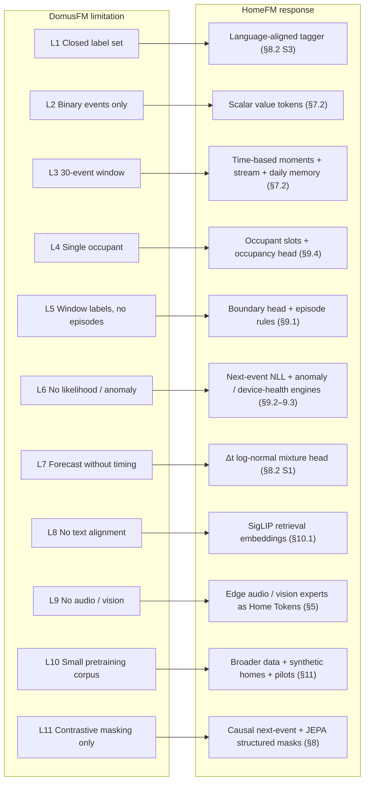

#### L1 · Closed label set, no zero-shot (R1)

- **In simple words:** DomusFM learns patterns on its own, but it can only put a *name* on an activity if it has been shown labelled examples of that activity. A new idea like "vacuuming" has no name in the model until someone provides examples.
- **In the paper:** §7.4.3 states DomusFM "does not yet operate in a zero-shot fashion" (zero-shot means recognising something with no labelled examples). Every activity-recognition result fine-tunes a linear head on 5–30 % of the target dataset's labels (§6.1.3, §6.4.3).
- **Where the labels come from:** the paper does no labelling of its own, and pretraining is label-free. The labels used for fine-tuning are the human-made activity annotations that ship with the public datasets (CASAS, UCI, …). So DomusFM *learns* without labels, but it can only *name* an activity that already has labelled examples.
- **Example:** *"How many times did someone vacuum today?"* None of the public datasets has a "vacuuming" annotation, and this home has never labelled it.
- **What goes wrong:** there is no output for "vacuuming". Pretraining may group vacuuming-like moments together (the paper's clustering task needs no labels), but the group has no name and cannot be found by the word "vacuuming". To add it as a class, someone must first provide labelled examples. 5 % of a CASAS dataset is still days of annotated activity, which a household will not provide for every new question.
- **Same failure:** "guest visit", "kids doing homework", "Dad took medicine", any concept the user invents.
- **How HomeFM fixes it:** each minute's summary is trained to sit close to text that describes it (SigLIP alignment, §8.2 Stage 3). A cooking minute lands near the words "someone is cooking". A new concept is then found by comparing minutes with its text, with no labels. Labels are still useful, but to improve accuracy, not to make a concept exist.

#### L2 · Binary events only; continuous data must be binarised (R2, R6)

- **In simple words:** DomusFM only understands on and off. Meters that report amounts (power, temperature, humidity) have to be squashed into on/off first, and the amount is thrown away.
- **In the paper:** §3.1 and §7.4.2 require continuous streams to be discretised into ON/OFF "virtual events" by pre-processing, and acknowledge possible information loss.
- **Example A:** *"How much energy did we use in the last hour?"* ON/OFF events for the kettle, oven and heater carry no kWh, so the answer cannot come from the model's input.
- **Example B:** *"Is my fridge OK?"* A failing compressor runs 25 min per cycle instead of 12 and draws 20 % more power. After binarisation both look like `fridge ON … fridge OFF`. Only the gap between events changes slightly, and the power level is gone.
- **Example C:** bathroom humidity turned into `shower ON/OFF` needs a threshold tuned per bathroom and season. A wrong threshold silently creates or deletes showers.
- **What goes wrong:** energy questions cannot be answered, slow device faults are invisible, and hand-tuned thresholds add hidden errors.
- **How HomeFM fixes it:** numbers enter the model as numbers (value tokens, sent when the value changes), so 1,800 W stays 1,800 W. Level, on/off rhythm and trend are all kept, and energy and device-health reasoning read the real signal (§7.0 step 1, §7.2).

#### L3 · Fixed 30-event window (R3)

- **In simple words:** DomusFM always looks at exactly the last 30 events. How much time that covers depends on how busy the home is: minutes when busy, hours when quiet, and never days or weeks.
- **In the paper:** §6.2 uses event-based windows of 30 events. §7.2 notes that the time covered by a fixed number of events varies widely across datasets, and performance drops in a 5-minute time-based variant.
- **Example A:** *"How many times did cooking happen in the last 4 hours?"* In a busy kitchen 30 events can be about 2 minutes, so a 40-minute cooking session spans many windows and no single window sees its start and end.
- **Example B:** at night, 30 events can cover 6 hours, so one window mixes sleeping, a bathroom trip and an early breakfast.
- **Example C:** *"Is Mum sleeping worse than last month?"* or *"Is the fridge degrading?"* need days to weeks of context. A 30-event window cannot see a trend.
- **What goes wrong:** long activities are cut into pieces, quiet periods are blurred together, and slow changes are invisible.
- **How HomeFM fixes it:** time is cut into fixed 1-minute slots, so "the last 4 hours" always means 240 steps whether the home is busy or quiet. A stream model reads hours of minutes in order, and daily summaries cover weeks (§7.0 steps 3–5).

#### L4 · Single occupant / perfect data association (R4)

- **In simple words:** DomusFM assumes one person lives in the home, or that someone has already told it who caused each event. A motion sensor fires the same way for grandma, her grandson or the dog.
- **In the paper:** §7.4.1 assumes single occupancy or that each event is already attributed to a person, and calls multi-occupant association an open challenge.
- **Example A:** *"How many people are in the living room?"* A PIR sensor fires the same way for one or four people. DomusFM has no occupancy output and no notion of "who".
- **Example B:** *"Did grandma eat lunch?"* while her grandson cooks at noon. Kitchen events are attributed to "the resident", so grandma's missed meal is hidden.
- **Example C:** the dog walks through the hallway at 2 am. Without a pet/person distinction this looks like an elderly person wandering at night: either a false alarm, or real wandering is learned as normal.
- **Example D:** *"Did we have guests?"* Guests mostly show up as more people than residents, which a single-occupant model cannot represent.
- **What goes wrong:** counts of people, per-person care questions and guest detection are impossible, and pets cause false alarms.
- **How HomeFM fixes it:** a "person card" (occupant slot) per resident and pet that events are assigned to, a per-room people count, and signals that carry identity (camera person counts, phone presence, radar) where the household allows them. With motion sensors only, it gives a calibrated range instead of a falsely confident number (§7.0, §9.4).

#### L5 · One label per window, no episode boundaries (R5)

- **In simple words:** DomusFM puts one activity label on each moment, but never says where an activity *starts* and *ends*. Counting "how many times" needs those start and end points, and a single label cannot show two things happening at once.
- **In the paper:** §6.4.1 classifies the activity at the last event of each window, with a stride of one event. The output is a per-event label sequence, not a list of occurrences.
- **Example:** *"How many times did cooking happen today?"* The model emits thousands of per-event labels, which have to be turned into episodes with no learned boundaries. A two-minute gap while stirring splits one cooking session into three. Brief "Other" labels in between (§6.1.1) fragment episodes further.
- **Example (overlapping):** cooking while the baby cries. A single-label window must pick one, so one of the two counts is wrong.
- **What goes wrong:** counts and durations are unreliable, and overlapping activities are lost.
- **How HomeFM fixes it:** several tags per minute (activities can overlap), a head that marks starts and ends, and per-activity rules in the ontology, for example "cries less than 60 s apart count as one" and "drop anything shorter than the minimum duration". Counts are computed from these episodes, not from windows (§9.1).

#### L6 · No likelihood, anomaly or device-health output (R6)

- **In simple words:** DomusFM can describe what is happening, but it cannot say *how unusual* it is for this home, and it has no idea when a sensor or appliance is broken.
- **In the paper:** §7.4.4 lists anomaly detection, behaviour-change detection and occupancy prediction as future work. The contrastive objective yields embeddings, not probabilities.
- **Example A:** *"Anything unusual last night?"* The front door opened at 03:12. DomusFM can embed that window but cannot say how improbable it is *for this home*.
- **Example B:** a PIR sensor stuck ON after a battery fault produces a regular stream of events. The model has no notion that the sensor is broken and may treat it as someone present.
- **Example C:** *"Is Dad's routine changing?"* Three night bathroom trips instead of one, week after week, is an early health signal that needs a per-person baseline and a drift score.
- **What goes wrong:** no security alerts, no fault detection, and no early warning of changing routines.
- **How HomeFM fixes it:** the model learns to predict the next event, so it can measure *surprise*: how unlikely the thing that just happened was (−log p(event | history)). The anomaly engine combines surprise with rarity and routine drift and always explains its flags. The device-health engine compares each device with its own past and with the same device type in other homes (§9.2, §9.3).

#### L7 · Forecasting without timing (R7)

- **In simple words:** DomusFM can guess *which* events are likely soon, but not *when*, or in what order.
- **In the paper:** §6.5.1 predicts the unordered bag of the next k events, deliberately ignoring order and timestamps. The 5-minute variant in §7.2 performs slightly worse.
- **Example:** *"Will Dad be up soon? I want the coffee machine ready."* The model can say bedroom and bathroom events are likely among the next 30, but not whether they come in 5 minutes or 3 hours.
- **Example (missing event):** no kitchen activity by 11:00 when breakfast normally happens by 9:00. Detecting that needs a timed expectation, which a bag of events does not provide.
- **What goes wrong:** no useful "when" predictions, and missed routines (skipped meals, missed medicine) cannot be detected.
- **How HomeFM fixes it:** the next-event head predicts which device, what value **and how long until it happens** (a log-normal mixture over Δt). "Expected by" deadlines and missed routines can then be checked (§8.2 Stage 1).

#### L8 · Embeddings not searchable by text (R10)

- **In simple words:** DomusFM stores what it learned as lists of numbers (embeddings) that are not connected to language. You cannot type a question and find matching moments.
- **In the paper:** embeddings are trained by contrasting views of event windows; they are not aligned with language.
- **Example:** *"When did someone come home late this week?"* or *"Show me the evening the kitchen was busy for hours."* The query agent has text, and DomusFM embeddings live in a different space, so there is nothing to search against.
- **What goes wrong:** open-ended and summary questions cannot use the model at all.
- **How HomeFM fixes it:** minute summaries are stored in the same space as text, so the agent's `semantic_search` tool turns a question into a vector and finds the closest minutes (open path, §5.1, §10.1).

#### L9 · Missing modalities: audio and vision are out of scope (R2)

- **In simple words:** DomusFM cannot hear or see. Anything that makes no sensor switch flip is invisible to it.
- **In the paper:** inputs are events from binary sensors and binarised continuous sensors (§3.1). Audio and camera events are not considered.
- **Example A:** *"How many times did my kid cry?"* or *"Did the dog bark while we were out?"* Crying and barking produce no binary sensor event.
- **Example B:** *"How many parcels did we receive yesterday?"* A door contact shows the door opened. Whether a parcel was left, a guest arrived or someone went out needs a camera detection.
- **What goes wrong:** whole question domains (childcare, pets, deliveries) cannot be answered.
- **How HomeFM fixes it:** audio and vision detectors run on the home hub and send only tags and embeddings, with a confidence, in the same event format (Home Tokens). HomeFM combines them with the sensor stream. Raw audio and video never leave the home (§5, §13).

#### L10 · Small, homogeneous pretraining corpus

- **In simple words:** DomusFM learned from a few public datasets, mostly single-person homes with older binary sensors. It has never seen many of the devices in a modern smart home.
- **In the paper:** pretraining uses six of seven public datasets (§5). §6.2.1 sizes the model to this small corpus.
- **Example:** a new home with Matter plugs, a doorbell camera, a smart lock, a robot vacuum and 150 devices. Locks, cameras, vacuums and air purifiers never appear in pretraining.
- **What goes wrong:** understanding of these devices rests entirely on the text description of the device ("smart lock, front door"), with no practice data behind it.
- **How HomeFM fixes it:** broader pretraining data (§11): more CASAS homes, energy datasets, simulated multi-person homes with faults added on purpose, and real pilot homes. A large teacher model trained on a server passes its knowledge to a small student that runs on the hub (§7.3).

#### L11 · Pretraining objective (see §8.1)

- **In simple words:** DomusFM's self-training game ("is this the same window with a few events hidden?") is too easy on home data. The model wins it by learning how sensors behave rather than what people do.
- **In the paper:** §4.3 uses masking only as augmentation for in-batch InfoNCE.
- **Example A:** motion sensors fire ON and then OFF a few seconds later. Hide the OFF and it is trivially guessed from the ON, so the attribute-masking stage mostly learns sensor mechanics.
- **Example B:** two windows of a resident sleeping on different nights land in the same batch and are pushed apart as "different", although they are the same behaviour.
- **What goes wrong:** pretraining carries little useful signal. In our real-data reproduction the contrastive loss fell to about 0.001 almost immediately, and pretraining gave no benefit on UCI B or hh101 ([DOMUSFM_REPRODUCTION.md](DOMUSFM_REPRODUCTION.md), §8.0).
- **How HomeFM fixes it:** harder and more useful games: predict the next event and when it happens; hide large structured chunks (a time block, a device, a room, a modality) and predict their meaning (JEPA); align with language using a loss that allows many matches (SigLIP). The choice is tested, not assumed, in the A–F comparison (§8.2, §8.3).

#### What DomusFM does well, and we keep

- **Sensor attributes as text** is what makes cross-home transfer work; its results with 5 % labels on unseen datasets support this.
- **Attribute-level fusion** of what, where, state and time.
- **Edge feasibility:** 36M parameters, < 500 MB, ~10 ms per window on a Celeron CPU.
- **Leave-one-dataset-out evaluation**, which we adopt as our protocol.

## 5. System architecture

Four layers. HomeFM sits in L2; the rest of the system turns its outputs into answers.

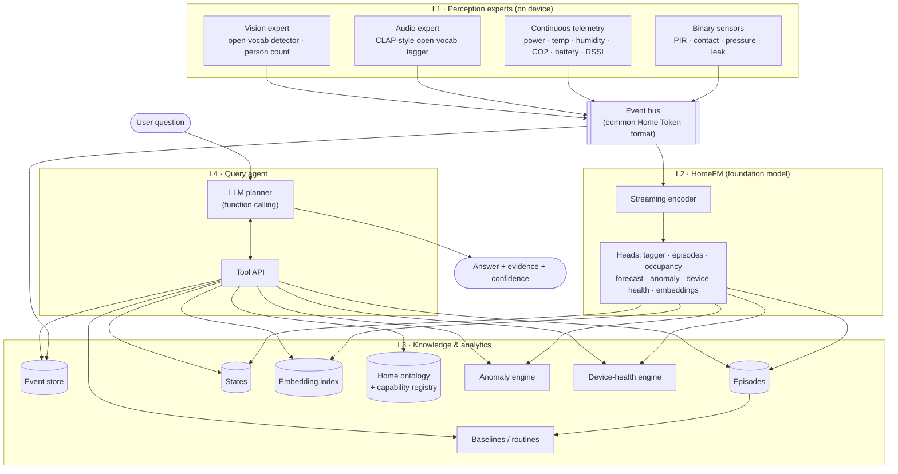

### 5.1 Three answer paths

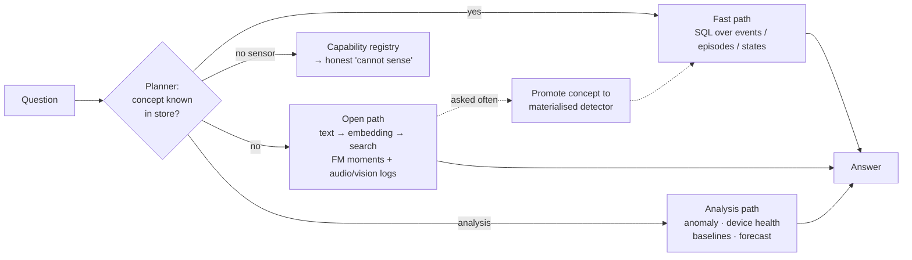

- **Fast path:** concepts already materialised (cooking, parcel, bark) → exact SQL answers.
- **Open path:** concepts not materialised → semantic search over HomeFM moment embeddings, with confidence.
- **Analysis path:** anomaly, device-health, baseline comparison and forecasting tools.
- **Promotion loop:** frequently asked open-path concepts become materialised detectors.

## 6. Data model

### 6.1 Home Token (common event format)

Every signal, from any sensor or expert, becomes a Home Token:

| Field | Type | Notes |
|---|---|---|
| `ts` | float (unix seconds) | Event time, home timezone stored separately |
| `home_id` | str | |
| `entity` | Entity | See below |
| `modality` | enum | `binary`, `scalar`, `audio_tag`, `vision_det`, `embedding` |
| `state` | int ∈ {OFF, ON, NA} | For binary modality |
| `value` | float \| None | Scalar reading or patch statistic |
| `vector` | float[] \| None | Audio / vision embedding (optional) |
| `confidence` | float ∈ [0,1] | 1.0 for physical sensors; model score for experts |
| `source` | enum | `sensor`, `expert`, `homefm` |
| `person_id` | str \| None | When known (camera, phone presence, wearable) |

**Entity** = `{entity_id, item, room, sensor_type, capability}`. The text `"{item} in {room}, {sensor_type} sensor"` is embedded with a frozen text encoder → the model never sees home-specific IDs (R8).

### 6.2 Home ontology

SAREF/Brick-inspired graph: `Home → Room → Device → Capability`, plus `Resident`, `Pet`, and aliases ("kid" → resident *Aarav*, "grandma's room" → *Bedroom 2*). The **capability registry** records which concepts are observable in this home, so the agent can refuse honestly.

### 6.3 Stores

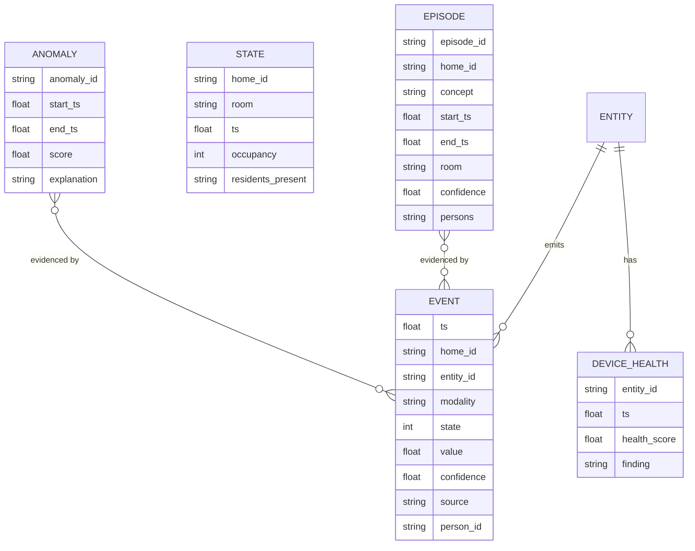

## 7. HomeFM model architecture

### 7.0 In plain words

HomeFM reads the home the way a person reads a diary: individual **words** (events) form **sentences** (minutes), sentences form a **story** (hours), and stories form **chapters** (days and weeks). The model builds its understanding in the same layers. The steps below follow one example: at **18:42 in the kitchen**, the stove plug jumps to 1,800 W, kitchen motion fires and the fridge door opens.

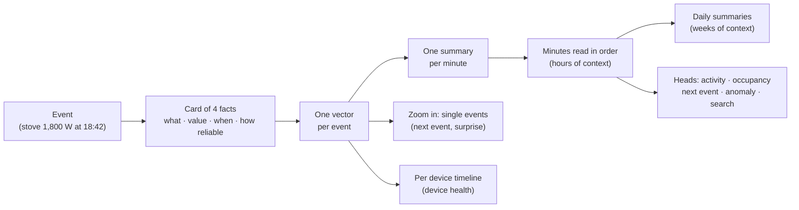

**1. Home tokens: each event becomes a card with 4 facts.**

| Fact | Example | Meaning |
|---|---|---|
| Entity text | "stove in kitchen, power sensor" | *Which* device, described **in words**, so the model understands a "stove" in any home, even one it has never seen. A frozen language model turns the words into numbers. |
| Value | ON, or 1,800 W | *What it reported*. Continuous values like power stay numbers; they are not flattened to ON/OFF. |
| Time | 18:42, Tuesday, 3 s after the previous event | *When*, plus how long since the last event |
| Meta | power reading, confidence 1.0 | *What kind of signal* and how reliable it is (an audio "baby crying" guess might be 0.8) |

**2. Attribute fusion: the 4 facts become one vector.** The facts are merged so they **influence each other**: "kitchen motion at 07:00" and "kitchen motion at 23:30" should mean different things, so the time changes how the device is read. This idea comes from DomusFM.

**3. Moment encoder (L1): one summary per minute.** Events are grouped into 1-minute slots. A few learned "reporters" read each minute's events, each looking for different things (movement, appliances, doors), and write one short summary together. A busy minute with 40 events and a quiet minute with none both become exactly one summary, so busy and quiet homes are handled the same way, and "nothing happened" is information too. Fixed minutes, rather than DomusFM's "last 30 events", make "the last 4 hours" always mean 240 steps.

**4. Stream model (L2): the minutes are read in order.** A transformer reads the sequence of minute summaries so each minute is understood in context: the stove means more if the fridge was just opened and someone has been in the kitchen for 10 minutes. It has two modes:

- **Live (causal):** each minute sees only the past, as in real time. Used for streaming, forecasting and spotting surprises.
- **Looking back (bidirectional):** each minute sees before and after. Used to summarise a finished period ("cooking from 18:42 to 19:21").

**5. Long-horizon memory (L3): days and weeks.** Each day is compressed into a few daily summary cards, and a small model reads weeks of them. Slow changes show up here: "Mum is waking later each week", "the fridge runs a little longer every day".

**Side branch A, event read-out: zooming back into single events.** After the minute-level understanding, the model returns to individual events, now informed by context. This is needed to predict **exactly which event comes next and when**, and to measure **surprise** ("the front door at 03:12 was very unlikely"), which feeds anomaly detection.

**Side branch B, entity axis: each device's own timeline.** Each device's events are also followed on their own, which gives a health signal per device, compared with its own past and with the same device type in other homes.

**6. Heads: small outputs on top for specific jobs.**

| Head | Job | Enables |
|---|---|---|
| Open-vocabulary tagger | Scores each minute against any text ("cooking", "vacuuming") | "Did anyone vacuum?", with no labels needed |
| Episode boundaries | Marks where an activity starts and ends | Counts and durations: "cooked 2 times" |
| Occupancy / identity slots | People per room, and *who* (resident, guest, dog) | "How many people are in the living room?" |
| Next event | What happens next, its value and when | Forecasts, and surprise scores |
| Anomaly score | How unusual this moment is for this home | "Anything unusual last night?" |
| Device health | Whether a device's behaviour is drifting | "Is the fridge OK?" |
| Retrieval embedding | A searchable vector per minute | The vector index behind the agent's search tool (§10.1) |

**Occupant slots.** The model keeps a few "person cards" per home (Dad, Mum, kid, dog) and assigns events to them. That is how a dog in the hallway at 2 am is told apart from an elderly person wandering.

**Sizes (§7.3).** A large **teacher** (300M–1B parameters) is trained on a server; a small **student** (20–50M) learns to copy it and runs on the home hub; a **tiny** version is used for tests.

**In one line:** event → card of 4 facts → one vector per event → one summary per minute → minutes read in order → daily summaries for weeks, with side branches that zoom into single events (prediction, surprise) and single devices (health), and small heads on top for specific jobs.

**Build status:** the scaffold implements the event cards, attribute fusion, the moment encoder, the stream model (both modes), the event read-out and the next-event head. Daily memory, the entity axis, occupant slots, and the tagger, boundary and device-health heads are not built yet.

### 7.1 Overview

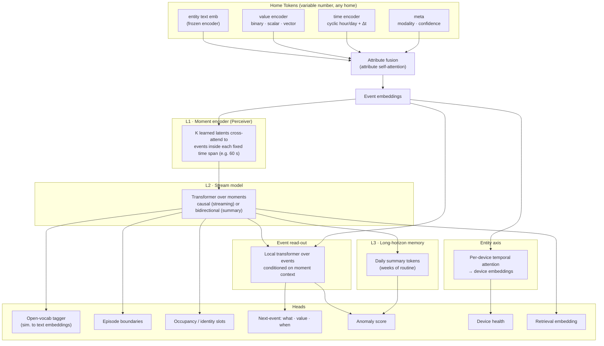

### 7.2 Components

**Event embedder.** Each token has four attribute vectors — entity (projected frozen text embedding), value (state embedding for binary; MLP on normalised scalar; linear projection for vectors), time (sin/cos harmonics of hour-of-day and day-of-week, plus `log(1+Δt)` since the previous event of the same entity and of the home), and meta (modality, confidence). A small transformer attends across the four attributes and pools them into one event embedding (DomusFM-style attribute fusion).

**Moment encoder (L1).** Time is cut into fixed spans (default 60 s). For each moment, K learned latent queries cross-attend to the events that fall inside it (Perceiver). This handles any number of sensors and any sparsity with constant cost; an empty moment attends to a learned "quiet" key.

**Why time-based moments instead of 30-event windows?** A 30-event window spans seconds in a busy kitchen and hours at night. Fixed time spans make "last 4 hours" map directly to model positions, make dense and sparse homes comparable, and give a regular grid for streaming.

**Stream model (L2).** A transformer over moment tokens with continuous-time positional information (moment start time encoded cyclically + learned relative position). Two modes share weights:

- **Causal** for streaming, forecasting and likelihood-based anomaly scoring. A carried KV cache / state keeps edge inference incremental (R9). An SSM (Mamba-style) variant is an option to evaluate for long contexts.
- **Bidirectional** for summary embeddings used in tagging, episodes and retrieval.

**Long-horizon memory (L3).** Each day is compressed into a small set of summary tokens. A lightweight transformer over the last N days models routine and drift (elderly-care trends, device degradation).

**Event read-out.** A small transformer over the raw event embeddings, where each event is conditioned on the stream context of its moment (bidirectional) or of the *previous* moment (causal). Used for event-level objectives (masked event prediction, next-event prediction).

**Entity axis.** Per-device temporal attention over the device's own tokens produces a device embedding for health monitoring (R6), compared against the device's history and across homes.

**Occupant slots (R4).** Each home learns a small set of slot embeddings (residents, pets). Slot attention assigns events to slots; supervised where camera, radar, phone presence or wearables give identity.

### 7.3 Model sizes

| Variant | Params | Where | Purpose |
|---|---|---|---|
| Teacher | 300M–1B | Server GPU | Pretraining at scale, pseudo-labels |
| Student | 20–50M (int8) | Edge hub | Streaming inference, per-home adaptation |
| Scaffold `tiny` | ~1–3M | Laptop / CI | Smoke tests, objective ablations on synthetic data |

## 8. Pretraining design

### 8.0 In plain words

**What pretraining is for.** We have millions of sensor events but very few labels saying "this was cooking". So before the model sees any labels, it teaches itself from the raw stream by playing self-made games (pretraining objectives). Labels come later and are used only for fine-tuning. The analogy is learning a language: before answering exam questions, a student reads thousands of books and plays "guess the missing word" or "guess what comes next". This section is about choosing good games.

#### Why "hide and guess" alone is not enough

*Masking* means hiding part of the data and asking the model to fill it in. DomusFM uses a version of it. On home data it is often too easy, or aimed at the wrong thing:

| # | Problem | In simple terms | Fix |
|---|---|---|---|
| 1 | Too easy to guess | Motion sensors fire ON then OFF seconds later. Hide the OFF and the model guesses it from the ON, learning sensor mechanics rather than behaviour. | Hide **bigger chunks**: a 5-minute block, one device, a whole room, all audio |
| 2 | Guessing exact details wastes effort | Like recalling a book's page number instead of its plot | Guess the **meaning** (a summary vector), not raw values (JEPA) |
| 3 | Similar things treated as different | "This window differs from every other window in the batch", yet two nights of sleep *are* the same behaviour | Treat matching windows as the same (SigLIP), or use games without "different" pairs |
| 4 | Looks at the future | A live home has no future; anomaly detection needs "how likely was what just happened?" | **Predict the next event** from the past only |
| 5 | Ignores timing | A 3-second and a 30-minute bathroom visit look alike if only order matters | Also predict **when** |
| 6 | Common sensors dominate | Most events are motion; a door at 3 am or a leak is hardly practised | Hide rare events more often and weight them more |
| 7 | Learns sensor IDs | "M003" means nothing in another home | Predict the device's **description** ("stove in kitchen") |
| 8 | No link to language | Hide-and-guess never teaches what "guest arrived" means | Align with text (Stage 3) |

**Evidence from our real-data runs** ([DOMUSFM_REPRODUCTION.md](DOMUSFM_REPRODUCTION.md)) is consistent with problems 1 and 3. DomusFM's contrastive loss fell to about 0.001 almost immediately, even on the 27M-event corpus. Pretraining gave no benefit on UCI B or hh101, and lowered hh101 activity F1 at 5 % labels (0.49 vs 0.57 without pretraining).

#### The proposed recipe: four stages

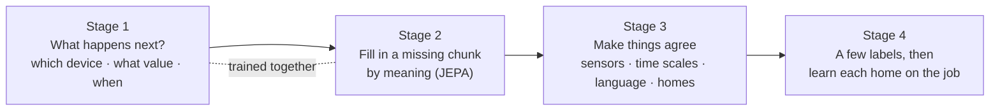

**Stage 1: "What happens next?" (the main game).** Given everything so far, predict the next event: which device, what value, and how long until it happens. *Example:* fridge door opened and stove on at 18:42 → "kitchen motion within about 10 s". It is the main game because it matches how the model runs live (past only), gives **forecasts** for free, and gives **surprise** for free: if the model expected nothing until 07:00 and the front door opens at 03:12, that surprise is the anomaly signal.

**Stage 2: "Fill in the missing chunk, by meaning" (JEPA).** Hide a big, structured piece (10 minutes, all kitchen sensors, all audio) and predict the **summary** of what was hidden, not the exact events. A slowly updated copy of the model provides the target summaries, which keeps the game stable. This teaches cross-sensor reasoning: "no kitchen sensors visible, but the stove plug drew power, so probably cooking".

**Stage 3: Make things agree.**

- *Across sensor types:* the motion view and the audio view of the same minute should agree.
- *Across time scales:* a minute's summary should fit its hour, and the hour its day.
- *With language:* a cooking window should land near the text "someone is cooking". This later lets the system answer "did anyone vacuum?" with no labels.
- *Across homes:* a small adversary tries to guess which home a window came from, and the model is trained to make that impossible, so it learns general knowledge instead of home-specific quirks.

**Stage 4: A few labels, then learn each home on the job.** Use the labels available (public datasets, simulated faults, user corrections). After installation, keep playing the Stage 1 and 2 games on **that home's own data** every day, adjusting only small per-home parts, so the model gets used to this family's routine without anyone labelling anything.

**Cheap extra games:** guess the time of day from a window (teaches routines); guess which events come next regardless of order (DomusFM's task; cooking steps can happen in any order); consistency checks (stove power should mean someone is in the kitchen).

#### The fair comparison (A–F)

Rather than assume Stage 1 + 2 is better, we test it. Model, data and compute stay the same; only the game changes.

| Variant | Game | Plain meaning |
|---|---|---|
| A | DomusFM contrastive | "Is this the same window with bits hidden?" (baseline) |
| B | Random masking | "Guess the hidden events" (BERT-style) |
| C | Structured chunks by meaning | Stage 2 only |
| D | Next event | Stage 1 only |
| E | D + C | **Proposed** |
| F | E + language + home-invariance | Full version; adds "search with any words" |
| G | F + harder, safer games (§8.4) | Proposed refinement: hide on/off pairs together, raise difficulty automatically, predict the next 1/10/60 minutes, treat routine repeats as matches, guard against collapse |

They are scored on activity recognition, exact counts, detecting injected faults, forecasting, finding never-labelled concepts from text, and learning from only 1–5 % of labels.

**Status:** A–F run end to end on simulated homes. On real data, DomusFM (A) is training on the 77-home corpus; the HomeFM E comparison on the same data and protocol is ready to run (`scripts/run_homefm_corpus.sh`).

### 8.1 Why masking alone is not enough

DomusFM uses masking as an **augmentation** for contrastive learning. Plain masking (either BERT-style reconstruction or masked-view contrastive) has specific failure modes on smart-home data:

| # | Problem | Consequence | Fix |
|---|---|---|---|
| 1 | Masked events are easy to guess (PIR ON→OFF pairs) | Learns sensor mechanics, not behaviour | Structured masks: time blocks, entity spans, rooms, modalities |
| 2 | Reconstruction in input space | Capacity wasted on noise (exact seconds, noisy values) | Predict **latents** (JEPA with EMA target encoder) |
| 3 | Contrastive false negatives | Repetitive routines: two "sleeping" windows pushed apart | Structural positives, SigLIP-style losses, non-contrastive options |
| 4 | Bidirectional only | No likelihood of the future → weak anomaly/forecast | **Causal next-event prediction** |
| 5 | Timing ignored | 3 s vs 30 min bathroom visit look the same | Predict Δt distribution |
| 6 | Frequent sensors dominate | Rare important events under-trained | Information-weighted masking, inverse-frequency loss weights |
| 7 | Predicting sensor IDs | Does not transfer | Predict semantic entity embeddings |
| 8 | No language grounding | No open vocabulary | Language alignment |

### 8.2 Proposed four-stage recipe

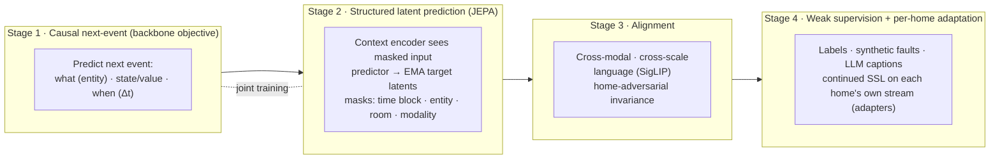

**Stage 1 — Causal next-event prediction (marked temporal point process).** For each event *i*, given all events before it, predict event *i+1*:

- **what:** entity, scored as similarity between the predicted vector and the semantic entity embeddings of the home (transfers across homes)
- **state / value:** categorical state for binary; Gaussian or quantile loss for scalars
- **when:** log-normal mixture over `Δt = t_{i+1} − t_i`

Loss: `L_next = CE(entity) + CE(state) + λ_v · L_value + NLL_{LogNormMix}(Δt)`.

This one objective gives streaming inference, forecasting, and **anomaly scores as negative log-likelihood** — capabilities masking cannot provide.

**Stage 2 — Structured latent prediction (JEPA).** A context encoder (bidirectional) sees the input with structured masks; a predictor predicts the **latent moment embeddings** produced by an EMA target encoder on the unmasked input. Loss on masked moments only: `L_jepa = SmoothL1(norm(pred), norm(target))`.

Mask families (sampled per batch):

| Mask | What is hidden | Forces the model to learn |
|---|---|---|
| Time block | All events in a contiguous span of moments | Behaviour over minutes |
| Entity span | All events of 1–3 entities over the window | Cross-sensor redundancy (e.g. stove ↔ kitchen PIR) |
| Room | All entities in one room | Spatial reasoning, occupancy |
| Modality | All audio or all scalar tokens | Robustness to missing modalities |
| Info-weighted | Events sampled ∝ 1/frequency(entity) | Rare but important events |

**Stage 3 — Alignment.**

- *Cross-modal:* sensor-only, audio-only and vision-only views of the same moment should agree.
- *Cross-scale:* a moment embedding should be predictable from its hour, and the hour from its day.
- *Language:* window/episode embeddings aligned with captions using a **SigLIP sigmoid loss** (tolerates many positives per batch → fixes false negatives in repetitive routines).
- *Home invariance:* a home classifier behind a gradient-reversal layer strips home identity from shared embeddings; per-home detail lives in adapters.

**Stage 4 — Weak supervision and per-home adaptation.** Supervised heads on dataset labels, synthetic faults, and filtered LLM captions. After deployment, continue Stage 1 + 2 on each home's own unlabelled stream, updating only per-home adapters (test-time training).

**Auxiliary tasks (cheap):** predict time-of-day from a window; predict the unordered bag of next-k events (DomusFM's task, tolerant to partial order); cross-sensor consistency (stove power ⇒ kitchen presence).

### 8.3 Objective ablation matrix

Same backbone, data and compute budget; only the objective changes.

| Variant | Objective | Config |
|---|---|---|
| A | DomusFM-style dual contrastive (attribute mask → event mask, InfoNCE) | `configs/objectives/A_contrastive.yaml` |
| B | BERT-style random event masking + reconstruction | `configs/objectives/B_masked_recon.yaml` |
| C | Structured latent masking (JEPA) | `configs/objectives/C_latent_mask.yaml` |
| D | Causal next-event (temporal point process) | `configs/objectives/D_next_event.yaml` |
| E | D + C (proposed) | `configs/objectives/E_next_event_latent.yaml` |
| F | E + language alignment (SigLIP) + home-adversarial | `configs/objectives/F_full.yaml` |

Evaluated on (§12): activity F1 (linear probe and fine-tune), episode-count exact match, anomaly AUROC on injected faults, forecast NLL, open-vocab retrieval on held-out concepts, 1 %/5 % few-shot adaptation.

| G | F + the refinements in §8.4 | not implemented yet |

**Hypothesis (to be tested, not assumed):** E beats A–D on anomaly, forecasting and counting and matches A on activity recognition; F adds zero-shot capability; G trains more stably than E/F and keeps a non-trivial loss on real data.

### 8.4 Proposed refinements (variant G)

The four-stage recipe (§8.2) addresses the problems in §8.1. Our real-data reproduction shows one failure most clearly: **the game becomes too easy**. DomusFM's contrastive loss fell to about 0.001 almost immediately, and pretraining gave no benefit ([DOMUSFM_REPRODUCTION.md](DOMUSFM_REPRODUCTION.md)). The five refinements below target that failure directly. They are proposals, not yet implemented, and are tested as variant G against A, E and F.

| # | Refinement | In simple words | Fixes (§8.1) |
|---|---|---|---|
| G1 | Pair-aware masking | If "motion ON" is hidden, also hide its matching OFF, and the other way round | #1 easy guesses |
| G2 | Adaptive mask difficulty | If the loss collapses, hide bigger chunks automatically (1 → 5 → 15 min; one device → whole room) | #1, and the collapse seen in the reproduction |
| G3 | Multi-horizon latent forecasting | Predict the *summary* of the next 1, 10 and 60 minutes, from the past only | #4, #5; links Stage 1 and Stage 2 |
| G4 | Routine-aware positives | Treat the same home at the same time of day on different days as "probably similar", not "different" | #3 false negatives |
| G5 | Collapse guard | A small penalty that keeps summaries varied, so the model cannot cheat by making them all the same | Stability of Stage 2 (JEPA) |

**G1 · Pair-aware masking.** Many sensors emit paired events: a PIR ON is followed by an OFF seconds later, and a door OPEN by a CLOSE. Hiding only one half of a pair lets the model recover it from the other half without learning anything about behaviour. G1 extends every mask family in §8.2 so that when one half of a pair is hidden, its partner inside the window is hidden too. Pairs are found from the entity's state type in the ontology; no labels are needed. Cost: negligible.

**G2 · Adaptive mask difficulty (curriculum).** A fixed masking rate is either too easy for some homes or too hard for others. G2 tracks the Stage 2 loss during training. If the loss drops below a threshold for a set number of steps, the sampler moves to a harder level: longer time blocks, more entities per span, then whole rooms and whole modalities. If the loss stops falling, it steps back. This keeps the game challenging throughout training, like a video game that raises its level as the player improves. The current level is logged, so an early collapse is visible instead of silent.

**G3 · Multi-horizon latent forecasting (causal JEPA).** Stage 1 predicts the very next event, which is local ("kitchen motion in 10 s"). Stage 2 fills in hidden chunks using both past and future. G3 adds a middle game: from the causal stream state at minute *t*, predict the EMA target summaries of the windows *t+1*, *t+10* and *t+60* minutes ahead. Loss: `L_future = Σ_h SmoothL1(norm(pred_h), norm(target_h))` for h ∈ {1, 10, 60}. This teaches routines ("dinner is coming") in the live, past-only setting that deployment uses, and directly supports questions like "Will Dad be up soon?" and "Is breakfast late?".

**G4 · Routine-aware positives.** In-batch contrastive learning treats every other window as a negative, so two normal nights of sleep are pushed apart (§8.1 #3). G4 marks windows from the same home at the same time of day on different days (within ±30 min) as soft positives, with a lower weight than true positives. It applies wherever a contrastive or SigLIP-style loss is used (Stage 3). The alternative is to rely on non-contrastive objectives only, which variant E already does for Stages 1–2.

**G5 · Collapse guard.** Predicting latent targets (JEPA) can collapse: the model outputs the same summary for every input and the loss is trivially low. The EMA target encoder reduces this risk but does not rule it out. G5 adds a VICReg-style variance term that penalises any embedding dimension whose standard deviation across the batch falls below a floor: `L_var = mean_d max(0, γ − std(z_d))`. It is cheap and also serves as a health metric during training.

**Combined objective for variant G:**

`L_G = L_next + λ_f · L_future + λ_j · L_jepa(pair-aware, adaptive, info-weighted masks) + λ_v · L_var + Stage 3 alignment (with routine-aware positives)`

followed by Stage 4 (weak supervision and per-home adaptation) unchanged.

**How we will know it works.** Same backbone, data and compute as A–F; only the objective changes. Success means:

- **Training health:** the loss falls steadily rather than collapsing to near zero in the first few hundred steps, and embedding variance stays above the floor.
- **Downstream:** G is at least as good as E/F on activity F1 at 1–5 % labels, and better on forecasting (NLL at 10 and 60 minutes), missed-routine detection, and anomaly AUROC on injected faults.
- **Real data:** pretraining gives a measurable gain over no pretraining on UCI B and hh101, which DomusFM's objective did not.

**Implementation notes.** G1 and G2 extend `structured_mask` in `src/homefm/objectives/masking.py`; G3 adds a head on the causal stream in `src/homefm/objectives/next_event.py` and reuses the EMA target from `latent_mask.py`; G4 changes the positive mask in `alignment.py`; G5 is a small loss term shared by the latent objectives. A `configs/objectives/G_refined.yaml` config would select them.

## 9. Downstream heads and analytics engines

### 9.1 Episodes (counting and duration)

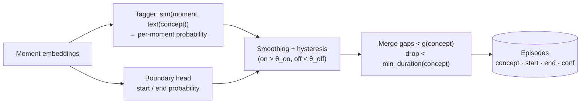

What counts as "one time" is concept-specific (e.g. cries < 60 s apart = one episode). `g` and `min_duration` live in the ontology per concept and can be tuned per home from feedback. This is the single biggest driver of count accuracy.

### 9.2 Anomaly engine

`score = w1 · surprise + w2 · rarity + w3 · routine_drift`

- **Surprise:** −log p(event | history) from the Stage 1 head.
- **Rarity:** density of the window embedding under this home's history (kNN distance).
- **Routine drift:** deviation of episode timing/duration/frequency from the per-person baseline.

Every flag carries an explanation ("front door opened at 03:12; normally no door events after 23:00").

### 9.3 Device-health engine

- **Sensor faults:** silence, stuck-on, battery decay, RSSI drop, event rate inconsistent with neighbouring sensors.
- **Appliance faults:** per-appliance power signature embeddings (entity axis) vs own history and vs same-type fleet — longer compressor cycles, changed wash-cycle shape, standby creep.

### 9.4 Occupancy and identity

Per-room occupancy regression from moment embeddings, supervised by camera/radar counts when available; occupant slots for "who". PIR-only homes get calibrated uncertainty rather than a point estimate.

## 10. Query agent

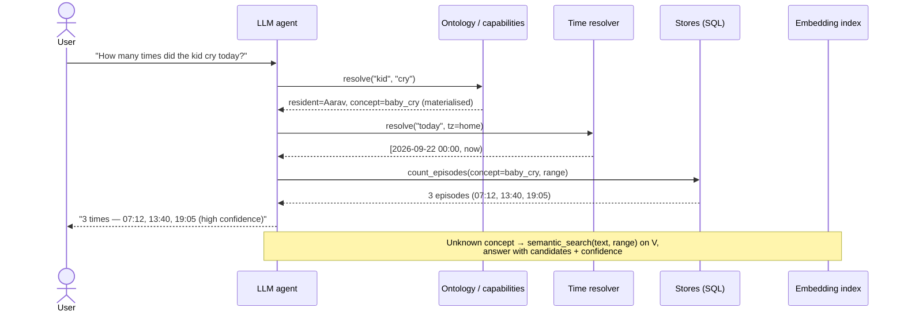

**Tools:** `query_events`, `query_episodes`, `get_state`, `semantic_search(text, range)`, `compare_baseline`, `detect_anomalies`, `device_health(entity)`, `energy_breakdown`, `forecast`, `list_capabilities`.

**Rules:**

- The LLM never produces numbers; tools do.
- Time expressions are resolved in code, in the home's timezone.
- Every answer includes evidence and confidence.
- If the capability registry says a concept is unobservable, say so.

**Model:** small local LLM (3–8B, function calling) on the hub by default; optional cloud model if the household opts in.

### 10.1 How the agent reads HomeFM outputs

HomeFM's contextual embeddings are **not text embeddings**, and the LLM **never reads them**. The LLM only sees text and JSON. HomeFM's outputs reach it through two bridges.

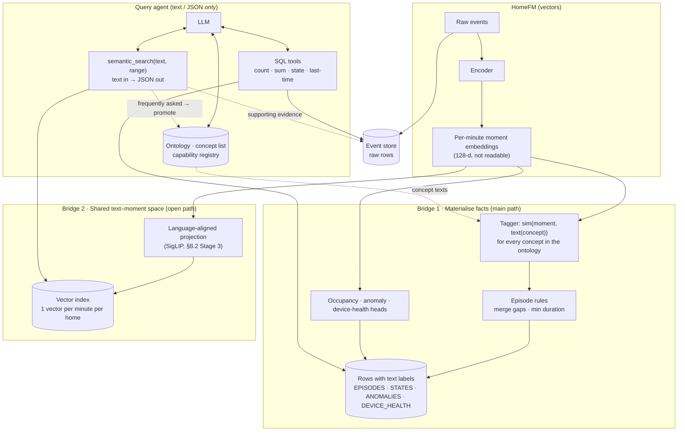

#### Bridge 1: HomeFM's heads turn vectors into stored facts (main path)

The embeddings are an intermediate result. HomeFM's heads convert them into rows with text labels as data arrives:

| Head | Output row |
|---|---|
| Tagger + episode rules | `EPISODE {concept:"cooking", start:18:42, end:19:21, room:"kitchen", conf:0.91}` |
| Occupancy head | `STATE {room:"living room", ts:…, occupancy:3}` |
| Next-event surprise + anomaly engine | `ANOMALY {start:03:12, score:0.97, explanation:"front door opened; unusual after 23:00"}` |
| Device-health engine | `DEVICE_HEALTH {entity:"fridge", score:0.3, finding:"compressor cycles 2× longer than baseline"}` |

The LLM answers with tools such as `count_episodes(concept="cooking", start=…, end=…)`: plain SQL over strings and timestamps, with no vectors involved.

**What gets stored is decided explicitly, from three sources:**

1. **The ontology's concept list.** It is a list of **text strings** covering the question taxonomy (§3.1): cooking, sleeping, baby crying, dog barking, parcel delivered, guest visit, away from home, … HomeFM tags every minute against every listed concept and stores the resulting episodes continuously.
2. **Raw events are always stored.** Energy readings, door openings and device telemetry go straight to the event store. "How much energy in the last hour?" is a sum over meter rows and needs no model.
3. **The promotion loop.** When a concept keeps being asked through Bridge 2, it is added to the concept list and stored from then on (§5.1).

The tagger is itself text-matched (moment embedding compared with the concept's text embedding), so stored concepts and open-path concepts use **one mechanism**. There is no separate classifier to keep in sync.

#### Bridge 2: a shared vector space for concepts that were not stored

Stage 3 of pretraining (language alignment) trains projections so that moment embeddings and text embeddings land in **the same vector space**: a minute of cooking lands near the text "someone is cooking", as CLIP does for images and captions.

Every minute's projected embedding is kept in a vector index. Storage is small: 1,440 minutes/day × 128 dims × 2 bytes (fp16) ≈ **370 KB per home per day**.

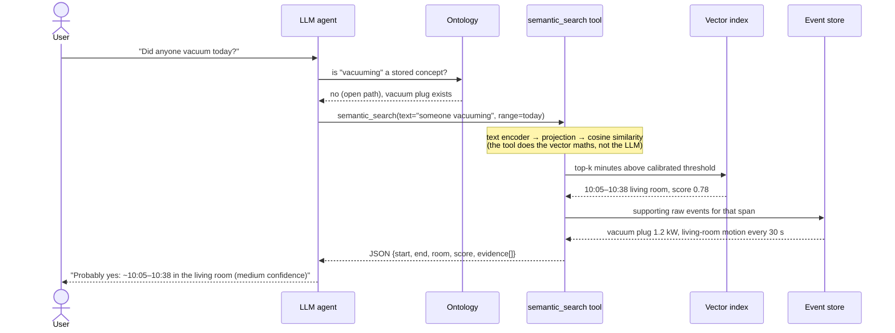

The LLM passes only text into `semantic_search` and receives only JSON back, including the supporting raw events rendered as text.

Because minute vectors are kept, **adding a concept later is cheap and retroactive**: add its text to the concept list and re-run the tagger over the stored vectors to get its full history, without reprocessing raw data.

#### What is stored, and who reads it

| Stored | Format | Read by |
|---|---|---|
| Raw events | Rows (time, device, value) | SQL tools: energy, door counts, telemetry, evidence |
| Episodes, states, anomalies, device health | Rows with **text** labels and explanations | SQL tools: most questions |
| Per-minute projected embeddings | Vectors (fp16) | `semantic_search` only: text in → JSON out |
| Ontology, concept list, capability registry | Text | The LLM, to map "kid" → resident and concept, or to answer "no sensor for that" |

#### Caveats

- Bridge 2 is only as good as the language alignment, which depends on caption quality (§11). Its results carry a confidence score and are less accurate than stored episodes, which is why frequent concepts are promoted to Bridge 1.
- Similarity thresholds for the open path are calibrated per concept family on held-out data, and tuned per home from user feedback.
- Minute vectors are tied to a model version. A HomeFM upgrade re-embeds the retained history (or keeps the old index until it expires) so old and new vectors are never mixed.
- Scaffold status: alignment training exists (the `language` objective in variant F). The tagger → episodes pipeline, the vector index and the `semantic_search` tool are not built yet (§16).

### 10.2 End-to-end example: counting cooking

This traces one question from sensor to answer: **"How many times did cooking happen in the last 4 hours?"**, asked at 20:00.

**Home:** kitchen stove smart plug, kitchen motion sensor, fridge door contact, microwave plug, and an optional kitchen microphone whose audio stays on the hub.

**What happened between 16:00 and 20:00:** the microwave ran for 1 minute at 16:20. Someone made tea from 17:05 to 17:25. Dinner was cooked from 18:30 to 19:25, with the stove switched off for 6 minutes in the middle.

The flow has three phases. **A** happens once, **B** runs all the time, and **C** runs only when someone asks.

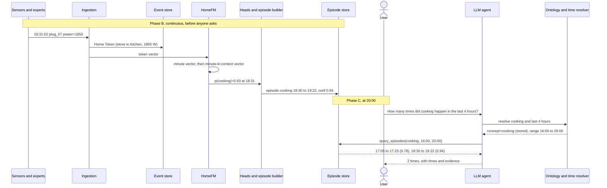

#### Phase A: setup (once)

**A1. Pretrain HomeFM** (§8). This is offline, on the public corpus. The home itself is never used. The model learns general patterns such as "stove power, kitchen motion and evening usually go together". Nobody labels "cooking" at this stage.

**A2. Register the home's devices** (§6.1). Each device is described by text, not by an ID:

| entity_id | Text the model sees |
|---|---|
| `plug_07` | "stove in kitchen, power sensor" |
| `pir_03` | "ceiling in kitchen, motion sensor" |
| `door_12` | "fridge in kitchen, contact sensor" |

Because the model reads "stove in kitchen", it works in a new home without retraining.

**A3. Define the concept in the ontology** (§6.2, §9.1):

| Field | Value for `cooking` |
|---|---|
| Description text | "someone is cooking food in the kitchen" |
| Merge gap `g` | 10 min: two bursts less than 10 min apart are one session |
| `min_duration` | 3 min: anything shorter is not cooking |
| Observable here? | Yes: stove plug and kitchen motion, plus audio if present |

#### Phase B: live processing (continuous)

Follow one moment, **18:31**, during dinner.

**B1. A sensor fires.** The Zigbee hub sends `18:31:02  0x00158d0001a2  {"power": 1850}`.

**B2. Normalise to a Home Token** (§6.1): `ts=18:31:02, entity=plug_07, modality=scalar, value=1850 W, confidence=1.0, source=sensor`. If a microphone is present, the audio expert adds its own token, such as `audio_tag="sizzling", confidence=0.82, source=expert`. The raw audio is discarded.

**B3. Store the raw event** in the event table. This keeps the evidence and answers exact questions ("when was the fridge opened?") without the model.

**B4. Token to vector** (§7.2). The token becomes one vector made of four parts:

- **what:** the device text, through the frozen text encoder (cached)
- **value:** 1850 W, scaled
- **when:** Tuesday at 18:31, as cyclic features
- **meta:** modality, source and confidence

**B5. Minute summary** (moment encoder). At 18:32, every token from 18:31 is combined into one moment vector: 5 stove readings, 2 motion events, 1 fridge open, 1 "sizzling". A busy minute stays one vector, and a quiet minute becomes a "nothing happened" vector.

**B6. Add context** (causal stream transformer). The 18:31 moment is read with the moments before it: someone entered the kitchen at 18:28, the fridge opened at 18:29, the stove came on at 18:30, it is dinnertime, and this home usually cooks now. The output is a contextual moment vector meaning "18:31 in context".

**B7. Heads read the vector** (§9). This is where vectors become facts:

| Head | Output for 18:31 |
|---|---|
| Tagger | Similarity to the text "someone is cooking food…" gives **p(cooking) = 0.93**. Also p(eating) = 0.10 and p(cleaning) = 0.05 |
| Boundary | High probability that cooking started at 18:30 |
| Occupancy | Kitchen: 1 person |
| Surprise | Low: a normal routine, so no anomaly |
| Embedding index | The vector is also written to the vector index, for open questions (§10.1, Bridge 2) |

**B8. Episode builder: minutes become "times"** (§9.1). It applies smoothing with hysteresis (on above 0.6, off below 0.4), then the concept's merge and drop rules:

| Time | p(cooking) | Result |
|---|---|---|
| 16:20 | 0.71 | On for 1 min, shorter than 3 min: **dropped** |
| 17:05–17:25 | 0.65–0.85 | On for 20 min: **episode 1** |
| 18:30–18:52 | 0.80–0.95 | On |
| 18:53–18:58 | 0.20 (stove off, stirring) | Off for 6 min, shorter than the 10 min gap: **merged** |
| 18:59–19:25 | 0.85–0.93 | On: **episode 2, 18:30–19:25** |

**B9. Refine later** (bidirectional pass). About once an hour, a pass reads the recent hours in both directions. It now knows how dinner ended, so it can correct boundaries. Here the end moves from 19:25 to 19:22, because the last 3 minutes were cleaning up.

**B10. Write the episode table:**

```
ep_881  cooking  17:05  17:25  kitchen  conf=0.78  evidence=[plug_07, pir_03, mic]
ep_884  cooking  18:30  19:22  kitchen  conf=0.94  evidence=[plug_07, pir_03, door_12, mic]
```

All of Phase B is done before anyone asks.

#### Phase C: the question (20:00)

**C1.** The user asks: *"How many times did cooking happen in the last 4 hours?"*

**C2. Resolve the words.** `resolve("cooking")` returns `concept=cooking, stored=yes, observable=yes`. If the home had no stove plug and no kitchen sensors, the capability registry would say so, and the agent would say it cannot tell rather than guess.

**C3. Resolve the time in code.** `resolve("last 4 hours", tz=home)` returns `[16:00, 20:00)`.

**C4. Query the facts.** `query_episodes(concept="cooking", start=16:00, end=20:00)` returns two episodes: 17:05–17:25 (confidence 0.78) and 18:30–19:22 (confidence 0.94). This is a plain database lookup that takes milliseconds. The model does not run at question time.

**C5. The LLM writes the answer**, using only the tool's numbers:

> **2 times** in the last 4 hours: 17:05–17:25 (20 min) and 18:30–19:22 (52 min). A 1-minute microwave use at 16:20 was not counted as cooking.

**C6. Feedback (optional).** The user replies: *"The 17:05 one was just making tea."* This is stored as a label for this home. The quick fix is to raise `min_duration` or add a `tea` concept, so short kettle-only sessions stop counting. Later, the label is one of the few per-home examples used for Stage 4 adaptation (§8.2).

#### The same question for a concept that is not stored

For *"How many times did we fry something today?"*, there is no `frying` concept and no stored episodes, so the agent uses Bridge 2 (§10.1):

1. `semantic_search("frying food in a pan", today)` turns the text into a vector in the same space as the moment vectors.
2. The index returns the closest minutes, for example 18:35–18:50 at similarity 0.71.
3. The agent answers more cautiously: *"Probably once, around 18:35–18:50 (medium confidence). I don't track frying directly."*

#### What the example shows

- **The model works before the question.** At question time only a lookup runs, so answers are fast, repeatable and backed by evidence.
- **Counting accuracy comes from two places:** the tagger's probabilities (the model) and the merge and drop rules (the ontology). The rules are simple, per concept and tunable per home.
- **The LLM never counts or does arithmetic.** Tools produce every number, and the LLM only puts it into words.

## 11. Data strategy

Data, not compute, limits scaling in this domain. No single public dataset covers the question list, so training data is a mix of four kinds: **public datasets, simulated homes, pretrained audio/vision experts with their datasets, and real opt-in homes.** All sources are converted to Home Tokens with the shared ontology.

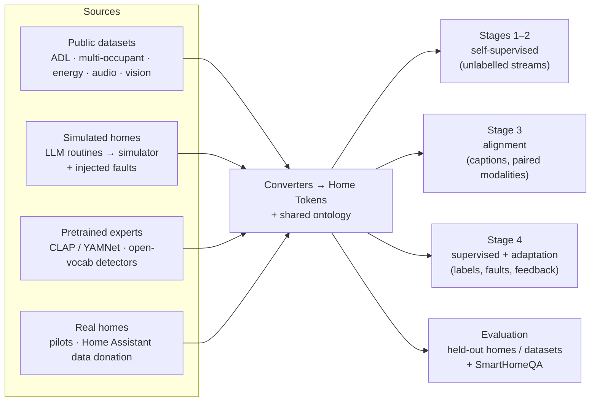

### 11.1 Data by training stage

| Stage | Needs labels? | Data |
|---|---|---|
| **Stages 1–2: self-supervised pretraining** (next-event, latent masking) | No, only raw event streams | Every home's events, labelled or not: public smart-home datasets, energy datasets as scalar tokens, simulated homes, pilot and donated homes. **The number of homes matters more than labels.** |
| **Stage 3: alignment** (language, cross-modal) | Captions | Activity labels → sentences, MuRAL natural-language annotations, simulator captions, filtered LLM-written captions; windows where sensors and audio/video were recorded together |
| **Stage 4: supervised tuning** | Yes | Labelled activity datasets, simulated homes with injected faults, user corrections from pilots |
| **Evaluation** | Yes | Whole datasets or homes held out from pretraining (leave-one-dataset-out / leave-one-home-out), and SmartHomeQA generated from their labels |

### 11.2 Public datasets by domain

| Domain | Datasets | What they give us |
|---|---|---|
| **Activities (ambient sensors)** | **CASAS**: Milan, Aruba and the larger HH-series of homes (many unlabelled); **Kasteren** A/C; **UCI ADL** Home B; **Orange4Home** | Main pretraining corpus. Orange4Home adds continuous power, water, CO₂ and noise readings |
| **Multiple occupants** | **ARAS** (2 houses, 2 residents each), **MuRAL** (2–4 people, natural-language annotations), **MARBLE** (several residents, smartwatch + environment sensors) | Occupancy and attribution heads, captions |
| **Multi-modal home** | **SPHERE** (environment sensors, wearables, video features) | Cross-modal agreement |
| **Energy and appliances** | **REFIT** (20 UK homes, per-appliance, ~2 years), **UK-DALE**, **REDD**, **ECO**, **AMPds**; Pecan Street (licence-restricted) | Appliance power signatures, energy questions, the normal baseline for device health |
| **Home audio** | **AudioSet** (baby cry, bark, doorbell, smoke alarm, glass breaking), **FSD50K**, **ESC-50**, **UrbanSound8K**, **DCASE SINS** (real home recordings of daily activities) | Fine-tuning the audio expert; HomeFM sees only its tags and embeddings |
| **Vision** | **COCO**, **Open Images** (people, boxes, bags); pretrained open-vocabulary detectors (OWL-ViT / Grounding DINO) | People counting, parcel and courier detection |

Audio and vision experts are **not trained from scratch**: we start from pretrained models and fine-tune them for home events.

### 11.3 Gaps no public dataset covers

| Gap | Why | Source |
|---|---|---|
| **Pets** in event streams | No public dataset has labelled pet-triggered sensor events | Simulator (pet motion, barking) + pilot homes with pets |
| **Baby crying in context** | Audio clips exist, but not inside a home event stream | Simulator places audio-expert outputs into daily routines; pilots |
| **Parcels and guests** | Not in any activity dataset | Simulator + doorbell-camera footage from pilots, annotated in-house |
| **Device faults** | Almost no public labelled appliance-fault data | **Faults injected into real appliance signals**: stretched REFIT fridge cycles, stuck sensors, battery decay, silent sensors |
| **Elderly decline over weeks** | Few long-term datasets, rarely labelled | Gradual drift in simulated routines, the longest CASAS homes, then consenting pilots |
| **Modern devices** (Matter, locks, cameras, robot vacuums) | Public datasets use older sensor setups | Pilot and donated Home Assistant histories |

**The simulator is central.** An LLM writes daily routines for several residents, babies and pets; the simulator turns them into sensor, audio and camera events. It provides dense labels and captions for free, the rare events and faults real data lacks, and control over difficulty. The scaffold's simulator (`homefm.data.synthetic`) is a starting point: it needs more devices and more realistic timing, and should be calibrated against pilot data.

### 11.4 Real homes: the main lever for scale

- **Pilot homes:** 10–30 consenting households with our sensor setup (cameras and microphones where allowed). They provide real noise, test data and feedback labels.
- **Data-donation programme:** many Home Assistant users already have months to years of local history. An opt-in, anonymised export tool mapped to our ontology could provide hundreds of modern homes of unlabelled streams, which is exactly what Stages 1–2 need. This takes the corpus from dozens of homes to hundreds.

### 11.5 Data-handling rules

- **Hold out whole homes or datasets**, never random windows; otherwise the model memorises the home and results are inflated.
- **Balance datasets** in pretraining (DomusFM oversamples small datasets) so CASAS or simulated homes do not dominate.
- **Mix simulated and real data** at a controlled ratio; always report results on **real held-out homes only**.
- **Licences and privacy:** verify each dataset's terms in M1 (CASAS asks for citation, Pecan Street is restricted, AudioSet is distributed as YouTube IDs). Pilot and donated data need consent, anonymisation and local-first storage.

### 11.6 M1 starting set

CASAS (Milan, Aruba, several HH homes), Kasteren, UCI B, Orange4Home, ARAS and MuRAL for events; REFIT for appliances; plus the simulator. This covers the DomusFM reproduction and a first HomeFM pretraining run. Audio, vision and pilot data arrive with the perception experts (Phase 2). Availability and licence terms of each dataset are the first M1 task.

## 12. Evaluation plan

| Area | Metric | Protocol |
|---|---|---|
| Activity recognition | Weighted F1 | Leave-one-dataset-out and leave-one-home-out; linear probe + fine-tune; 1/5/10/30 % labels |
| Counting | Episode-count exact match, MAE | Per concept, per question range |
| Durations | Mean absolute error (min) | Per concept |
| Open vocabulary | Retrieval mAP / tagging F1 on held-out concepts | Concepts never seen in training |
| Anomaly | AUROC, false alarms per home-week | Injected + real faults |
| Device health | Detection lead time, precision | Injected degradation, real faults |
| Occupancy | Count MAE, identity accuracy | Camera/radar ground truth |
| Forecasting | NLL, next-k multiset F1 | Next 5 min and next k events |
| End-to-end QA | Answer accuracy on **SmartHomeQA** | Generated + human-paraphrased questions over labelled data |
| Edge | Latency, RAM, energy | Hub-class device |

**Baselines:** DomusFM reproduction (primary), DeepCASAS, Chronos, GPT-2-style event model, zero-shot LLM.

## 13. Deployment, privacy and edge

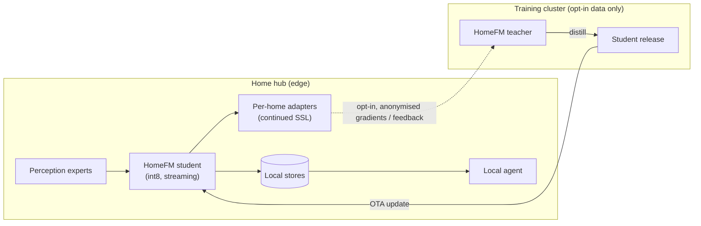

- Raw audio/video never leaves the device; only events and embeddings are stored.
- Retention limits per data class; user-visible and deletable history.
- Federated or opt-in feedback for improving the teacher.
- Teacher → student distillation per release; int8 quantisation; ONNX runtime on the hub.

## 14. Roadmap

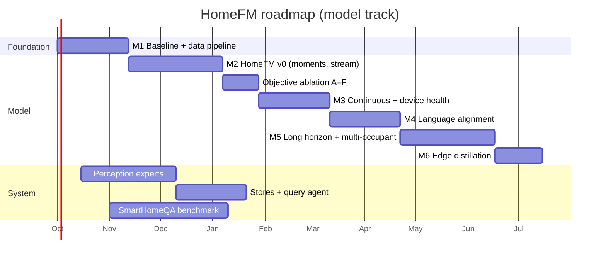

| Milestone | Exit criterion |
|---|---|
| M1 | Common token format, dataset converters, DomusFM reproduction within ±0.03 F1 of the paper |
| M2 | HomeFM v0 beats DomusFM reproduction on leave-one-dataset-out |
| Ablation | A–F matrix complete; pretraining recipe fixed with evidence |
| M3 | Device-health detection on injected faults; continuous tokens without binarisation |
| M4 | Zero-shot tagging on held-out concepts above agreed threshold |
| M5 | Routine drift + occupancy heads; multi-resident datasets |
| M6 | Student < 500 MB, < 20 ms per moment on hub |

**First end-to-end demo (~8 weeks):** one home (real or simulated) answering one question per domain using off-the-shelf experts and rule-based episodes; HomeFM swapped in as it matures.

## 15. Risks and open questions

| Risk | Mitigation |
|---|---|
| Pretraining data too small / homogeneous | Synthetic homes, more CASAS homes, pilots, distillation |
| "One occurrence" is ambiguous | Per-concept episode rules in ontology; feedback tuning |
| Multi-occupant attribution | Identity-bearing sensors where allowed; calibrated uncertainty otherwise |
| False alarms (elderly care, security) | Per-home calibration, alert budgets, human-in-the-loop confirmation |
| Synthetic-to-real gap | Domain-adversarial training, real pilot validation |
| Privacy / trust | Edge-only default, event-only storage, transparent history |

**Open decisions**

1. Edge-only vs edge + cloud (LLM size, expert placement).
2. Target sensor ecosystem (Home Assistant / Matter / vendor-specific).
3. v1 priority domains (recommend 2–3 deep, e.g. activity + energy/device health + security).
4. Access to real pilot-home data.

## 16. Repository layout

```
F:/Foundation_Model/
├── docs/DESIGN.md                 ← this document
├── configs/
│   ├── base.yaml                  model / data / training defaults
│   └── objectives/                A–F ablation variants
├── src/homefm/
│   ├── schema/                    Home Token, Entity, Episode, ontology
│   ├── data/
│   │   ├── synthetic.py           simulator with episodes, captions, injected faults
│   │   ├── converters/            CASAS (+ stubs for other datasets)
│   │   ├── text_encoder.py        frozen entity/caption text encoders
│   │   └── windowing.py           time-based windows → tensors
│   ├── model/
│   │   ├── embedder.py            attribute fusion event embedder
│   │   ├── moment_encoder.py      Perceiver moment encoder
│   │   ├── stream.py              causal / bidirectional stream model
│   │   ├── readout.py             event read-out
│   │   ├── heads.py               next-event TPP, projections
│   │   └── homefm.py              assembled model
│   ├── objectives/                masking + A–F objective implementations
│   ├── train/pretrain.py          training CLI
│   └── eval/                      metrics, linear probe, anomaly AUROC
├── scripts/run_ablation.py        runs A–F on synthetic data, prints comparison
└── tests/                         smoke + unit tests
```
